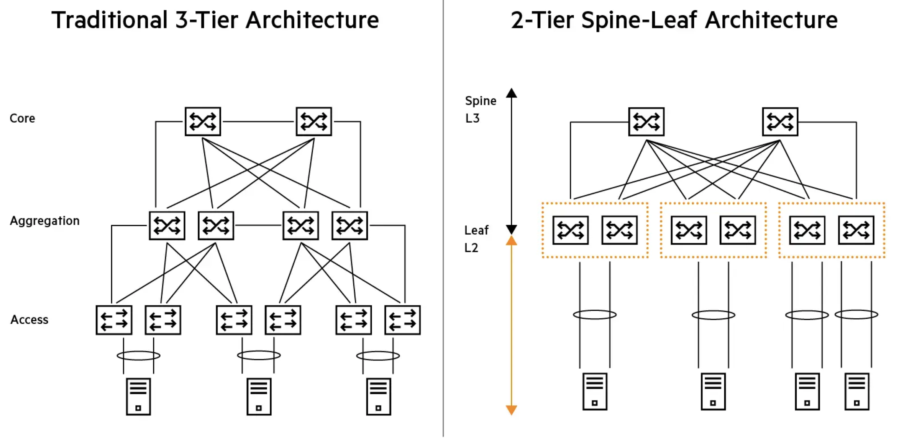
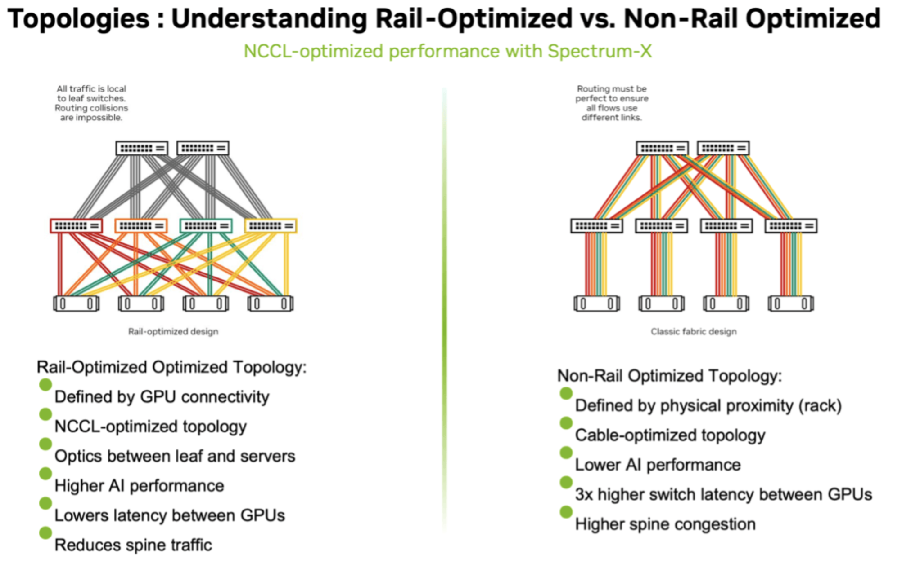
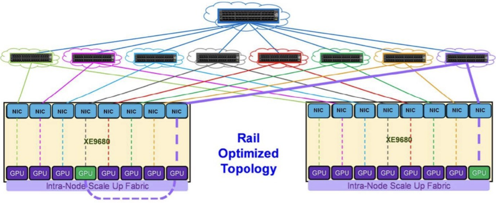
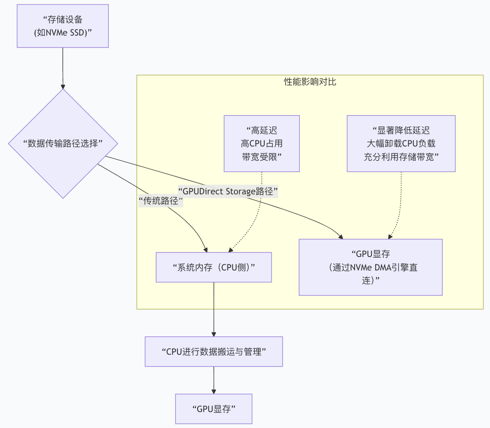

# 模块二：组网设计与实战

## 1. 网络拓扑设计

### 1.1 Rail-optimized 拓扑与传统的 Spine-Leaf 的区别



传统三层架构通常由核心层、汇聚和分发层以及接入层组成。在那种架构中，交换机之间一次只能激活一条路径，这意味着高延迟和更高的瓶颈。Spine-Leaf 架构的创新在于创建了一个两层拓扑。脊层处理所有连接，并允许叶交换机之间单跳连接，从而大幅降低了延迟。AI集群对计算能力的需求极大。这些工作负载的带宽密集程度超过了我们以往见过的任何应用，而涉及大量GPU时，Spine-Leaf 配置有时可能难以满足要求。同时，全互联的通信模式会使脊层链路混乱，并在交换机之间造成不均衡的负载分布。

传统的云网络设计是为了应对大量随机的小流量，而 **AI 训练流量**具有以下三个致命特征：

* **高突发（Burstiness）：** 所有 GPU 会在同一时间发送海量数据。
* **强同步（Synchronization）：** 必须等所有 GPU 完成数据交换后，训练才能进入下一轮迭代。
* **集合通信（Collective Communication）：** 主要是 `All-Reduce` 等操作，即所有服务器的第 N 个 GPU 需要互相交换信息。

**传统连接方式（物理隔离的机架视图）**

在传统设计中，你会把一台 DGX 服务器（内含 8 张网卡）的所有网卡都插到同一个 Leaf（机顶）交换机上。

* **结果：** 1 台服务器就会占用 8 个 400G 端口。如果一个交换机有 64 个端口，它只能接 8 台服务器。
* **问题：** 当 GPU 0 要找另一台服务器的 GPU 0 通信时，流量必须经过“Leaf -> Spine -> Leaf”，跳数多且容易在 Spine 层产生拥塞。

NVIDIA 的创新接法：



* **定义 Rail（轨道）：** 将集群中的所有第 0 号 GPU 的网卡定义为“Rail 0”，第 1 号 GPU 的网卡定义为“Rail 1”，以此类推。
* **物理连接：**
  * 服务器的 **NIC 0** 连接到 **Leaf 交换机 0**。
  * 服务器的 **NIC 1** 连接到 **Leaf 交换机 1**。
  * ...以此类推，8 张网卡分别连接到 8 台不同的 Leaf 交换机。
* **逻辑效果：** 同一索引的 GPU（比如全集群所有的 GPU 0）被物理地“对齐”在了同一个二层交换机下。



#### **A. 极低的通信跳数（One-hop Communication）**

在 AI 训练最常用的 `All-Reduce` 算法中，主要发生在相同编号的 GPU 之间。

* **优势：** 既然所有的 GPU 0 都在同一个 Leaf 交换机上，它们之间的通信**永远不需要经过 Spine 交换机**。
* **结果：** 延迟减半，且完全避免了 Spine 层的带宽竞争。

#### **B. 消除网络拥塞与“哈希碰撞”**

视频解释了传统网络依赖 ECMP（等价多路径路由）来分发流量，这在 AI 场景下极易导致某些链路爆满、某些链路空闲（哈希不均）。

* **轨道优化解决方案：** 由于流量在物理上就被分流到了 8 个独立的轨道（8 台交换机），流量分布变得**极其确定且均衡**。每个轨道处理总流量的 1/8，天然消除了拥塞风险。

#### **C. 配合 SHARP 技术（计算外展）**

视频提到了 NVIDIA 的 **SHARP (Scalable Hierarchical Aggregation and Reduction Protocol)** 协议。

* **原理：** 由于同一轨道的流量都在一台 Leaf 交换机内，交换机可以直接在 ASIC 芯片内完成数据的聚合和削减（Reduction）计算。
* **价值：** 交换机分担了 GPU 的计算压力，数据不需要在网络中来回传输，效率翻倍。

Rail-Optimized 架构是专为 **NCCL（NVIDIA 集合通信库）** 设计的物理实现：

1. **性能：** 为大规模 GPU 集群提供最高的吞吐量和最低的尾部延迟（Tail Latency）。
2. **扩展性：** 通过这种分轨设计，集群可以平滑扩展到数万颗 GPU，而不会因为网络拓扑复杂化而性能下降。
3. **计算与网络融合：** 它让网络不再仅仅是传输管道，而是成为了 AI 算力的一部分。

## 2. 超万卡集群建设与挑战

### 2.1 大模型驱动万卡集群建设

自 ChatGPT 面世以来，大模型技术进入迅猛迭代期，模型参数量呈“指数级”跃升，从 2018 年 BERT 模型的 1.1 亿参数，快速突破至 2021 年 GPT-3 的 1750 亿参数，而后随着 Mixture of Experts（MOE）等先进结构迈入万亿规模，OpenAI 于 2025 年发布的 GPT-5 参数规模已经达到了 52 万亿。大模型能力的跃迁，直接带来了对巨量算力与能源的刚性需求，传统算力设施已无法满足需求。从具体消耗来看，GPT-4（含 16 个专家模型、1.8 万亿参数）一次训练需在 25000 个 A100 芯片上运行 90 至 100 天；从设施要求来看，大模型对底层算力提出更高标准，不仅需要更高密度的存算硬件、高性能无阻塞的网络连接，还需支持更高并行度的通信与计算范式，新一代智算中心的技术需求日益严苛。这种“算力缺口”成为关键推力，让超万卡集群逐渐成为大模型基建的标配。

### 2.2 万卡集群功耗现状

随着 AI 芯片性能的指数级增长，服务器功耗呈现爆发式上升。以英伟达为例，其 B200GPU 单芯片功耗达 1000W，GB200 更突破至 2700W，驱动单机柜功率从 20kW 跃升至 120kW 以上。这种功耗激增直接导致了电流需求的急剧上升。现代 AI 处理器的持续电流需求可能达到 1000A 或更高，峰值电流甚至可达 2000A。在如此高的电流需求下，I²R 损耗剧增，散热成本攀升。

在功率损耗和散热管理方面，通常有两种方法可以改善 PDN 对电力系统性能的影响：第一种方式是使用更大尺寸的电缆、连接器和更厚的主板电源板以降低 PDN 电阻；第二种方式是提高电压以降低给定功率传输的电流，这样可以降低电缆、连接器、主板铜平面尺寸及其相关的尺寸、成本和重量。

然而，采用第一种方式会将增加的功率分配给多个服务器处理会造成更大的功率损失，因此，近年来电力设计越来越多地采用第二种方式，即采用更高的电压来降低功率损耗。2016 年，谷歌在 OCP 峰会上提出了 48V 机架电源架构，用以取代当时普遍应用的 12V。

### 2.3 液冷协同设计

当前液冷技术发展呈现出三大主流技术路线并行的格局。冷板式液冷作为最成熟的方案，通过在 CPU、GPU 等高发热器件上安装冷板实现液冷散热，改造相对简单，兼容性好，适合现有数据中心的升级改造。浸没式液冷则是更为彻底的解决方案，将整个服务器浸没在绝缘冷却液中，在高密度算力场景下优势明显，特别适合 AI 训练等高功率密度应用。喷淋式液冷介于两者之间，通过精确喷淋实现局部液冷。

随着数据中心功率密度的不断提升，液冷系统与配电系统的协同设计已成为提升整体能效的关键路径。英伟达 Kyber 机架架构实现了 800VDC 与液冷技术的融合，这一架构的核心在于对 800VDC 电力输送、液体冷却和机械设计的创新，能显著提升供电效率，减少能量损耗。在 2024 年 OCP 全球峰会上，谷歌讨论了开发多达 1 MW IT 机架的计划^[5](https://github.com/Infrasys-AI/AIInfra/blob/main/01AICluster/03SuperPod/01Challenge.md#user-content-fn-5-43c236c73f335ae6e88d7ce4869cbd2e)^。这一目标的实现离不开液冷与配电系统的深度协同。

### 2.4 万卡建设互联现状

在万卡级 AI 集群中，框式交换机和盒式交换机的混合架构已成为主流选择。框式交换机通常作为核心层和汇聚层设备，具备强大的扩展性和高性能处理能力。这类设备拥有较大的机箱，采用模块化设计，内部包含多个插槽，可插入不同功能的模块，如电源模块、交换模块、接口模块等^[8](https://github.com/Infrasys-AI/AIInfra/blob/main/01AICluster/03SuperPod/01Challenge.md#user-content-fn-8-43c236c73f335ae6e88d7ce4869cbd2e)^。框式交换机通过背板交换连接多块线卡，其内部连线采用 CLOS 结构，这种设计使得单个框式交换机能够支持数百个端口的高密度连接。

相比之下，盒式交换机则主要应用于接入层，具有固定配置、固定端口数量、固定电源模块和风扇等特点。盒式交换机通常高度在 1-2U 之间，端口数量一般小于 60 个，不具备扩展性^[9](https://github.com/Infrasys-AI/AIInfra/blob/main/01AICluster/03SuperPod/01Challenge.md#user-content-fn-9-43c236c73f335ae6e88d7ce4869cbd2e)^。

在实际的万卡集群部署中，“框框、盒盒盒”结构体现为多层次的网络拓扑设计。这种设计充分利用了框式交换机的高性能和盒式交换机的高密度特性，实现了成本与性能的优化平衡。

### 2.5 万卡集群通信算法

Ring 算法是分布式训练中最基础的集合通信算法，英伟达的 NCCL 通信库采用了这种算法，其工作原理相对简单：将所有通信节点通过首尾连接形成一个单向环，数据在环上依次传输。在 Ring AllReduce 算法中，整个过程分为两个阶段：Reduce-Scatter 和 AllGather。在 Reduce-Scatter 阶段，每个节点将数据切分成 N 份（N 为节点总数），并将不同的分片发送给环上的邻居节点；在 AllGather 阶段，各节点收集来自其他节点的所有分片数据^[11](https://github.com/Infrasys-AI/AIInfra/blob/main/01AICluster/03SuperPod/01Challenge.md#user-content-fn-11-43c236c73f335ae6e88d7ce4869cbd2e)^。

Ring 算法的优势在于其带宽效率高，因为每个 GPU 都参与发送和接收，能够充分利用所有节点的带宽资源。在理想情况下，Ring AllReduce 的通信时间与 GPU 节点数无关，只受限于 GPU 间最慢的连接，通信时间计算公式为：T = 2\*(N-1)\*S/(NB)，其中 N 为节点数，S 为数据大小，B 为带宽^[12](https://github.com/Infrasys-AI/AIInfra/blob/main/01AICluster/03SuperPod/01Challenge.md#user-content-fn-12-43c236c73f335ae6e88d7ce4869cbd2e)^。这意味着当网络中存在高速链路时，Ring 算法能够实现接近理论极限的性能。

然而，当集群规模扩展到万卡级别时，Ring 算法面临着严重的性能瓶颈。最主要的问题是延迟随 GPU 数量呈线性增长，这是因为 Ring 算法需要 N-1 步才能完成一次全规约操作，每一步都需要等待前一阶段的数据传输完成。在 24,000 块 GPU 的超大规模集群中，树状通信算法在延迟上可优化约 180 倍，此时树状通信的延迟显著优于环状通信^[13](https://github.com/Infrasys-AI/AIInfra/blob/main/01AICluster/03SuperPod/01Challenge.md#user-content-fn-13-43c236c73f335ae6e88d7ce4869cbd2e)^。

此外，Ring 算法在超大规模集群中的另一个挑战是链路故障的影响。由于所有节点形成一个环，任何一个链路或节点故障都可能导致整个环的中断，进而影响整个训练任务的执行。虽然可以通过双环或多环设计来提高可靠性，但这会进一步增加网络的复杂度和成本。

另一种常见的 AllReduce 实现算法是 Halving-Doubling，该算法的核心机制是每次选择节点距离倍增的节点进行两两通信，且每次通信量会相应地倍减（或倍增）。Halving-Doubling 算法的优点十分突出：一方面，它的通信步骤较少，仅需 2log₂N 次（其中 N 表示参与通信的节点数）即可完成，因此拥有更低的延迟，相比之下 Ring 算法的通信步骤需 2（N-1）次；另一方面，它规避了单节点瓶颈问题，同时能让每个节点充分利用自身的发送与接收带宽，是目前超大规模通信场景中常用的方式。但这种算法的缺点是每一步相互通信的节点均不相同，链接的来回切换会带来额外开销；并且在通信的最后几步中会产生大量数据传递，进而导致速度变慢。

在超大规模 AI 集群中，随着 GPU 数量的增长，无论是 Ring 算法还是 HD 算法，其通信延迟都会显著上升^[14](https://github.com/Infrasys-AI/AIInfra/blob/main/01AICluster/03SuperPod/01Challenge.md#user-content-fn-14-43c236c73f335ae6e88d7ce4869cbd2e)^。因此有很多研究者提出混合通信算法来提升整体性能。根据集群规模和通信模式的不同，动态选择最适合的通信算法。例如，在小规模集群中使用 Ring 算法，在大规模集群中使用树状算法。例如 ACCL 算法，第一步，基于 Ring 算法执行节点内的 Reduce-Scatter；第二步，基于 Halving-Doubling 算法执行节点间的 All-Reduce；第三步，基于 Ring 算法执行节点内的 All-Gather^[15](https://github.com/Infrasys-AI/AIInfra/blob/main/01AICluster/03SuperPod/01Challenge.md#user-content-fn-15-43c236c73f335ae6e88d7ce4869cbd2e)^。

### 2.6 光模块成本激增

基于英伟达 H100 等主流 GPU 的典型配置，并考虑集群内部的多层网络架构和冗余设计，目前单个 10 万卡规模的 AI 训练集群需要 8-12 万个 800G 光模块。从 GPU 与光模块的配比关系来看，不同规模集群呈现出明显的非线性增长特征。在小规模集群（万卡以下）中，光模块与 GPU 的比例约为 1:2 至 1:2.5；中等规模集群（10-20 万卡）的配比提升至 1:5；而在 30 万或 50 万张卡的超大规模集群中，这一比例可能上升至 1:8。以英伟达 GH200 集群为例，在 4SU 集群的全光网络、三层 Fat-Tree 架构下，服务器和 Leaf 层交换机使用 400G 光模块，Leaf-Spine 和 Spine-Core 使用 800G 光模块，GPU 与光模块的比例达到 1:9。

多模光模块使用多模光纤，芯径较粗（通常为 50 或 62.5 微米），允许多条光模式同时传播，适合短距离高速传输，一般传输距离不超过 500 米，常用于数据中心内部或机房内连接。单模光模块则采用单模光纤，芯径细（通常为 9 微米），仅允许单一路径光信号传输，因而在传输过程中光信号衰减和色散较小，支持远距离传输，通常可达到几十公里甚至上百公里，适合城域网和长距离数据中心互联。

单模光模块和多模光模块在价格方面存在明显差异，主要源于其光源、光纤类型及制造工艺的不同。单模光模块通常采用分布反馈激光器（DFB）或外调制激光器（EML），激光器成本较高，且对光纤对准精度要求严格，使得单模模块整体价格较高。相较之下，多模光模块使用的垂直腔面发射激光器（VCSEL）成本较低，且多模光纤芯径较粗，连接和安装更加简便，因此模块和布线成本均较单模方案低廉。以 10G 速率为例，单模光模块价格通常在 120\~2000 元不等，而多模光模块价格多在 100 元左右^[16](https://github.com/Infrasys-AI/AIInfra/blob/main/01AICluster/03SuperPod/01Challenge.md#user-content-fn-16-43c236c73f335ae6e88d7ce4869cbd2e)^。

光模块成本在 AI 集群总体拥有成本中占据重要地位，且这一占比随着集群规模的扩大而显著提升。在十万卡级 AI 集群中，光模块成本占比通常为 15%-20%。Meta 的 LLaMA3 训练集群采用 H100+800G 方案时，光模块投资占比约 18%^[17](https://github.com/Infrasys-AI/AIInfra/blob/main/01AICluster/03SuperPod/01Challenge.md#user-content-fn-17-43c236c73f335ae6e88d7ce4869cbd2e)^。以 8-12 万个 800G 光模块的需求量计算，假设平均单价为 5000 元人民币，则光模块总成本约为 4-6 亿元人民币。在十万卡集群中，不同互联方案的光模块成本差异显著。英伟达 InfiniBand 方案的物料成本最高，约为 3.9 亿美元，光模块与 GPU 的比例约为 3.6 倍；英伟达以太网方案成本略低，约为 3.7 亿美元，比例约为 2.6 倍；博通以太网方案成本最低，约为 3.5 亿美元，比例同样为 2.6 倍，相比 InfiniBand 可节省约 4 亿美元。

### 2.7 InfiniBand 协议在超大规模组网中的技术瓶颈与成本挑战

InfiniBand 协议在 AI 训练低延迟网络领域拥有霸主地位，基于英伟达自己的一套协议，配合 GPU 运算特点自成一套体系。该协议在设计之初就支持 RDMA（远程直接内存访问）技术，从硬件层面确保数据的可靠传输，提供了更高的带宽和更低的延迟。

在技术架构方面，InfiniBand 采用分层设计，包括物理层、链路层、网络层、传输层和应用层。其核心优势体现在以下几个方面：

1. 极低的通信延迟：InfiniBand 网络的端到端延迟通常在微秒级别，远低于以太网的毫秒级别延迟，这对于 AI 训练中的梯度同步等集体通信操作至关重要。
2. 高带宽利用率：InfiniBand 支持 QoS（服务质量）控制和拥塞管理，能够确保关键流量的带宽保证，避免网络拥塞导致的性能下降。
3. 硬件级可靠性：InfiniBand 在硬件层面实现了数据的可靠传输，包括错误检测、重传机制和路径冗余等功能，提高了系统的整体可靠性。
4. 与 GPU 的深度集成：InfiniBand 与英伟达 GPU 具有天然的兼容性，能够充分利用 GPU Direct 技术，实现 GPU 到 GPU 的直接数据传输，避免 CPU 和内存的参与，显著提升性能。

尽管 InfiniBand 在低延迟方面具有显著优势，但其在超大规模组网中面临严重的扩展性瓶颈。最核心的限制来自于交换机端口容量的约束。NVIDIA Quantum-2 系列交换机由 64 个每秒 400Gb 的连接埠或 128 个每秒 200Gb 连接埠组成，使用 32 个实体八进位小型插入式（OSFP）连接器。这一端口容量限制直接影响了集群的扩展能力。由于 Quantum-2 交换机的端口容量较低，在一个拥有十万节点的集群中，完全互联的 GPU 数量最多只能达到 65,536 个 H100^[20](https://github.com/Infrasys-AI/AIInfra/blob/main/01AICluster/03SuperPod/01Challenge.md#user-content-fn-20-43c236c73f335ae6e88d7ce4869cbd2e)^。这意味着十万卡集群无法通过传统的 3 层 Clos 网络架构实现完全互联，必须采用更为复杂的 4 层架构。这种架构设计虽然解决了连接数量的问题，但带来了成本的显著增加。这一成本增加主要来自以下几个方面：交换机数量的增加：4 层架构需要更多的各级交换机，不仅增加了设备采购成本，还增加了机房空间占用和电力消耗。光模块数量的增加：4 层架构比 3 层架构需要更多的收发器，这直接导致光模块成本增加约 33%。布线复杂度的提升：4 层架构的网络拓扑更为复杂，需要更多的光纤连接和更复杂的布线设计，增加了部署和维护成本。

为了应对 InfiniBand 在超大规模组网中的局限性，业界提出了多种替代方案，主要包括以太网 RoCE（RDMA over Converged Ethernet）和英伟达 Spectrum-X 以太网方案。以太网 RoCE 方案的优势在于其开放性和成本效益。RoCE 利用标准的以太网硬件实现 RDMA 功能，避免了 InfiniBand 的专用硬件需求，显著降低了成本。Meta 等公司已成功部署基于 RoCEv2 的大规模 AI 网络，其 24K H100 GPU 集群采用单平面 Spine-Leaf 架构，实现了良好的性能和成本平衡。英伟达 Spectrum-X 以太网方案则提供了另一种选择。Spectrum-X 以太网的每个 SN5600 交换机有 128 个 400G 端口，而 InfiniBand NDR Quantum-2 交换机只有 64 个 400G 端口。这意味着采用 Spectrum-X 可以使用 3 层交换机网络而不是 4 层，4 层交换机网络比 3 层交换机网络要多出 1.33 倍的光模块。

## 3. 万卡集群交付与测试步骤

### 3.1 集群环境适配与调试工具

万卡集群环境下的训练脚本需要特别适配大规模分布式环境的特点，并集成相应的调试工具，常用的调试工具有：

（1）性能分析工具：

NVIDIA Nsight Systems：用于CUDA应用的性能分析和优化

PyTorch Profiler：集成在PyTorch中的性能分析工具

torch.autograd.profiler：用于分析计算图和内存使用

（2）通信调试工具：

NCCL-tests：官方提供的NCCL通信性能测试工具

nccl-netmon：用于监控NCCL通信性能和错误

ibmon：用于监控InfiniBand网络性能

（3）可视化工具：

TensorBoard：用于可视化训练过程、损失曲线、模型结构等

WandB（Weights & Biases）：提供更高级的实验跟踪和可视化功能

Grafana：结合 Prometheus 实现集群级别的监控数据可视化

此外，在万卡规模下，故障是常态，训练脚本需要集成完善的容错机制，定期保存检查点，发现异常数据并处理，监控系统和日志。

### 3.2  系统性能的关键指标

衡量系统性能的关键指标包括：

（1）计算性能指标：

线性度=实际加速比/理论加速比；

模型FLOPS利用率（MFU）=实际FLOPS/理论峰值FLOPS；

训练效率=有效训练时间/总时间等。

（2）通信性能指标：

聚合带宽（Aggregate Bandwidth）：所有GPU间通信的总带宽；

通信效率（Communication Efficiency）：实际通信速度与理论速度的比值；

延迟（Latency）：数据从源到目的地的传输时间

（3）资源利用率指标：

GPU利用率（GPU Utilization）：GPU实际计算时间占总时间的比例

显存利用率（Memory Utilization）：实际使用显存占总显存的比例

CPU利用率（CPU Utilization）：CPU实际使用时间占总时间的比例

（4）能效指标：

算力功耗比（FLOPS/Watt）：总FLOPS/总功耗（瓦特）

PUE（Power Usage Effectiveness）：总能耗/IT设备能耗

（5）可靠性指标：

平均无故障时间（MTBF）：两次故障之间的平均时间，总运行时间/故障次数

可用性（Availability）：系统正常运行时间占总时间的比例，(总时间 - 故障时间)/总时间

故障恢复时间（MTTR）：从故障发生到系统恢复正常的平均时间

（6）容错能力评估：

故障检测覆盖率：系统能够自动检测到的故障类型占总故障类型的比例

故障自动恢复率：系统能够自动恢复的故障占检测到故障的比例

数据一致性保障：故障恢复后数据完整性的保证程度

### 3.3 测试环境具体核心步骤

#### 单核压测

单核压测是验证单个GPU核心计算能力的基础测试，主要用于评估GPU在极限负载下的稳定性和性能表现。gpu\_burn是基于NVIDIA CUDA框架开发的轻量级GPU压力测试工具，专为验证GPU核心（CUDA Core）和显存（VRAM）稳定性设计，通过"饱和式计算"让GPU达到满负载，是检测GPU硬件故障（如显存坏块、核心算力衰减）的核心工具[[2]](https://github.com/Infrasys-AI/AIInfra/blob/main/01AICluster/03SuperPod/03TestCase.md#endnote-2)。

gpu\_burn的核心原理包括三个方面：（1）算力拉满，调用CUDA内核函数执行密集型浮点运算（支持单精度float、双精度double），使CUDA Core利用率接近100%；（2）显存压榨，分配大尺寸显存缓冲区循环读写数据，占用90%以上显存空间；（3）多卡适配，自动识别服务器中所有NVIDIA GPU，支持单卡、多卡并行压测。

#### 单机压测

单机压测的评估需要建立全面的指标体系来衡量GPU和系统的综合性能。主要评估指标如下：

计算性能指标方面，主要测试GPU的FP32/FP16和INT8计算能力。使用GEMM（矩阵乘法）函数测试实际浮点计算能力，可通过CUBLAS测试极限性能。测试要求在8张卡系统上分别测试1、2、4、8卡数量下的FP32/FP16/INT8性能，实际计算效率需达到SPEC基准的80%以上。

多GPU并行性能指标包括三个核心参数：加速比（Speedup）=单GPU运行时间/多GPU运行时间，这是最直观的性能提升指标；效率（Efficiency）=加速比/GPU数量，反映资源利用率；计算能力利用率（Compute Utilization），衡量GPU计算单元的实际使用效率[[5]](https://github.com/Infrasys-AI/AIInfra/blob/main/01AICluster/03SuperPod/03TestCase.md#endnote-5)。

硬件健康指标监控是确保测试安全的重要环节，包括：GPU利用率、温度、功耗、显存带宽与占用、错误率与稳定性。这些指标需要在测试过程中实时监控，确保GPU工作在安全范围内[[6]](https://github.com/Infrasys-AI/AIInfra/blob/main/01AICluster/03SuperPod/03TestCase.md#endnote-6)。

系统级性能指标通过NVIDIA Nsight Systems等工具进行深入分析。Nsight Systems能够采集GPU硬件指标（如SM利用率、显存带宽），从硬件层面定位性能瓶颈。该工具支持CPU相关采集项（CPU指令指针/回溯采样、CPU上下文切换追踪）、异构计算相关采集（CUDA trace、GPU metrics、NVTX trace）以及图形API追踪等全方位监控能力。

#### 通信压测

在万卡集群中，集体通信算法的性能直接决定了分布式训练的效率。NCCL（NVIDIA Collective Communications Library）是最常用的集合通信库，用于加速多GPU的分布式深度学习训练和推理。

万卡集群的通信压测需要特别关注网络拓扑的影响。当前主流的网络架构是借鉴NVIDIA DGX-SuperPod-A100的设计，每个基本单元SU（Scalable Unit）包含200台A800主机和4台Leaf交换机，20台节点间的同号网卡通过单台Leaf直接通信。这种架构支持四种通信路径：同一个Node内的GPU通过NVLink通信；同一个SU内不同Node的同号网卡GPU通过Leaf交换机直接通信（同轨通信）；不同网卡的GPU需要跨Spine通信（跨轨通信）；不同SU间的GPU同样需要跨Spine通信。

在集体通信算法的选择上，不同算法在不同场景下表现各异。Ring AllReduce算法将每个节点的数据切分成N份，充分利用所有节点的发送和接收带宽，适合大数据块传输，能够改善时延抖动问题，但延迟相对较高（2N-2 步长）。相比之下，MultiShot算法只需要2个通信步骤，速度几乎是Ring AllReduce的3倍，特别适合小数据量的快速同步[[7]](https://github.com/Infrasys-AI/AIInfra/blob/main/01AICluster/03SuperPod/03TestCase.md#endnote-7)。

万卡集群的通信压测工具需支持大规模节点扩展、多通信模式，且能适配RDMA等高速协议，常用工具按场景分为以下几类：


|                |                              |                                                                                                                                            |                                              |
| -------------- | ---------------------------- | ------------------------------------------------------------------------------------------------------------------------------------------ | -------------------------------------------- |
| **通信场景**   | **推荐工具**                 | **核心能力**                                                                                                                               | **适用场景**                                 |
| 点对点通信     | iperf3/ib\_send\_bw          | - iperf3：测试TCP/UDP带宽、延迟（支持多线程）； - ib\_send\_bw：Infiniband专用，测试RDMA点对点带宽/延迟                                    | 验证单链路通信性能（如网卡、交换机端口）     |
| 集合通信       | osu-micro-benchmarks         | AllReduce性能测试：使用NCCL的AllReduce操作测试通信效率； Broadcast测试：验证广播操作的性能和正确性； ReduceScatter测试：测试数据分发的性能 | 验证分布式训练、大数据任务的多节点协同性能   |
| GPU集群通信    | NCCL-tests                   | NVIDIA专属，基于NCCL库，测试GPU间直接通信（如GPU-GPU RDMA）的集合通信性能                                                                  | AI训练场景（如GPT、ResNet训练的梯度同步）    |
| 网络稳定性压测 | pktgen-dpdk/ib\_traffic\_gen | 生成高并发数据包，测试长时间（如24小时）通信的丢包率、误码率                                                                               | 验证集群在满负载下的稳定性（如7x24小时任务） |

万卡集群直接全量压测风险高（易因局部故障导致整体失败），通常按照“单节点→小集群→全集群”的梯度推进，逐步定位问题：

步骤1：单节点与点对点基础测试（排除单点故障），验证单节点网卡、驱动、通信库的基础功能，排除单点硬件/软件问题。

网卡基础检测：通过ibstat（Infiniband）或ethtool（以太网）查看网卡状态，确认RDMA功能启用（ibv\_devinfo查看RDMA设备）；

点对点带宽/延迟测试：选2台节点（同交换机接入、跨交换机、跨汇聚层），使用ib\_send\_bw -a（Infiniband）测试RDMA点对点带宽（需接近网卡理论带宽，如200G网卡需≥180Gbps）；

使用ib\_send\_lat -a测试延迟（RDMA场景通常≤5μs，TCP场景≤50μs）；

多线程测试：模拟多并发流，验证带宽是否线性叠加。

步骤2：小集群集合通信测试（定位局部瓶颈），验证小规模节点（如32卡、128卡、512卡）的集合通信性能，定位交换机层级、路由配置的瓶颈。

基于osu-micro-benchmarks的集合通信测试：通过Slurm调度分配N个节点（如N=32/128），运行命令：srun -N 32 -n 32 osu\_allreduce -m 1024:16384（测试AllReduce操作，消息大小从1KB到16KB，覆盖梯度同步常用大小），可以测试得到延迟（随节点数增长是否平缓）、吞吐量（是否接近“节点数 × 单链路带宽”的理论值，如32节点×100Gbps=3.2Tbps，实际需≥80%理论值）等关键指标。

GPU集群专项测试：用NCCL-tests的all\_reduce\_perf测试GPU间AllReduce性能：

评估“总线带宽”（如8卡GPU服务器内的NVLink带宽）和“跨节点带宽”是否匹配，避免“内部快、外部慢”的瓶颈。

步骤3：全集群（万卡）压测（模拟真实业务），验证万卡规模下的通信扩展性、稳定性，模拟真实业务负载。

节点分配策略：通过调度工具（如Slurm）分配连续拓扑的节点（如按机架、交换机分组），避免跨区域调度导致的网络延迟激增；

AI训练场景：用Megatron-LM（大模型训练框架）的“空跑测试”（不计算仅通信），测试万卡下AllReduce的梯度同步延迟（如1024维梯度的同步延迟≤1ms）；

大数据场景：用Spark的SortBenchmark测试Shuffle阶段的通信吞吐量（如1TB数据Shuffle的总通信耗时≤30分钟）；

长时间稳定性测试：运行压测任务24-72小时（如ib\_traffic\_gen -t 86400），监控丢包率（需≤10⁻⁹）、节点离线率（需为0）、交换机端口错误数（如CRC错误、丢包计数需为0）。

#### 集群健康检查

万卡集群的健康状态评估需要建立全面、多层次的指标体系。腾讯云的GPU实例监控系统提供了完整的指标框架，涵盖GPU基础性能、内存使用、功耗、温度等核心维度[[8]](https://github.com/Infrasys-AI/AIInfra/blob/main/01AICluster/03SuperPod/03TestCase.md#endnote-8)。

GPU基础性能指标包括：GPU使用率（评估负载所消耗的计算能力，非空闲状态百分比）、GPU显存使用量（评估负载对显存占用，单位MB）、GPU显存使用率（评估负载对显存占用百分比）、GPU功耗使用量（评估GPU耗电情况，单位W）、GPU温度（评估GPU散热状态，单位摄氏度）、GPU编码器使用率和GPU解码器使用率。

GPU健康状态综合指标（gpu\_status）是一个关键的综合评估指标，当出现以下情况时会判定为故障状态：ECC错误超过阈值、显存地址重映射失败、GPU卡rev ff、infoROM错误、存在待隔离页、remapped rows错误。这些指标的监控对于及时发现硬件故障至关重要。

RDMA网络健康指标是万卡集群特有的监控维度，包括：RDMA网卡接收/发送带宽（MBit/s）、RDMA网卡入包量/出包量（个/秒）、CNP统计量（拥塞通知报文统计）、ECN统计量（显示拥塞通知统计）、端测丢包量、接收方乱序错误量、发送方超时错误量、TX/RX PFC统计量等。这些指标能够全面反映RDMA网络的运行状态和潜在问题。

Nvidia DCGM（Data Center GPU Manager）能够采集显存占用、各种算力利用率、温度、功率、频率以及NVLink等各种异常相关指标。DCGM的优势在于能够在内核层面采集GPU指标，避免频繁调用nvidia-smi带来的上下文切换开销，还能够通过进程ID（PID）追踪GPU负载归属[[9]](https://github.com/Infrasys-AI/AIInfra/blob/main/01AICluster/03SuperPod/03TestCase.md#endnote-9)。

#### 告警监控

万卡集群的监控工具部署需要考虑高可用性、可扩展性和性能效率。主流的监控架构采用Prometheus+Grafana+Alertmanager的组合，配合各种Exporter实现全方位监控。

Prometheus部署架构采用联邦模式以分散采集压力，通过node\_exporter采集Linux主机的CPU、内存、磁盘等硬件指标。在GPU监控方面，腾讯云的Prometheus TKE GPU Exporter提供全自动管理，用户无需手动部署Exporter或编写配置规则，仅需在集成中心选择对应集群，即可实现从GPU硬件到容器化应用的全链路指标采集。

Grafana集群部署通过HA配置保障高可用，利用社区模板（如Node Exporter Full、Kubernetes Cluster）可以快速部署监控面板。Grafana的web界面（ip:3000）提供了强大的数据可视化能力，支持通过导入官方监控图表模板来简化配置工作。

Alertmanager告警管理支持多种通知渠道，包括邮件、短信、钉钉、微信等。告警规则的配置需要根据实际业务需求进行定制，例如GPU温度持续5分钟超过80℃时触发告警，GPU功耗使用率小于0时可能出现Unknown Error等。

DCGM-Exporter作为NVIDIA官方的GPU监控工具，提供了超越nvidia-smi的精细化监控能力。通过DCGM-Exporter采集的核心指标包括编码器利用率、GPU使用率、卡状态、错误计数与掉卡状态等，能够更精确地掌握GPU运行状态和健康状况。

#### 残留清理恢复

万卡集群的残留清理和资源回收是确保系统长期稳定运行的重要环节。由于训练任务的复杂性和不确定性，异常终止的任务可能留下各种临时资源，如果不及时清理，会导致资源泄漏和系统性能下降。

系统级残留清理主要通过包管理工具完成。使用sudo apt-get autoremove -y && sudo apt-get autoclean命令可以清理残留依赖和缓存，确保系统环境的整洁。这种定期清理机制对于长期运行的集群尤为重要，能够防止无用软件包和临时文件占用大量存储空间。GPU显存清理是最关键的资源回收操作。通过调用torch.cuda.empty\_cache ()函数可以清理PyTorch的CUDA缓存，释放不再使用的显存。

### 3.4 万卡测试方案

#### 3.4.1 模型测试方案

集群模型测试有两大方向，一是模型按照参数量（模型大小、注意力机制头数、隐藏层大小、层数）和匹配的计算节点数递增，并提供Dense类模型和MoE稀疏类模型进行测试，主要关注的指标包括Per-GPU teraFLOP/s：单GPU峰值算力，每秒万亿次浮点运算能力，FLOPS利用率是衡量硬件计算资源利用效率的关键指标；MFU（Model FLOPs Utilization）：模型利用率，是衡量模型计算效率的重要指标，定义为训练时获得有效GPU计算FLOPS（training FLOPS per GPU）与该GPU的峰值FLOPS（peak FLOPS）的比值；Aggregate petaFLOP/s：集群峰值算力，总千万亿次浮点运算能力。

二是根据不同的并行策略（TP、PP、DP、EP、CP）、序列长度、GBS来递增计算节点，此时需要考虑的测试性能指标通常更多，包括单步迭代时间、单步训练波动时间、单步性能波动情况、训练时长、吞吐量、线性度、MTTR（平均故障恢复时间）。

吞吐量的计算方法为：吞吐量 = 全局Batch Size × 序列长度/(总训练时间 × GPU 数量)。

这一指标直接反映了模型的训练速度，在测试中，需要在稳定状态下测量吞吐量，排除训练初期的不稳定阶段。

#### 3.4.2 通信测试指标

万卡集群通信测试需要建立系统性的指标体系，涵盖通信算法、节点规模、数据包大小、拓扑结构、性能表现等多个维度。

通信算法包含Ring AllReduce、Tree AllReduce、All-to-All、Broadcast、Reduce Scatter、AllGather。

在测试中可以控制的规模指标：

节点数：参与通信的服务器节点数量

GPU数：参与通信的GPU总数

包大小：测试数据包的字节数（1KB、1MB、100MB、1GB等）

拓扑结构：Tree、Ring、Tree+Ring、Fully Connected

测试性能指标：

平均延迟：数据从源端到目的端所需时间，包括传播延迟、处理延迟和排队延迟。

带宽：单位时间内可传输的数据量，受物理介质和协议栈限制

网络利用率：实际传输数据量与网络总带宽的比值，通常以百分比表示

失败重试数：通信过程中由于各种原因导致的重传次数

网卡阻塞率：网卡队列中等待传输的数据占比

吞吐量（Throughput）：单位时间内网络成功传输的数据量，受延迟、丢包率等制约

丢包率（Packet Loss Rate）：传输过程中丢失数据包的比例，直接影响可靠性，通过比较发送和接收的数据包数量计算

GPU利用率：GPU计算核心的活跃时间占比

#### 3.4.5 线性度测试

在万卡集群中评估通信的线性度Scaling Linearity，是为了衡量随着集群规模扩大时，通信效率是否保持理想比例提升或下降。好的通信线性度意味着集群规模增长能够有效扩展，反之说 明存在通信瓶颈、网络拥塞、协议限制等问题。

万卡集群通信线性度的评估主要关注以下关键指标：

测试规模：覆盖从单节点（8-16卡）到万卡级别的扩展范围，特别关注可能存在拐点的关键规模区间，如256卡、1024卡、4096 卡、8192 卡、10240卡等节点，并采用渐进式扩展策略。

消息大小：包括小消息（1KB-64KB）、中等消息（1-100MB）和大消息（500MB-2GB）三个区间.不同消息大小会触发不同的通信模式和优化策略，小消息主要受延迟影响，大消息主要受带宽影响，中等消息则需要平衡延迟和带宽。

带宽：包括理论带宽（基于硬件规格计算的理论上限）、有效带宽（实际测试获得的可用带宽）、单卡带宽衰减率（多卡通信时单卡实际获得的带宽相对于理论带宽的比例）。

延迟P99：评估通信系统稳定性的关键指标，能够反映系统在高负载下的最坏情况表现，对于大规模训练的稳定性至关重要。

同步开销占比：通信时间在总训练时间中的比例。

线性度：实际性能相对于理论线性扩展性能的比值，线性度的计算公式为：线性度 = 多机多卡总吞吐量 /(单卡吞吐量 × 卡数 × 集群机器数)，取值范围为0\~1，数值越接近1表示线性扩展性能越好。理想情况下，线性度应该等于100%，表示性能随集群规模线性扩展。实际情况下，由于通信开销、负载不均衡等因素，线性度通常小于100%。

异常事件：在测试过程中，将重点监控各类异常事件，包括GPU故障、网络中断、软件崩溃、死锁、超时等。

通信算法：分析不同通信算法下的可扩展性差异。

通过万卡集群通信线性度测试，可以定位集群通信瓶颈（是网络带宽瓶颈还是软件栈瓶颈）并为大规模训练提供性能预测依据，判断是否值得扩展至万卡级别。

### 实验3: **集群性能分析与测试**

•         环境准备:配置IB网卡IP、验证RDMA功能

•         使用ib\_write\_bw/ib\_read\_bw测试双向带宽

•         使用perftest工具验证延迟指标

•         对比TCP vs RDMA的性能差异

•         **动手目标**:理解RDMA的性能优势,掌握基础测试工具

```
目的：在 IB 环境中进行链路健康、带宽与时延测试，并生成 CSV 报告
- 环境前提：节点已安装 ibverbs perftest 工具（ib_read_bw/ib_write_bw/ib_send_bw、ib_send_lat 或 ibv_rc_pingpong），SM 正常运行
- 用法：
  - 链路健康检查（单机执行）：
    - bash Cluster/experiments/ib/ib_check.sh
  - 拓扑/链路诊断（单机执行）：
    - bash Cluster/experiments/ib_diag.sh /tmp/ib_diagnet.txt
  - 带宽测试（两机配合；在服务端与客户端分别执行）：
    - 服务端：bash Cluster/experiments/ib/ib_bw_test.sh server read 0.0.0.0 5 64,256,1024,4096,65536,1048576 /tmp/ib_read.csv
    - 客户端：bash Cluster/experiments/ib/ib_bw_test.sh client read <server_ip> 5 64,256,1024,4096,65536,1048576 /tmp/ib_read.csv
    - 将 proto 参数改为 write 或 send 可测试写/发送带宽；输出 CSV 包含 proto,size,avg_bw_Gbps,avg_msg_rate_Mpps
  - 时延测试（两机配合；自动选择 ib_send_lat 或回退至 ibv_rc_pingpong）：
    - 服务端：bash Cluster/experiments/ib/ib_pingpong.sh server
    - 客户端：bash Cluster/experiments/ib/ib_pingpong.sh client <server_ip> 1024 1000 /tmp/ib_lat.csv
  - TCP vs RDMA 对比（两机配合；在服务端与客户端分别执行）：
    - 服务端：bash Cluster/experiments/tcp_vs_rdma.sh server
    - 客户端：bash Cluster/experiments/tcp_vs_rdma.sh client <server_ip> 10 1048576 /tmp/tcp_vs_rdma.csv
 
```

```
# sudo yum install infiniband-diags
# sudo yum install libibverbs-utils
#!/usr/bin/env bash
set -euo pipefail

ts="$(date +%Y%m%d_%H%M%S)"
report="/tmp/ib_health_report_${ts}.txt"

require() {
  if ! command -v "$1" >/dev/null 2>&1; then
    echo "missing: $1" >&2; exit 1
  fi
}

require ibstat
require ibv_devinfo
if command -v perfquery >/dev/null 2>&1; then have_perf=1; else have_perf=0; fi
if command -v opensm >/dev/null 2>&1; then have_opensm=1; else have_opensm=0; fi

active_links="$(ibstat | grep -c 'state: Active' || true)"
down_links="$(ibstat | grep -c 'state: Down' || true)"

mtu_lines="$(ibv_devinfo | grep -i 'active_mtu' || true)"

if [ "$have_perf" = "1" ]; then
  perf_errors="$(perfquery 2>/dev/null | grep -E 'Error|Symbol|Link' | awk '$NF!="0"' | wc -l | tr -d '[:space:]')"
else
  perf_errors="NA"
fi

sm_state="$(systemctl is-active opensm 2>/dev/null || echo 'unknown')"

{
  echo "IB Health Report"
  echo "time: $(date)"
  echo "host: $(hostname)"
  echo "active_links: ${active_links}"
  echo "down_links: ${down_links}"
  echo "opensm_state: ${sm_state}"
  echo "mtu_info:"
  echo "${mtu_lines}"
  echo "perf_errors_nonzero_count: ${perf_errors}"
} > "$report"

echo "$report"

```

```
#!/usr/bin/env bash
set -euo pipefail
OUT="${1:-/tmp/ib_diag_report.txt}"
if ! command -v ibdiagnet >/dev/null 2>&1; then echo "missing: ibdiagnet"; exit 1; fi
diag="$(ibdiagnet 2>&1 || true)"
errors="$(echo "$diag" | grep -Ei 'error|bad|fail' | wc -l | tr -d '[:space:]')"
active="NA"
down="NA"
if command -v iblinkinfo >/dev/null 2>&1; then
  active="$(iblinkinfo | grep -c 'ACTIVE' || true)"
  down="$(iblinkinfo | grep -c 'DOWN' || true)"
fi
{
  echo "ibdiagnet_error_lines: ${errors}"
  echo "active_links: ${active}"
  echo "down_links: ${down}"
} > "$OUT"
echo "$OUT"
```

```
#!/usr/bin/env bash
set -euo pipefail

ROLE="${1:-}"
PROTO="${2:-read}"
SERVER_IP="${3:-}"
DURATION="${4:-5}"
SIZES="${5:-64,256,1024,4096,65536,1048576}"
OUT="${6:-ib_bw_${PROTO}.csv}"

cmd_for_proto() {
  case "$PROTO" in
    read) echo "ib_read_bw" ;;
    write) echo "ib_write_bw" ;;
    send) echo "ib_send_bw" ;;
    *) echo "unsupported proto: $PROTO" >&2; exit 1 ;;
  esac
}

run_server() {
  cmd="$(cmd_for_proto)"
  if ! command -v "$cmd" >/dev/null 2>&1; then
    echo "missing command: $cmd" >&2; exit 1
  fi
  "$cmd" -R -D "$DURATION"
}

to_gbps() {
  bw="$1"; unit="$2"
  if [ "$unit" = "Gb/s" ] || [ "$unit" = "Gbps" ]; then
    awk -v v="$bw" 'BEGIN{printf "%.3f\n", v+0}'
  elif [ "$unit" = "Mb/s" ] || [ "$unit" = "Mbps" ]; then
    awk -v v="$bw" 'BEGIN{printf "%.3f\n", (v+0)/1000.0}'
  else
    awk -v v="$bw" 'BEGIN{printf "%.3f\n", v+0}'
  fi
}

run_client() {
  if [ -z "$SERVER_IP" ]; then
    echo "missing server ip" >&2; exit 1
  fi
  cmd="$(cmd_for_proto)"
  if ! command -v "$cmd" >/dev/null 2>&1; then
    echo "missing command: $cmd" >&2; exit 1
  fi
  IFS=, read -r -a arr <<< "$SIZES"
  echo "proto,size,avg_bw_Gbps,avg_msg_rate_Mpps" > "$OUT"
  for sz in "${arr[@]}"; do
    out="$("$cmd" -R -s "$sz" -D "$DURATION" "$SERVER_IP" 2>&1 || true)"
    bw_line="$(echo "$out" | grep -E 'BW average|BW Avg' | tail -n1 || true)"
    rate_line="$(echo "$out" | grep -E 'MsgRate average|MsgRate Avg' | tail -n1 || true)"
    bw_val="$(echo "$bw_line" | awk '{print $(NF-1)}')"
    bw_unit="$(echo "$bw_line" | awk '{print $NF}')"
    rate_val="$(echo "$rate_line" | awk '{print $(NF-1)}')"
    gbps="$(to_gbps "${bw_val:-0}" "${bw_unit:-Gb/s}")"
    echo "$PROTO,$sz,$gbps,${rate_val:-0}" >> "$OUT"
  done
  echo "$OUT"
}

usage() {
  echo "usage:"
  echo "server: ib_bw_test.sh server <proto:read|write|send> <ignored> <duration> <sizes_csv> <out_file>"
  echo "client: ib_bw_test.sh client <proto:read|write|send> <server_ip> <duration> <sizes_csv> <out_file>"
}

if [ "$ROLE" = "server" ]; then
  run_server
elif [ "$ROLE" = "client" ]; then
  run_client
else
  usage; exit 1
fi

```

## 4. NV Blackwell 与 NVL72

NVIDIA Blackwell 架构正引领 AI 计算进入新纪元。本节将深入解析其整体架构的演进历程以及多样化的产品形态，展示从单芯片到大规模系统部署的完整生态。

从 Ampere 到 Hopper 再到 Blackwell，NVIDIA 的 GPU 架构不断演进，这背后是对高性能计算和 AI 领域日益增长的市场需求的积极响应。每一代架构的推出，都伴随着性能的大幅提升和新技术的引入，以满足不断变化的计算需求。

其次，**存储性能**是衡量 GPU 能力的重要指标。

在 HBM 大小和 HBM 带宽两行中，我们可以看到显著的提升。从 A100 的 80GB HBM 和 2TB/s 带宽，逐步提升到 H200 的 141GB 和 4.8TB/s，而 Blackwell 架构的产品更是实现了飞跃，B100 和 B200 拥有 180GB/192GB HBM 和 8TB/s 带宽，GB200 更是达到了惊人的 384GB HBM 和 16TB/s 带宽。

随着 AI 模型的不断增大，对显存容量和带宽的需求也在不断增加。从 A100 到 H200 再到 Blackwell 系列，显存容量和带宽的提升是显而易见的。这种提升使得 GPU 能够更有效地处理大规模数据集，加速了 AI 模型的训练和推理过程。除了容量和带宽的提升，NVIDIA 在存储技术方面也不断创新。例如，HBM（高带宽存储器）的迭代升级，使得 GPU 能够以更高的速度访问显存，从而提高了整体的计算效率。

### 4.1 NVL & SuperPod

GB200 NVL72 是 NVIDIA Grace Blackwell 超级芯片的创新集成，采用先进的液冷机架式设计，集成了 36 个 GB200 Grace Blackwell 超级芯片。

作为 GB200 NVL72 的核心，每个 GB200 Grace Blackwell 超级芯片都通过 NVIDIA NVLink™-C2C 高速互连技术，将两颗高性能的 NVIDIA Blackwell Tensor Core GPU 与一个 NVIDIA Grace™ CPU 紧密连接起来，实现了 CPU 与 GPU 之间以及两颗 GPU 之间的极致带宽通信。

在此基础上，GB200 SuperPOD 则是一个由 8 个 GB200 NVL72 单元组成的超级计算集群，旨在提供前所未有的 AI 训练和推理性能。

图 5 全面介绍了 Hopper 架构（GH200 NVL 32, GH200 SuperPod）和 Blackwell 架构（GB200 NVL72, GB200 SuperPod）的主要产品及其关键性能指标。

[](https://github.com/Infrasys-AI/AIInfra/blob/main/01AICluster/03SuperPod/images/04Evolution05.png)

1. **内存与带宽**：HBM 总大小从 GH200 SuperPod 的 24.5TB（LPDDR5X 为 123TB）大幅跃升至 GB200 SuperPod 的 110TB，显存带宽也从 Hopper 的 4.8TB/s 提升到 Blackwell 的 8TB/s。这表明新架构为超大规模 AI 模型提供了更广阔的内存空间和更快的数据存取速度。
2. **计算能力 (FLOPs/OPS)**：
   * **FP16** 算力从 GH200 SuperPod 的 256 PFLOPs，飙升至 GB200 SuperPod 的 1440 PFLOPs（即 1.44 EFLOPS），实现了超过 5 倍的巨大飞跃，展现了 Blackwell 架构在 AI 训练任务中的强大潜力。
   * **INT8 和 FP8** 算力也呈现相似的倍数增长，对于推理任务至关重要。

值得注意的是，Blackwell 架构引入并大幅提升了**FP6 和 FP4**的计算能力，其中 GB200 SuperPod 的 FP4 算力高达 5760 PFLOPs（5.76 EFLOPS），这预示着在低精度推理和更高效的 AI 应用方面将有突破性的进展。

3. **内部互联带宽**：
   * **GPU-GPU 带宽** 从 Hopper 架构的 0.9TB/s 提升到 Blackwell 架构的 1.8TB/s，翻了一番。
   * **NVLink 带宽** 的提升尤为显著，从 GH200 SuperPod 的 230TB/s，跃升至 GB200 SuperPod 的 1PB/s（1000TB/s），这对于实现 GPU 集群内的高效数据同步和模型并行训练至关重要，确保了超大规模集群的线性扩展能力。NVLink Switch 也从 Gen3 64 Port 升级到 Gen4 72 Port，提升了交换能力。
4. **外部网络带宽**：
   * **Ethernet 带宽** 从 256 x 200Gb/s 提升到 576 x 400Gb/s，总带宽大幅增加。
   * **IB 带宽** 从 256 x 400Gb/s 提升到 576 x 800Gb/s，这表明 NVIDIA 正在为构建更大、更复杂的分布式 AI 训练和推理集群提供更强大的外部通信能力，以减少网络瓶颈。
5. **总功耗**：随着性能的急剧提升，功耗也相应增加。GH200 SuperPod 的总功耗为 256kW，而 GB200 SuperPod 的总功耗高达 777.6kW，这反映了这些超级计算系统对电力和散热基础设施的极致要求。
6. **网络产品**：Hopper 架构的 HGX 使用 ConnectX-7 NIC，而 Blackwell 架构则升级到 ConnectX-8 NIC，提供了更高的网络性能和更先进的网络卸载功能。

### 4.2 十万 xAI 组网方案

xAI Colossus 是全球规模最大的十万卡AI计算集群，基于NVIDIA H100/H200 GPU构建，采用液冷与高效以太网互联技术，旨在支撑下一代大模型训练。

#### 4.2.1 **核心计算架构：液冷GPU集群**

* **GPU配置**：共部署10万张NVIDIA Hopper GPU（5万张H100 + 5万张H200）。
* **机架设计**：采用超微液冷机架，每机架集成8台4U服务器，每服务器搭载8块GPU，单机架共64块GPU。
* **集群规模**：8个机架组成一个阵列（512 GPU），整体由近200个阵列、超1500个机架构成。
* **可维护性**：服务器采用可维护托盘设计，配备热插拔电源；机架设置1U歧管，便于冷却液接入与维护操作。

#### 4.2.2 **高速互联网络**

* **技术选型**：全线采用400GbE以太网（NVIDIA Spectrum-X方案），支持RDMA，兼顾扩展性与性能。
* **节点连接**：每节点配备9个400GbE端口（总带宽3.6Tbps），其中8个通过BlueField-3 SuperNIC专用于AI网络，1个通过ConnectX-7服务CPU通信。
* **交换能力**：采用64端口800GbE以太网交换机（SN5600），可灵活拆分为128条400GbE链路，实现GPU与CPU网络分离，保障高带宽与低延迟。

#### 4.2.3 **存储与CPU计算集群**

* **存储系统**：部署EB级NVMe SSD存储，基于超微1U服务器构建，通过网络为全体GPU/CPU提供高容量数据访问。
* **CPU集群**：采用风冷式超微1U服务器（每机架42台），搭载高性能x86 CPU，每节点配置400GbE网卡，并通过机架后置热交换器接入液冷回路散热。

#### 4.2.4 **散热与能源管理**

* **液冷系统**：GPU机架采用冷却液分配单元（CDU），通过管道循环为计算节点散热；CPU集群、网络及存储设备通过风冷+液冷热交换器混合散热。
* **机房冷却**：依托冷水循环系统，CDU将热量传递至循环水，外置冷却装置完成热交换。
* **电力系统**：采用三相供电，每机架配备冗余电源条；引入特斯拉Megapack储能系统（单组容量3.9MWh），缓冲功耗波动，提升电网稳定性。

## 5. 存储架构与GPUDirect 技术

**模型规模的爆炸式增长**：从BERT到GPT-4，参数规模增长万倍，存储需求从GB到TB级。

**硬件发展的不匹配**：算力（GPU）按“摩尔定律”增长，存储（特别是带宽/延迟）提升缓慢。

**系统级瓶颈转移**：当计算足够快时，数据搬运，成为主要耗时环节。

### 5.1 **训练阶段：数据集与Checkpoint的存储模式分析**

#### **1. 数据集加载：TB级顺序读的优化**

* **典型场景**：
  * 海量小文件（图片、文本）vs 大文件（拼接后的二进制文件，如`.bin`）。
  * 顺序读为主，但伴有大量的随机索引（样本洗牌）。
* **性能瓶颈**：
  * **IOPS不足**：当数据集由数百万个小文件组成时，元数据操作成为瓶颈。
  * **带宽不足**：即使顺序读，若带宽低于GPU消耗速度，计算单元就会“饿死”。
* **优化策略**：
  * **数据预处理**：将小文件打包为大文件（如WebDataset格式），变随机读为顺序读。
  * **存储介质选择**：高带宽需求选择全闪阵列或高性能并行文件系统（如Lustre, GPFS）。
  * **预取与缓存**：在内存或高速缓存盘（如NVMe）上实现多级缓存，掩盖延迟。
  * **案例**：GPT-3训练使用内存映射文件（mmap）直接读取大型打包数据集。

#### **2. Checkpoint保存：周期性爆发写的挑战**

* **典型场景**：
  * 每N小时（或迭代步数）保存一次全量模型状态（参数、优化器状态、梯度）。
  * 单次写入量可达**数TB**，要求短时间内完成，否则影响训练效率。
* **性能瓶颈**：
  * **峰值带宽**：爆发写需要存储系统在短时间内提供极高带宽。
  * **写放大**：某些存储系统（如RAID 5/6，某些对象存储）有写放大效应。
  * **一致性风险**：Checkpoint写入过程中故障可能导致文件损坏。
* **优化策略**：
  * **异步写入**：在后台线程/进程执行保存，不阻塞主训练循环。
  * **增量Checkpoint**：仅保存自上次Checkpoint以来的变化量（如使用分层的Chunk-based快照）。
  * **存储格式优化**：采用分片存储（如多个文件），便于并行写入和后续分布式加载。
  * **案例**：DeepSpeed ZeRO-3的Checkpoint分片，各GPU只写自己的部分。

### 5.2 推理阶段：模型加载与KV Cache的存储协同

#### **1. 模型参数加载：从冷启动到热服务**

* **“冷启动”延迟挑战**：
  * 百亿模型加载可能需要数分钟，严重影响服务可用性。
  * 传统方案：全量加载至内存，内存成本极高。
* **优化策略**：
  * **内存映射（Memory-Mapping）**：将模型文件映射到地址空间，按需（Page Fault）加载，极大缩短启动时间。
  * **分层存储**：高频模型常驻内存/显存，低频模型放置于SSD甚至硬盘。
  * **模型并行与分片加载**：将大模型分片，多机多卡并行加载。

#### **2. KV Cache的内存-存储协同**

* **什么是KV Cache？**：自回归生成时，为避免重复计算历史Token的Key和Value向量，将其缓存。
* **存储挑战**：
  * **容量巨大**：长上下文（如128K）场景下，KV Cache可达GB级，超过单卡显存。
  * **访问模式**：每生成一个Token，都需要读取所有历史K/V向量，是**高带宽敏感型**操作。
* **协同优化方案**：
  * **CPU Offloading**：将部分非活跃的KV Cache卸载到主机内存，通过PCIe快速换入换出。
  * **NVMe Offloading**：利用高性能SSD（如企业级NVMe）作为KV Cache的扩展池（类似虚拟内存）。
  * **预取与压缩**：预测未来将访问的Cache块，或对Cache进行无损/有损压缩。
  * **案例**：vLLM等推理引擎通过PagedAttention技术，将KV Cache组织成分页形式，高效管理显存与磁盘交换。

### 5.3 ** 存储性能三要素：IOPS、带宽、延迟的权衡艺术**

#### **1. 核心概念深度解析**

* **IOPS（每秒I/O操作数）**：
  * 关键于**元数据操作**（打开/关闭文件）和**小文件随机读写**。
  * 训练中数据索引、推理中加载大量小参数时敏感。
* **带宽（吞吐量，MB/s或GB/s）**：
  * 关键于**大块连续数据**的传输，如数据集加载、Checkpoint保存。
  * **计算公式**：`所需带宽 = 模型参数量 * 精度字节数 / 可容忍加载时间`。
* **延迟（每次I/O操作的耗时）**：
  * 关键于**同步操作**和**关键路径**上的请求，如模型第一层权重的加载延迟直接影响首Token延迟。
  * 对在线推理的响应时间影响极大。

#### **2. 工作负载与存储类型的匹配**


| **工作负载**     | **关键指标**   | **推荐存储类型**                   | **实例**               |
| ---------------- | -------------- | ---------------------------------- | ---------------------- |
| 小文件数据集读取 | **高IOPS**     | 高性能本地SSD，全闪阵列            | 图片训练集             |
| 大文件顺序读/写  | **高带宽**     | 并行文件系统，多盘RAID 0，对象存储 | Checkpoint，打包数据集 |
| 低延迟模型服务   | **低延迟**     | 内存，PMem，高端NVMe SSD           | 在线推理模型权重       |
| 海量模型归档     | **低成本/ TB** | 对象存储（S3）、磁带库             | 历史模型版本           |

#### **3. 系统级权衡**

* **成本 vs 性能**：内存 > NVMe SSD > SATA SSD > HDD > 对象存储。
* **持久性 vs 速度**：写入即持久化（同步）会大幅降低速度，需异步或定期持久化。
* **共享 vs 独占**：共享存储（NFS）便于协作，但可能引入性能波动和单点故障。

### 5.4 **痛点分析与优化手段：大模型Checkpoint专题**

#### **1. 核心痛点**

* **保存时间过长**：占用宝贵的训练时间，降低GPU利用率。
* **存储成本高昂**：TB级Checkpoint占满高性能存储空间。
* **恢复时间长**：故障后重启慢，影响研发效率和服务可用性。
* **管理复杂**：多个实验、多个版本的Checkpoint难以管理。

#### **2. 进阶优化手段**

1. **分层Checkpoint**：

   * **快照**：高频保存到本地NVMe（如每30分钟）。
   * **全量**：低频保存到共享高性能存储（如每4小时）。
   * **归档**：最终保存到低成本对象存储。
2. **异步与增量技术**：

   * **后台异步写入**：利用CPU或专用I/O节点进行压缩、加密和传输。
   * **增量差分**：基于RSYNC算法或文件系统快照（如ZFS），只保存变化块。
3. **压缩与去重**：

   * **模型压缩**：保存前对优化器状态等使用有损/无损压缩（如FP16 -> BF16）。
   * **全局去重**：跨实验、跨版本识别相同的参数块（如预训练好的底层权重），只存储一份。

### **训练存储优化方案与训练流程的存储分析（数据湖与存储加速）**

#### **训练流程的存储热点分析**

1. **数据准备阶段**：
   * **原始数据湖存储**：海量非结构化数据（文本、图像、视频）通常存放在对象存储（如S3/HDFS）或分布式文件系统中
   * **预处理瓶颈**：数据清洗、分词、格式转换等操作产生大量中间文件，需要高IOPS存储支持
2. **训练执行阶段**：
   * **数据加载管道**：从存储→主机内存→GPU显存的数据流形成关键路径
   * **混合访问模式**：
     * 顺序读取：批量样本加载
     * 随机访问：数据增强时的随机裁剪/翻转
     * 小文件IO：读取配置、日志、指标文件
3. **检查点与恢复阶段**：
   * **写放大效应**：全量检查点包含参数、优化器状态、梯度等多个副本
   * **恢复延迟敏感**：故障恢复时间直接影响训练任务SLA

## 6. **GPUDirect Storage 原理**

GPUDirect Storage（GDS）的核心原理是让数据直接从存储设备传输到GPU显存，**绕过了传统I/O路径中必须经过的CPU系统内存这一步骤**[-2](https://developer.nvidia.cn/blog/gpudirect-storage/)[-5](https://developer.nvidia.cn/blog/boosting-data-ingest-throughput-with-gpudirect-storage-and-rapids-cudf/)。这种设计通过消除不必要的数据复制，从根本上解决了高性能计算（尤其是AI和大规模数据分析）中数据喂给GPU太慢的瓶颈问题。

传统路径：存储设备 → 主机内存 → CPU处理 → 系统内存 → GPU显存
问题：多次内存拷贝 + CPU介入 → 高延迟 + CPU占用



实际测试中，单个AI训练任务的数据传输率可以从33 GB/s提升至94 GB/s[-1](https://fis.com.tw/ai%e4%b8%96%e4%bb%a3%e6%96%b0%e5%bc%95%e6%93%8e%ef%bc%81gds%e9%87%8d%e5%a1%91%e9%ab%98%e6%95%88%e5%84%b2%e5%ad%98%e5%ae%9a%e7%be%a9/)。在NVMe SSD的4KB随机读取测试中，吞吐量峰值可从2.24 GB/s提升至8.8 GB/s。

## **实验 2:** **本地存储与缓存优化**

•         NVMe性能测试:FIO工具模拟顺序读写、随机IOPS

•         配置tmpfs作为训练数据缓存层

•         使用GPUDirect Storage API加速数据加载(模拟场景)

•         监控工具:iostat、nvme-cli的使用

```
- NVMe 性能测试（单机执行）：
  - bash Cluster/experiments/nvme_fio.sh /dev/nvme0n1 seq_read 10 /tmp/nvme_seq.csv
- tmpfs 训练缓存层（需要 root 或 sudo）：
  - bash Cluster/experiments/tmpfs_cache.sh mount /mnt/tmp_cache 128G
  - 训练完成后卸载：bash Cluster/experiments/tmpfs_cache.sh unmount /mnt/tmp_cache
- GDS 探测（单机执行）：
  - bash Cluster/experiments/gds_probe.sh /tmp/gds_probe.csv

"""
```

要有效使用 FIO，你需要了解其核心参数。下表汇总了关键选项及其作用：


| 参数                    | 说明与常见值                                                                                                                                                                                                                                   |
| ----------------------- | ---------------------------------------------------------------------------------------------------------------------------------------------------------------------------------------------------------------------------------------------- |
| **`--filename`**        | 指定测试目标，如`/dev/sdb` (整块硬盘) 或 `/mnt/data/testfile` (具体文件)[-1](https://www.ctyun.cn/developer/article/559664825004101)。                                                                                                         |
| **`--rw`**              | 定义读写模式：`read`(顺序读), `write`(顺序写), `randread`(随机读), `randwrite`(随机写), `randrw`(混合随机读写)[-1](https://www.ctyun.cn/developer/article/559664825004101)[-2](https://jcloud.sjtu.edu.cn/document/detail.html?mod=&id=1288)。 |
| **`--bs`**              | **块大小**，决定每次 I/O 操作的数据量，如 `4k`, `64k`, `1m`。对测试性能影响显著[-1](https://www.ctyun.cn/developer/article/559664825004101)[-2](https://jcloud.sjtu.edu.cn/document/detail.html?mod=&id=1288)。                                |
| **`--size`**            | 测试文件总大小或 I/O 总量，如`1G`, `10G`[-1](https://www.ctyun.cn/developer/article/559664825004101)。                                                                                                                                         |
| **`--numjobs`**         | 并发**线程或进程数**，用于模拟多任务负载[-1](https://www.ctyun.cn/developer/article/559664825004101)。                                                                                                                                         |
| **`--iodepth`**         | **I/O 队列深度**，决定同时向内核提交的 I/O 请求数量，对异步I/O影响大[-1](https://www.ctyun.cn/developer/article/559664825004101)。                                                                                                             |
| **`--runtime`**         | 测试运行的最长时间（秒），需与`--time_based` 同用以实现基于时间的测试[-1](https://www.ctyun.cn/developer/article/559664825004101)[-2](https://jcloud.sjtu.edu.cn/document/detail.html?mod=&id=1288)。                                          |
| **`--direct`**          | 是否使用直接 I/O (绕过缓存)。`1`为启用，可使测试结果更接近磁盘真实性能[-2](https://jcloud.sjtu.edu.cn/document/detail.html?mod=&id=1288)[-4](https://www.yisu.com/jc/677408.html)。                                                            |
| **`--ioengine`**        | 指定 I/O 引擎。推荐`libaio` (Linux 异步 I/O)，高性能测试常用[-2](https://jcloud.sjtu.edu.cn/document/detail.html?mod=&id=1288)[-7](https://dev-ops.gitlab.cn/help/administration/operations/filesystem_benchmarking.md)。                      |
| **`--group_reporting`** | 当有多个任务时，汇总显示整个组的统计数据[-2](https://jcloud.sjtu.edu.cn/document/detail.html?mod=&id=1288)[-9](https://cloud.tencent.com.cn/developer/article/2016833?from=15425)。                                                            |

### 🛠️ 常用测试场景与命令

你可以根据想考察的性能维度，参考以下命令模板进行调整和测试：

**1. 随机读写 (评估IOPS与延迟)**
这是最常用的场景，通常使用 **4K 小块** 进行测试。

* **随机读 (测试读取IOPS)**:

  ```
  fio --filename=/dev/sdb --rw=randread --bs=4k --iodepth=1 --direct=1 --size=10G --numjobs=1 --runtime=600 --group_reporting --name=randread_test
  ```
* **随机写 (测试写入IOPS)**:

  ```
  fio --filename=/dev/sdb --rw=randwrite --bs=4k --iodepth=1 --direct=1 --size=10G --numjobs=1 --runtime=600 --group_reporting --name=randwrite_test
  ```

**2. 顺序读写 (评估吞吐量/带宽)**
通常使用 **较大块（如128K或1M）** 来测试磁盘的连续读写速度。

* **顺序读**:

  ```
  fio --filename=/dev/sdb --rw=read --bs=1m --iodepth=32 --direct=1 --size=10G --numjobs=4 --runtime=300 --group_reporting --name=read_test
  ```
* **顺序写**:

  ```
  fio --filename=/dev/sdb --rw=write --bs=1m --iodepth=32 --direct=1 --size=10G --numjobs=4 --runtime=300 --group_reporting --name=write_test
  ```

实验：创建一个名为 `mix_test.fio` 的配置文件，可以同时定义顺序读写和随机读写两种测试任务：
