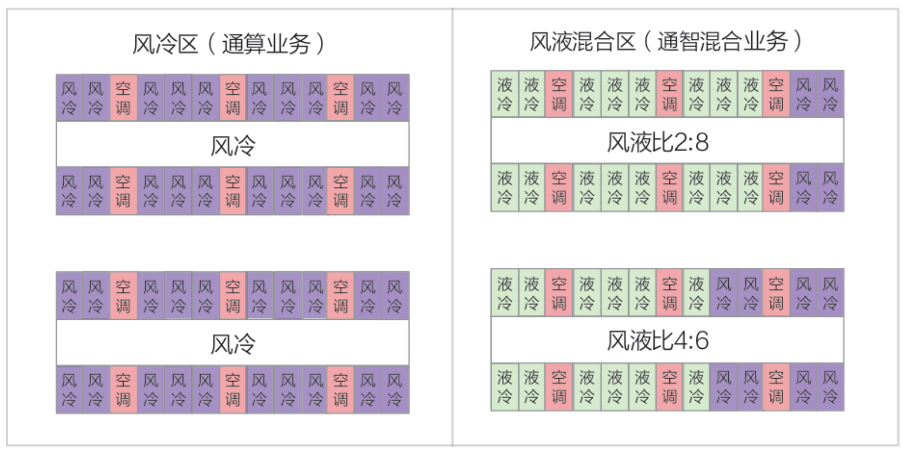
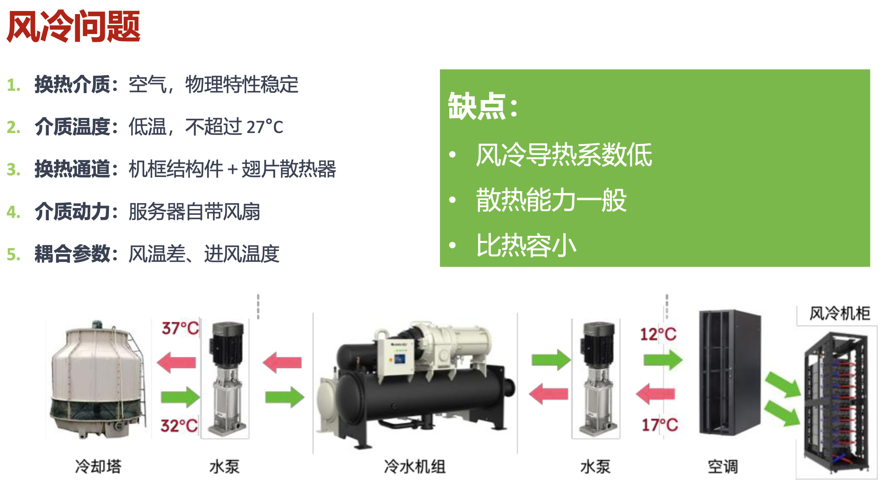
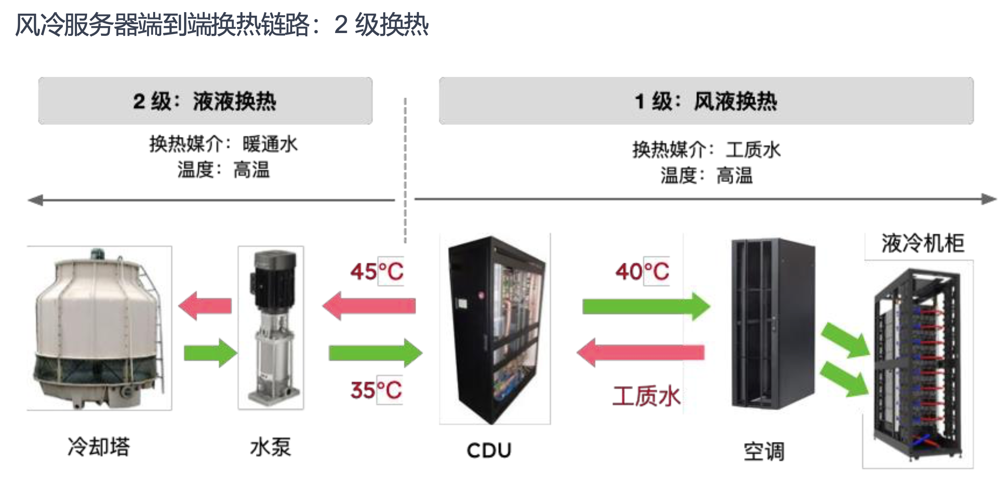
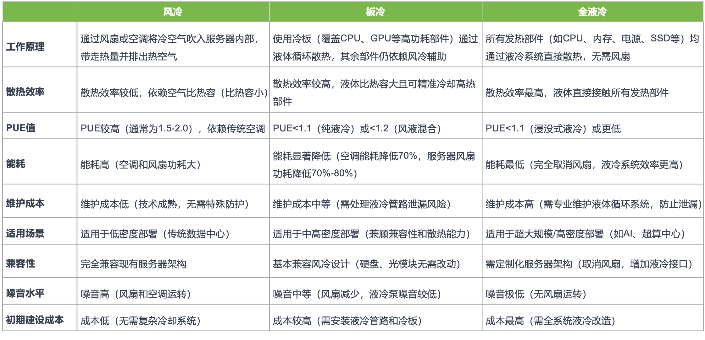
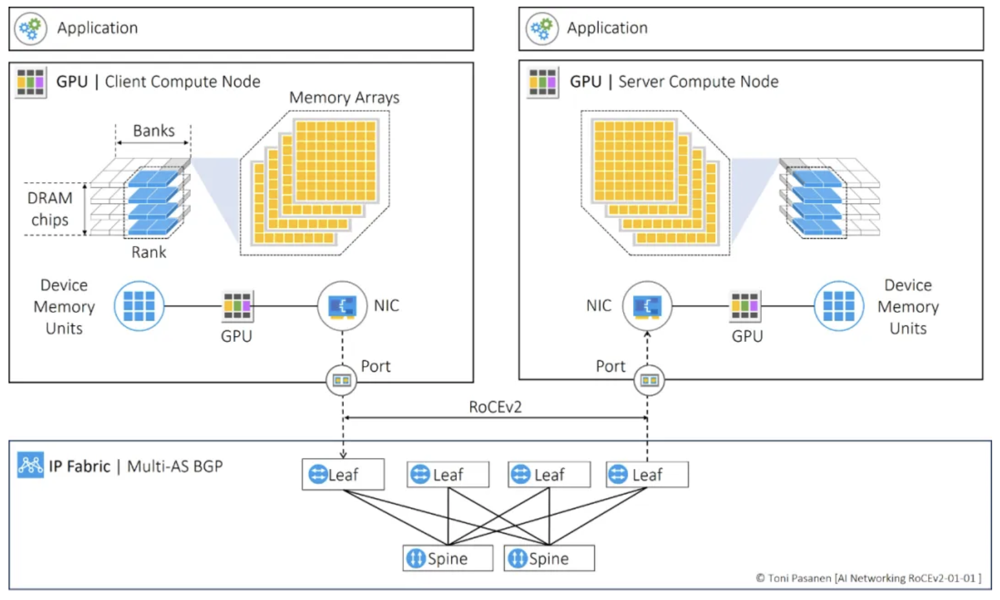
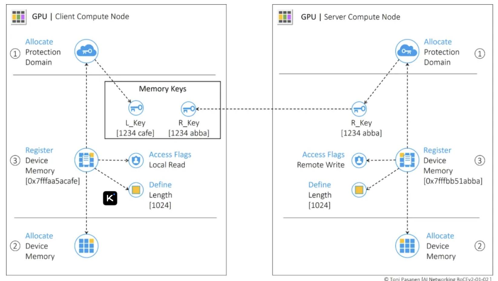
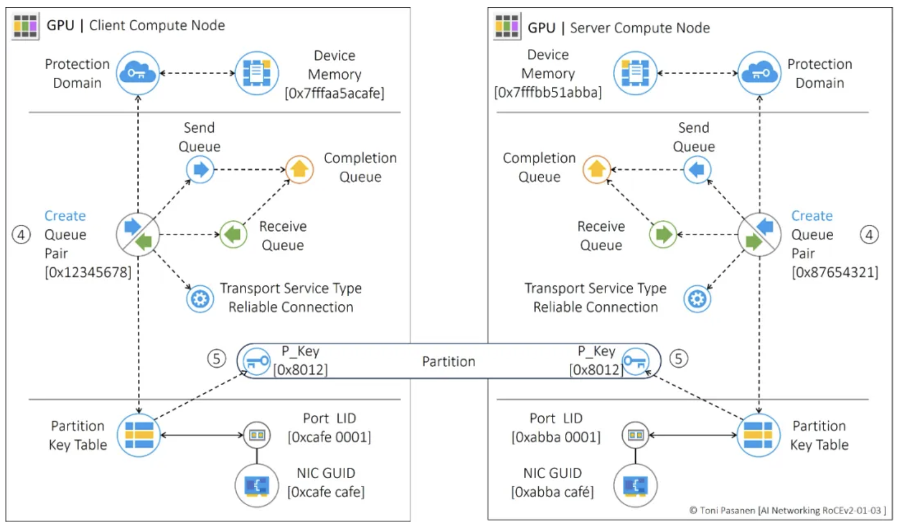
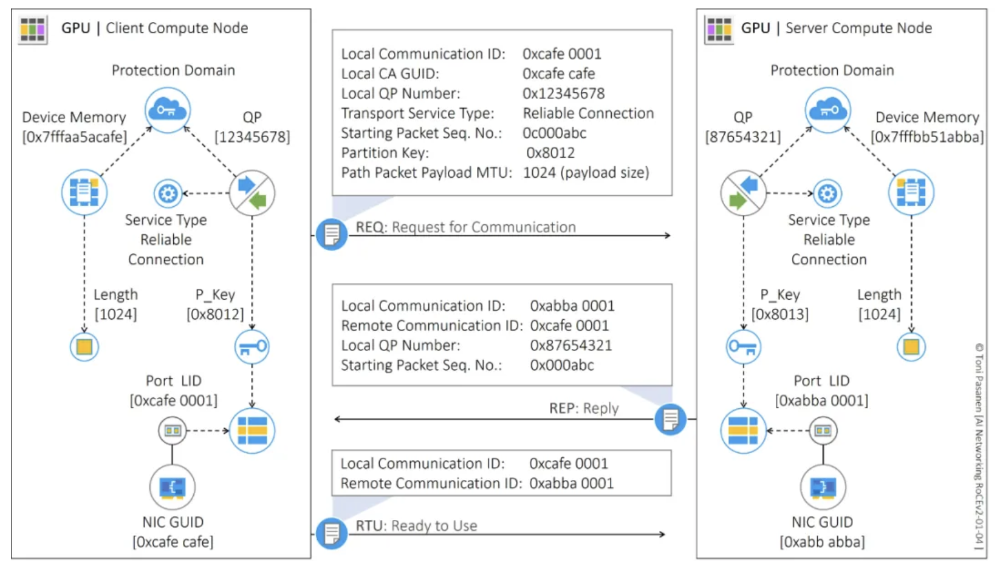
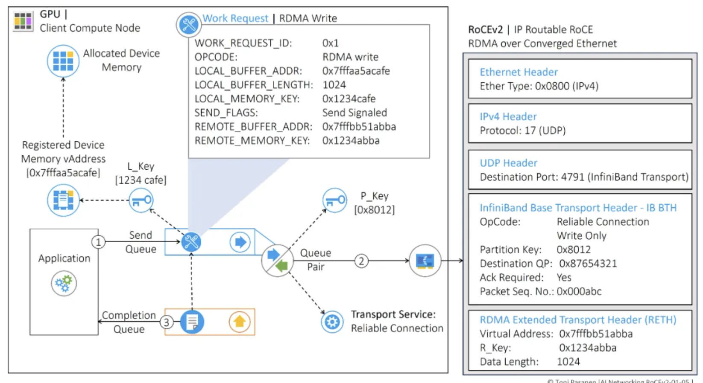

# 模块一：集群与网络架构

## 1. 为什么需要智算集群

AI 大模型的运行离不开强大算力的支撑，这种算力的实现高度依赖于由众多处理器互联而成的 AI 算力集群。如何处理和建设更大规模，更稳定的 AI 计算集群，是当今 AI 建设的一个关键。

我们来看几个例子：

2018 年的 BERT 模型，模型参数约 **3.4亿** 参数 (Base)，数据规模约**16GB** 文本，单卡训练时间耗时数天。

2019 年的 GPT-2 模型，模型参数约 **15亿** 参数 (最大版本), 数据规模约 约 **40GB** 互联网文本，需多卡服务器十几天。

2020 年的 GPT-3 模型，模型参数约 **1750亿** 参数， 约 **45TB，含 **数千亿** Token， 需**数万**张A100 GPU，训练耗时**数月。据估算，用512张V100需约7个月，1024张A100可缩至约1个月

2024 年的 Llama 3.1 模型，模型参数 4050 亿参数，消耗 **约3.67万亿** Token，需要数千至上万张GPU组成的集群进行训练。

2025 年的 盘古 Ultra MoE 模型，模型参数 **7180亿** 参数，超过 **18TB** 训练数据，在**万卡级**昇腾集群上训练。

从上面的数据可以看出：

1. **计算需求呈指数级爆发**：模型参数和数据规模从**亿级、GB级**跃升至**千亿/万亿级、TB级**。这意味着计算量（FLOPs）爆炸式增长。
2. **训练范式从“单机”到“超大规模分布式”**：早期模型可在一台服务器内完成，而GPT-3开启了必须依赖大规模数据中心集群的时代。如今，没有万卡级别的并行计算，训练万亿模型是不可想象的。
3. **目标从“能跑起来”到“高效利用”**：随着集群规模扩大，核心挑战从提供算力，变为**如何高效利用算力**（如提升MFU利用率，以及如何克服跨节点通信、故障率高等系统性难题。

从我们的角度来看，智算集群最大的需求就是如何高效利用：那么什么样的情况下是高效利用呢？

> 1.如何计算模型显存占用量：
>
> 模型显存占用量主要包括参数，梯度，优化器状态几部分：0.34 * 4 * 4 = 5.44 G
>
> 2.什么是算力，如何衡量集群的算力大小：
>
> 算力水平用单位 FLOPS(Floating point Operations Per Second)每秒浮点计算次数来衡量。
>
> **`算力 = 核心频率 × 核心数量 × 每周期可执行的浮点运算次数`**
>
> 例如：A100 GPU (FP16 Tensor Core): 1.41GHz × 6912核心 × (512 FLOPs/核心/周期) ≈ **312 TFLOPS**。
>
> **`集群峰值算力 = 单卡峰值算力 × 卡数`**。
> 例如：1024张A100 (FP16)集群：312 TFLOPS × 1024 ≈ **319 PFLOPS**。
>
> 为了量化集群的效率，业界使用 **MFU** 指标：
> **`MFU = 实测有效算力 / 集群理论峰值算力`**
> 在上述GPT-3例子中，MFU = 121 PFLOPS / 319 PFLOPS ≈ **38%**。这意味着，尽管集群拥有319 PFLOPS的“容量”，但受限于通信、内存、流水线气泡等问题，实际只有约38%的算力被有效用于模型计算。**提升MFU正是大规模智算集群设计与优化的核心目标。

### 实验一：模型测试

1. 测试显存占用是否符合预估

```

# pip install transformers torch
# pip install huggingface_hub
# huggingface-cli download --resume-download gpt2 --local-dir ./gpt2-model
# local_model_path = "./models/gpt2"
import os
os.environ['HF_ENDPOINT'] = 'https://hf-mirror.com'
from transformers import AutoModelForCausalLM, AutoTokenizer
import torch

# 1. 指定模型并自动下载（国内可使用镜像）
model_name = "gpt2"  # 可选 "gpt2-medium", "gpt2-large", "gpt2-xl"
tokenizer = AutoTokenizer.from_pretrained(model_name)
model = AutoModelForCausalLM.from_pretrained(model_name)

# 2. 处理输入并生成文本
prompt = "The meaning of life is"
inputs = tokenizer.encode(prompt, return_tensors="pt")

# 3. 模型推理（禁用梯度计算以节省内存）
with torch.no_grad():
    outputs = model.generate(inputs, max_length=50, num_return_sequences=1)

# 4. 解码并输出结果
generated_text = tokenizer.decode(outputs[0], skip_special_tokens=True)
print(generated_text)
```

通过运行上述代码，观察显存的占用情况是否符合自己的预估，为什么？


| 模型             | 参数量 | FP32显存   | FP16显存   | 适用显卡          |
| ---------------- | ------ | ---------- | ---------- | ----------------- |
| **gpt2** (small) | 124M   | 600-700 MB | 300-400 MB | GTX 1060 6G以上   |
| **gpt2-medium**  | 355M   | 1.4-1.6 GB | 700-800 MB | RTX 2060 8G以上   |
| **gpt2-large**   | 774M   | 3.0-3.2 GB | 1.5-1.6 GB | RTX 3070 8G以上   |
| **gpt2-xl**      | 1.5B   | 6.0-6.5 GB | 3.0-3.3 GB | RTX 3090 24G/4090 |

## 2. 智算集群的发展方向

随着SOTA大模型训练算力起点从千卡向万卡乃至更大规模演进，能源逐渐成为大模型发展遇到的主要瓶颈，在算力资源和电力资源的双重限制下，未来大模型的军备竞赛将会从“算力之争”演变为“效率之争”，优化算力供给结构，发展具有高算效、高能效、可持续、可获得、可评估五大特征的高质量算力已经成为当务之急。

## 2.1 分离到统一

在算力生产环节，算力和显存带宽的设计失衡往往是导致算力效率损失的主要因素。因此，芯片“算力-显存”协同设计至关重要，需要以算力效率为目标来平衡芯片的计算能力和显存的运载能力，避免显存带宽约束下的巨大算力损失。

**核心挑战的根源**在于传统“CPU+GPU”服务器的扩展存在根本性极限。当集群规模从千卡膨胀至万卡时，跨服务器间的通信开销呈指数级增长，导致“墙效应”——计算能力的增长被通信延迟和带宽瓶颈所“阻隔”，集群的实际有效算力利用率（MFU）会急剧下降。一个万卡集群如果协同效率低下，其整体算力可能远不如一个五千卡但高度协同的集群。

为突破此瓶颈，**“异构超节点”** 策略正成为架构演进的核心，即 Scale-up 而非 Scale-out。例如 NV 的 NVL-72和华为的 Cloud-Metric 384。

### 2.2 **网络互联**革命

在算力聚合环节，通过“算力-互联”协同设计和“算力-网络”协同设计，采用高、低速域分层互联架构，为芯片匹配合适的片间互联和节点间互联带宽，解决通信性能瓶颈，可以进一步提升芯片在实际业务模型下的MFU，提升集群层面投资回报率。

万卡集群通信易产生瓶颈与拥塞，网络延迟和带宽限制严重拖累训练效率。

**提升互联带宽**：采用**硅光共封装 (CPO)** 等技术，延长高速信号传输距离，降低延迟采用**硅光共封装 (CPO)** 等技术，延长高速信号传输距离，降低延迟。

**实现网内计算**：在交换机芯片内置集合通信引擎，使数据在传输过程中即可完成计算，大幅减少通信开销。

**采用无损网络技术**：基于RoCEv2等协议，结合智能拥塞控制算法，实现接近零丢包的高效通信。

### 2.3 **软件与调度智能化**

在算力调度环节，通过全面的监控指标和异常检测快速定位软硬件故障，通过断点续训、故障容错等机制快速恢复训练，实现大模型长时间稳定训练，以此提升集群算力整体利用率，降低大模型整体训练成本。

大规模分布式训练的软件栈复杂，资源调度和故障恢复难度大，影响整体利用率。

**AI驱动的智能调度**：利用强化学习等技术，综合考虑作业完成时间、能耗成本，实现动态最优调度。
**云原生与Serverless化**：用户只需提交容器化任务，平台自动分配和回收海量资源，大幅降低使用门槛和总拥有成本[。
**故障预测与自愈**：利用AI对硬件进行健康预测，提前干预，减少训练中断。

### 2.4 绿色可持续

智算集群功率密度激增，能耗和散热成本已成为主要运营支出和制约因素。

**液冷技术普及**：**冷板式**和**浸没式**液冷能效高，可支持单柜百千瓦以上功率密度，从“可选”变为“必选”。
**算电协同**：让算力负载主动匹配电力供应，如在电价低或绿电充足时加大计算，实现能源与算力的双向优化。
**余热回收**：将计算产生的废热用于建筑供暖等，创造经济价值。

## 3. 智算集群与传统数据中心的对比

HPC 的发展历程与趋势：处理器从 CPU 主导转向异构计算（GPU/ARM/ 国产芯片崛起），网络从以太网与专有网络进化到 InfiniBand/RoCE/ 光互连，存储经历 HDD 到 SSD 的迭代并向 SCM/HBM/ 存算一体突破，服务器则从性能导向转向绿色化（液冷）与模块化。整体来看，HPC 硬件始终围绕 “性能提升、能效优化、场景适配” 演进，未来将进一步通过技术融合（如 Chiplet、存算一体）与国产化替代，支撑 AI、超算等领域的算力需求。


| 对比维度     | **传统数据中心**                                  | **智算中心**                                                 |
| ------------ | ------------------------------------------------- | ------------------------------------------------------------ |
| **核心任务** | **通用计算**：数据处理、Web服务、数据库、企业应用 | **智能计算**：大规模AI模型训练、海量数据推理                 |
| **计算范式** | **多任务、离散型**                                | **单任务、密集型、大规模并行**                               |
| **架构核心** | **以CPU为中心**                                   | **以AI加速器为中心**                                         |
| **存储范式** | **存算分离**，强调数据的持久化与共享              | **存算协同/近存计算**，强调数据向计算单元的高速供给          |
| **网络范式** | 面向**南北向流量**，关注对外服务带宽与可靠性      | 面向**东西向流量**，追求**内部超低延迟、超高带宽与无损通信** |
| **关键挑战** | 数据安全、业务连续性、弹性资源分配                | **大规模并行效率、通信瓶颈、极致能效**                       |
| **散热方式** | **风冷**为主                                      | **液冷**为主（冷板式/浸没式）                                |
| **核心度量** | **可用性、可靠性**                                | **有效算力利用率**、**MFU**、**单位算力成本/能耗**           |

## 4.基于 NV 的集群基础建设

为什么AI集群基建是一场革命？

传统数据中心以 **“通用计算”** 为核心，而AI集群是 **“大规模并行计算”** 的产物。这种根本性差异，驱动了基础设施的全面变革。

1. **算力密度指数级增长**：
   * **过去**：一个机柜主要装CPU服务器，功率密度在5-10kW。
   * **现在**：一台8卡GPU服务器的峰值功耗就超过10kW。一个装满此类服务器的机柜，功率密度轻松突破**50kW**，甚至向**100kW**迈进。
2. **互联需求成为生命线**：
   * AI训练（如万卡集群）不是单台服务器的战斗，而是数千张GPU的协同作战。GPU间通信延迟和带宽直接决定了训练效率。因此，**网络从“连接”变为“总线”**，需要超低延迟、超高带宽的InfiniBand或RoCEv2网络，并采用**胖树**或**超立方**等无损网络拓扑。
3. **能效即成本，成本即竞争力**：
   * 一个100MW的AI数据中心，PUE（电能使用效率）每降低0.1，每年可节省数百万至数千万美元的电费，并释放出宝贵的电力容量用于计算。因此，**散热技术从“成本中心”变为“战略核心”**。

### 4.1 服务器

现代AI服务器设计哲学是 **“围绕GPU设计一切”**。CPU沦为“管理员”和“调度员”，负责数据加载、任务调度；GPU/NPU是“工人”，负责核心张量计算。我们先来看看 CPU 与 GPU 服务器有什么区别：

#### 4.1.1 通用服务器

通用服务器的"单节点形态"围绕实用性与扩展性设计：

**尺寸与 CPU 配置**："1U 2 路"是其主要标识——"1U"指服务器高度（1U = 4.445 cm），适配标准机柜，节省空间；"2 路"表示节点内搭载 2 颗 CPU（如 AMD EPYC 9004 系列），满足多任务并发处理需求，避免单 CPU 算力瓶颈。

**存储配置方案**：

1. **混合存储方案**：4×3.5 英寸硬盘（大容量、低成本，适合冷数据存储）+ 2×E1.S 硬盘（高密度、中速，适合热数据存储）+ 2×M.2 硬盘（高速、小容量，用于安装操作系统与核心应用），兼顾容量、速度与成本，适用于企业级通用场景
2. **高容量存储方案**：10×2.5 英寸硬盘，通过增加硬盘数量提升总存储容量，同时减小节点内部空间占用，适合数据备份、文件存储等对容量需求极高的场景


| 编号 | 部件名称        | 技术功能与协同作用                                                                                                                                                              |
| ---- | --------------- | ------------------------------------------------------------------------------------------------------------------------------------------------------------------------------- |
| 2    | 电源模块（PSU） | 提供稳定直流供电，采用冗余设计（如 1+1 冗余），当某一电源故障时另一电源可无缝接管，避免节点宕机，保障业务连续性；电源模块需适配节点总功耗（300-500W），防止功率不足导致性能降频 |
| 5    | PCIe Riser 模组 | 作为 PCIe 插槽的扩展桥梁，将主板上的 PCIe 通道延伸至极节点外部，支持外接网卡、RAID 卡等扩展设备，提升服务器功能扩展性                                                           |
| 8    | NIC 网卡模组    | 实现服务器与网络的连接，通常支持 10Gb/s 或 25Gb/s 速率，满足传统场景下的数据传输需求；部分高端型号支持 100Gb/s，适配高速局域网环境                                              |
| 15   | 主板            | 服务器的硬件骨架，连接 CPU、内存、硬盘、电源等所有部件，其设计需兼顾信号完整性与散热布局，确保各部件协同运行                                                                    |
| 16   | 内存            | 临时存储 CPU 运算所需的数据与指令，最大支持 极 24 条 DDR5 内存，DDR5 相比 DDR4 速率更高（最高 6400 MT/s），且支持 ECC 错误校验，提升数据可靠性                                  |
| 19   | CPU 处理器      | 通用服务器的计算核心，文档重点提及 AMD EPYC 9004 系列，该系列支持最多 96 个核心，具备强大的多线程处理能力，可同时运行多个并发任务                                               |
| 25   | 风扇模块        | 采用风冷散热，通过"前进后出"的固定风道将发热部件的热量排出节点；支持智能调速，根据硬件温度自动调整转速，平衡散热效率与能耗                                                      |


#### 4.1.2 NV GPU 型 AI 服务器

该 AI 服务器采用"4U 机架式"设计（高度约 17.78 cm），更大的内部空间用于容纳更多 GPU 与散热组件：

* **核心硬件配置**：
  * CPU：2 颗 AMD EPYC 900 极 4/9005 系列处理器，负责任务调度、数据预处理与 GPU 协同管理
  * GPU：8 张 NVIDIA HGX H100，基于 Hopper 架构，支持 FP8 精度计算，单卡 FP8 算力达 200 PFlops，8 张总算力 1.6 PFlops
  * GPU 互联：通过 NVIDIA NVLink 与 NVSwitch 实现 GPU 间高速通信，总带宽 900 GB/s
  * 内存与存储：12 通道 DDR5 RDIMM（最大 1.5 TB），8×2.5 英寸 Gen5 NVMe 热插拔硬盘（单盘速率 7.4 GB/s）
  * 电源：5+1 冗余 3000W 电源（80 PLUS Titanium 认证），总功率 15000W，满足高功耗需求

NV GPU 型 AI 服务器的物理结构以"最大化 GPU 性能"为核心，各部件功能与协同逻辑如下：


| 编号 | 部件名称        | 技术功能与协同作用                                                                                  |
| ---- | --------------- | --------------------------------------------------------------------------------------------------- |
| 6    | 系统风扇模组    | 负责 CPU、内存、硬盘的散热，采用分区散热设计，避免热气流干扰；支持温度联动调速                      |
| 8    | PCIe Switch 板  | 作为 CPU 与 GPU 的数据桥梁，采用 PEX89104 型号（支持 PCIe 5.0），将 CPU 的 PCIe 通道分配给 8 张 GPU |
| 9    | 散热器 & CPU    | CPU 散热器采用热管+大面积鳍片设计，应对高功耗；CPU 负责调度 GPU 任务                                |
| 10   | 内存            | DDR5 RDIMM 支持 ECC 校验，避免训练中断；通过 Infinity Fabric 总线与 CPU 连接                        |
| 14   | NVIDIA HGX H100 | 算力核心，单卡集成 4 个 GPU 芯片，8 张 HGX H100 通过 NVLink 组成 GPU 集群                           |
| 15   | DPU             | 数据处理单元，卸载 CPU 的网络任务，支持 RDMA，降低分布式训练延迟                                    |
| 18   | NIC 模组        | 支持 2×10Gb/s 或 2×25Gb/s 速率，用于连接存储集群与前端应用                                        |
| 22   | 风扇模组        | GPU 专属散热风扇，采用下吹式风道，确保 GPU 温度低于 85℃                                            |

逻辑结构体现了"CPU-GPU-DPU"的数据流关系：CPU 通过 PCIe Switch 将训练任务分配给 GPU，GPU 间通过 NVLink 同步参数，DP 极 U 负责节点极间通信与网络任务卸载。文档明确其核心支持能力包括 NVIDIA HGX H100 8-GPU、双 AMD EPYC 处理器、12 通道 DDR5 内存、8×NVMe 硬盘及冗余电源设计。

### 4.1.3 通用 vs AI 服务器

**通用服务器**采用同构架构，以 CPU 为核心，强调计算、存储与网络的均衡能力，适用于 Web 服务、数据库等传统业务场景。其设计注重扩展性、散热与运维便利性

**AI 服务器**采用异构架构，融合 CPU 与 GPU/NPU，突出并行计算与高吞吐数据访问能力，专为大模型训练与推理设计。其硬件配置针对高性能计算优化，依赖高速互联与先进散热技术保障稳定运行

两类服务器在 AI 基础设施中各有定位：通用服务器支撑系统基础服务与数据管理，AI 服务器提供核心算力。未来随着大模型复杂度提升，AI 服务器将进一步向高集成度、高能效与规模化集群方向发展，推动 AI 基础设施的整体演进。

> * **拓扑与互联**：
>   * **机内互联**：通过**NVLink**（NVIDIA私有，带宽达900GB/s+）或**xGMI**（AMD私有）实现GPU间全互联，构成一个超强的计算单元。
>   * **机外互联**：通过**PCIe Switch**或**自定义ASIC**（如NVIDIA的NVSwitch芯片）扩展机内GPU数量，再通过**高速网卡**（NIC/DPU）接入集群网络。
> * **形态演进**：
>   * **通用GPU服务器**：标准2U/4U机架式。
>   * **高密度服务器**：如DGX H100，8卡一体，内部采用NVLink全互联，像一个“超级计算机节点”。
>   * **整机柜设计**：如OCP的HGX参考设计，将多个GPU主板、交换机和电源集中在一个机柜内，最大化密度和互联效率，减少线缆。

### 4.2 风冷 vs 液冷









AI负载是动态的，不同的训练任务功耗差异巨大。需要智能的**电力与冷却容量管理软件**，实时监测机柜、机房、园区各级的可用容量，实现资源的动态分配和超卖，最大化基础设施利用率。

运维工程师需要理解液冷系统原理、能处理泄漏应急预案、能看懂流量和热阻曲线。通过分析冷却液的电导率变化、CDU泵的振动数据、服务器进水/回水温差趋势，提前预判故障。

## 5. 大模型训练对基础设施的要求

业界先进的（State-Of-The-Art，SOTA）模型参数规模和数据规模仍在持续增长，巨头之争已经从千亿模型向万亿模型发展，GPT-4模型具有1.8万亿参数，在约 13万亿个Token上进行了训练，算力需求大约为2.15e25 FLOPS，相当于在大约2.5万张A100加速卡上运行90\~100天^[10]^。为此，领先的科技公司正在加速算力基础设施建设，Meta在原有1.6万张A100卡集群基础上又建设两个具有约2.5万张H100加速卡集群，用来加速LLaMA3的训练；Google建设了具有2.6万张H100加速卡的A3人工智能超级计算机，可以提供26 ExaFLOPS的人工智能性能，Microsoft和OpenAI正在为GPT-6训练构建具有10万张H100加速卡集群，并规划具有数百万张卡的“星际之门”人工智能超算^[11]^。由此可见，万卡已经成为未来先进大模型训练的新起点。


随着算力需求持续增加、算力规模持续扩大，算力利用效率问题日益凸显。据公开报道，GPT-4训练的MFU在32%\~36%之间，其根本原因是显存带宽限制了芯片算力的发挥，即“内存墙”（Memory Wall）问题。

NVIDIA从V100开始，在每一代芯片中间都会有一次显存升级，以A100为例，首发版本采用40 G HBM2显存，带宽最高1 555 GB/s，升级版本采用80 G HBM2，带宽提升至2 039 GB/s。

但对比 SOTA 模型所需求的存储资源来说只能是九牛一毛，所以就依赖于低精度和卡间互联带宽、节点间互联带宽来缓解这个问题。

从应用层面来看，大模型训练往往需要通过有机的组合多种分布式策略，来有效地缓解LLM训练过程中的硬件限制。对于基于Transformer架构的模型来说，常用的分布式策略包括数据并行、张量并行和流水线并行。

从硬件层面来看，互联的设计一方面需要满足算力高效扩展的需求，另一方面还要匹配并行训练集合通信对互联拓扑的要求。互联设计可以按尺度分为片上互联、片间互联和节点间互联。

片上互联物理尺度最小、技术难度较高，需要采用芯粒（Chiplet）技术将多个Chiplet进行合封并建立超高速互联链路，NVIDIA在尽可能做大单晶粒面积的基础上，通过更先进的基片上芯片（Chip on Wafer on Substrate，CoWoS）工艺将两个晶粒整合到一个封装当中，之间通过10 TB/s NVLink进行互联，使得两个芯片可以作为一个统一计算设备架构（Compute Unified Device Architecture，CUDA）在GPU运行。

相比片上互联，片间互联的技术成熟度更高、可获得性更优，通常这部分互联发生在单一节点或超节点内部，旨在构建多卡之间超高带宽、超低延迟的计算域，来满足张量并行、专家并行和序列并行极高的通信需求。目前，已经有NVLink、PCIe、RoCE（RDMA over Converged Ethernet）以及诸多私有互联方案。

节点间横向扩展（Scale-out）互联作用主要是为参数面网络中流水线并行和数据并行提供足够通信带宽，通常采用Infiniband或RoCE组成胖树（Fat-Tree）无阻塞网络架构，二者都能够通过多层组网实现千卡乃至万卡级集群互联，比如采用64端口交换机，通过3层Fat-Tree无阻塞组网理论上可以构建约6.6万卡集群，采用128端口交换机理论上可以构建约52.4万卡集群。

## 6. NV 网络关键技术

IB 最初由 Intel、IBM、Compaq 等巨头联合发起，目标是取代服务器内部陈旧的 PCI 总线，解决 I/O 瓶颈。随着以太网和 PCI-X 的进步，IB 没能占领 PC 市场，但在超级计算机领域找到了归宿。经过多年整合，目前 **NVIDIA (收购了 Mellanox)** 是 IB 市场绝对的主导者。IB 已经从一种总线技术进化为顶级的 AI 互联网络协议。

2010年，为了让 RDMA 跑在廉价的以太网上，IBTA 组织发布了 RoCE。但 v1 只能在二层网络（同一交换机下）传输，无法跨网段，限制了规模。引入了 **UDP/IP 封装**。这意味着 RDMA 数据包可以像普通上网流量一样被路由器转发，具备了三层路由能力，从此在大规模云数据中心爆火。

### 6.1 IB 与 RoCE 性能对比与选型依据

IB 采用基于 **Credit（信誉/令牌）** 的机制。接收端有多少缓存，就发多少令牌给发送端，没令牌就不能发。IB 交换机是专门设计的（Cut-through 模式），不跑复杂的以太网协议，直接在硬件层完成极速转发。

RoCEv2 它将 RDMA 数据塞进 UDP 报文里。对交换机来说，它看起来就像普通的互联网流量。以太网本质是“尽力而为”的（丢包很常见）。为了跑 RDMA，必须配置 **PFC (优先流量控制)** 和 **ECN (显式拥塞通知)**。


| 性能指标**         | **InfiniBand (IB)**                                    | **RoCE v2**                                                    |
| ------------------ | ------------------------------------------------------ | -------------------------------------------------------------- |
| **延迟 (Latency)** | **极致极低**(1\$\\mu s\$ 以内)。硬件直发，几乎无抖动。 | **较低**(3-10\$\\mu s\$)。经过 UDP 协议栈封装，有微小开销。    |
| **可靠性**         | **原生无损**。物理层保证不丢包。                       | **配置无损**。依赖复杂的交换机调优，配置不当极易丢包。         |
| **带宽效率**       | 极高。几乎没有无效载荷开销。                           | 较高。但在大规模并发时，由于拥塞控制机制，有效吞吐会有所下降。 |
| **可扩展性**       | **中大规模**。受限于子网管理器 (SM) 的集中性能。       | **超大规模**。借力 BGP 等成熟路由协议，可支撑 10 万卡集群。    |

* 英伟达 (NVIDIA)： 如果你买的是 **DGX/HGX 原厂服务器**，默认推荐依然是 **InfiniBand**。
  * 但英伟达推出了 **Spectrum-X** 平台，专门优化了以太网 (RoCE) 用于 AI 训练。对于不想被 IB 锁定的云厂商，英伟达现在也卖 RoCE 方案。
* **非英伟达 GPU (AMD/Intel/国产 GPU)：**
  * **AMD (MI300/MI325X)** 和 **Intel (Gaudi 3)** 的集群几乎**清一色选择 RoCE (以太网)**。
  * 原因：这些厂商没有 IB 技术的控制权（IB 几乎等同于英伟达），他们必须通过 **UEC (超以太网联盟)** 来对抗英伟达的 IB 壁垒。
* **超大规模头部厂商 (Meta, Google, Microsoft)：**
  * **Meta** 的 Llama 3 训练集群就大量使用了 **RoCE (以太网)**。对于万卡、十万卡级别的超大规模集群，以太网的路由扩展性和多供应商选择优势超过了 IB 的极低延迟优势。

你可以根据以下三个维度来做最终决定：

##### 1. 看你的 GPU 品牌

* **NVIDIA GPU (H100/B200):** 如果你追求**稳**，且预算不敏感，首选 **IB**。如果你是大型云服务商，想控制成本，选 **RoCE (Spectrum-X)**。
* **AMD/国产 GPU:** 基本不用纠结，直接选 **RoCE**。

##### 2. 看集群的规模

* **小于 1,024 张卡：** 选 **IB**。在这个规模下，IB 的稳定性和易用性能节省大量人工调优成本。
* **大于 10,000 张卡：** 选 **RoCE**。以太网在超大规模网络下的故障隔离和路由能力更强。

##### 3. 看团队的运维能力

* 如果你没有专门的网络优化团队，**千万别碰 RoCE**。RoCE 一旦发生网络拥塞导致丢包，AI 训练任务会频繁崩溃（CheckPoint 失败），损失的工时费可能比省下的硬件费还要多。

### 6.2 RDMA技术原理


先看看最常见的 Kernel TCP，其收数据的流程主要要经过以下阶段：

1. 网卡驱动从内核分配 dma buffer，填入收队列
2. 网卡收到数据包，发起 DMA，写入收队列中的 dma buffer
3. 网卡产生中断
4. 网卡驱动查看收队列，取出 dma buffer，交给协议栈
5. 协议栈处理报文
6. 操作系统通知用户态程序有可读事件
7. 用户态程序准备 buffer，发起系统调用
8. 内核拷贝数据至用户态程序的 buffer 中
9. 系统调用结束

可以发现，上述流程有**三次上下文切换**（中断上下文切换、用户态与内核态上下文切换），有**一次内存拷贝**。虽然内核有一些优化手段，比如通过 NAPI 机制减少中断数量，但是在高性能场景下， Kernel TCP 的延迟和吞吐的表现依然不佳。

使用 RDMA 技术后，收数据的主要流程变为（以send/recv为例）：

1. 用户态程序分配 buffer，填入收队列
2. 网卡收到数据包，发起 DMA，写入收队列中的 buffer
3. 网卡产生完成事件（可以不产生中断）
4. 用户态程序 polling 完成事件
5. 用户态程序处理 buffer

上述流程**没有上下文切换，没有数据拷贝，没有协议栈的处理逻辑**（卸载到了RDMA网卡内），也没有内核的参与。CPU 可以专注处理数据和业务逻辑，不用花大量的 cycles 去处理协议栈和内存拷贝。

这是 RDMA 性能远超传统 TCP/IP 的根本原因：

1. **零拷贝 (Zero Copy)**：
   * **传统方式**：数据需要在“应用程序缓存 **\$\\leftrightarrow\$** 内核协议栈缓存 **\$\\leftrightarrow\$** 网卡缓存”之间多次搬运。
   * **RDMA 方式**：网卡直接从应用程序内存读取数据发送，或将接收到的数据直接写入目标应用的内存，完全跳过内核中间缓存。
2. **内核旁路 (Kernel Bypass)**：
   * **传统方式**：每次发送数据都要发起“系统调用”进入内核态，产生昂贵的 CPU 上下文切换开销。
   * **RDMA 方式**：应用程序在用户态直接控制网卡。由于省去了内核调度，延迟从几十微秒缩短到 1 微秒级。
3. **协议栈卸载 (Protocol Offload)**：
   * **传统方式**：TCP 的封包、解包、校验、重传全靠 CPU 算力。
   * **RDMA 方式**：所有的传输层逻辑（如 IB 或 RoCE 协议栈）都硬化在网卡芯片中。数据传输时不占用 CPU 资源，CPU 只负责任务的初始化。

RDMA 的两种操作模式

这是理解 RDMA 灵活性的关键：

1. **双边操作 (Two-Sided: Send/Receive)**：
   * 类似于传统通信，接收端必须**主动参与**，预先提供一个接收缓存区，才能接收发送端发来的数据。
2. **单边操作 (One-Sided: Read/Write)** —— **RDMA 的灵魂**：
   * **RDMA Write**：发送端直接将数据写入对方内存的指定地址，**对方 CPU 完全无感**，甚至不需要运行任何代码。
   * **RDMA Read**：一端直接从另一端的内存读取数据拿回来。
   * *应用场景*：在 AI 训练中，单边操作极大减少了参数交换时的通信开销。



下面将重点介绍示例应用将数据从客户端计算节点 (CCN) 的设备内存写入服务器计算节点 (SCN) 的设备内存时所涉及的过程，共分为四步：1) 内存分配和注册、2) 创建队列对、3) 连接启动、 4) 从 CCN 和 SCN 的角度进行的写入操作。

#### 6.2.1 **内存分配和注册**

1. **创建保护域**：首先调用`ibv_alloc_pd()`，创建一个**保护域**。PD是RDMA 架构中的**资源隔离容器**，后续创建的所有核心对象（如内存区域、队列对）都必须关联到一个PD，确保访问安全与隔离。
2. **注册内存区域**：接着，通过`ibv_reg_mr()`函数注册一块用户态内存。此操作：

   * **锁定物理页**：防止该内存被交换到磁盘，保证其物理地址固定。
   * **告知网卡**：将这块内存的**物理页映射表**交给RDMA网卡，使网卡能直接进行DMA操作。
   * **设置权限**：明确指定该内存区域的访问权限，例如`IBV_ACCESS_LOCAL_WRITE`（本地写）、`IBV_ACCESS_REMOTE_READ`（远程读）、`IBV_ACCESS_REMOTE_WRITE`（远程写）。
3. **获得内存密钥**：注册成功后，会返回一个`ibv_mr`结构体，其中包含两个关键密钥：

   * **lkey**：**本地密钥**。当本机CPU通过RDMA网卡访问这块已注册内存时使用。
   * **rkey**：**远程密钥**。当远程节点想要对本机的这块内存进行**RDMA Read或Write**操作时，必须在请求中携带此密钥。网卡会验证此密钥，匹配则允许访问。
4. **交换访问参数**：为了让远程节点（CCN）能够向本地节点（SCN）执行RDMA Write，SCN必须通过一条**独立的、可靠的带外通道**（例如传统的TCP Socket），将自己的**内存虚拟地址**、**长度**和最重要的**rkey**发送给CCN。
5. **执行远程操作**：CCN获得地址和rkey后，即可发起单边RDMA Write。其网卡将数据包直接发送到SCN的网卡，SCN网卡验证rkey通过后，**无需SCN的CPU参与**，便将数据直接写入指定内存地址。
6. RDMA单边操作前，必须在远程节点预先注册一块内存，生成远程密钥，并通过独立通道将密钥和内存地址发给发起端。发起端凭此可直接写入，全程无需远程CPU参与。



#### 6.2.2 **创建队列对**

1. **创建核心队列**：
   * **队列对**：通过`ibv_create_qp()`创建。一个QP本质上是**一个通信端点**，包含一个**发送队列**和一个**接收队列**。
   * **完成队列**：通过`ibv_create_cq()`创建。CQ用于异步接收操作完成的通知。发送和接收队列可绑定到同一个或不同的CQ。
   * **关联PD**：创建QP时必须指定**保护域**，确保该通信通道只能访问该PD下的内存资源。
2. **配置QP属性**：
   * **服务类型**：设置为可靠连接，确保消息按序、可靠送达。
   * **队列深度**：定义SQ和RQ中**工作请求**的最大数量，决定了“飞行中”未完成操作的数量。
   * **最大消息大小**：定义单次传输的数据上限。
3. **初始化与分区安全**：
   * **状态机**：QP需经历一系列状态`INIT -> RTR -> RTS`才能通信。`INIT`状态是起点。
   * **分区密钥**：`ibv_modify_qp()`函数在`INIT`状态时，需要从端口查询并设置一个**P\_Key**。P\_Key是子网管理器配置的**网络分区标识符**，只有P\_Key匹配的节点才能通信，提供网络级隔离。
   * **交换连接信息**：CCN和SCN需通过带外方式交换**QP号、端口号、P\_Key、GID**等连接信息，即交换`ibv_qp_attr`中的关键参数。
4. **通信与验证**：
   * 通信建立后，**每个发出的数据包都会携带发送端QP的P\_Key**。
   * 接收端网卡在硬件层面会验证数据包中的P\_Key是否与**目标QP所配置的P\_Key**匹配。不匹配则丢弃，实现硬件级安全隔离。



#### 6.2.3 **RDMA 连接启动**

1. **REQ报文**：由主动方发送，携带了建立连接所需的**所有本地参数**。
   * **寻址信息**：`LID`（本地端口在子网内的短地址）和`GID`（全局唯一IPv6地址），用于在网络上定位对端。
   * **QP核心属性**：本地`QP号`、服务类型（如RC）、`P_Key`。
   * **序列号**：起始`PSN`，用于确保可靠传输中数据包的顺序和完整性。
   * **操作参数**：如`有效负载大小`，用于协商最大传输单元。
2. **REP报文**：由被动方发送，是对REQ的确认。它**回显**了主动方的关键参数，并附上**自己的本地参数**（自己的QP号、PSN等），表示接受连接。
3. **RTU报文**：由主动方发送，是对REP的最终确认。至此，双方就所有通信参数达成一致。
4. **QP状态转换**：此握手过程驱动QP状态机变化：
   * **INIT -> RTR**：收到REP后，被动方QP可转为`RTR`；主动方在发出RTU前，也会将自己QP转为`RTR`。`RTR`表示**QP已准备好接收**来自对端QP的数据包。
   * **RTR -> RTS**：发送/收到RTU后，双方QP转为`RTS`状态。`RTS`表示**QP已准备好发送**数据，至此双向通道完全打通。



#### 6.2.4 **工作请求消息**

1. **创建工作请求**：应用调用Verbs API（如`ibv_post_send`）创建并提交一个`ibv_send_wr`结构体到QP的发送队列。这个WR是驱动硬件的“指令单”，关键字段包括：
   * `wr_id`: 用户定义的标识符，用于在完成时关联请求。
   * `opcode`: 设置为`IBV_WR_RDMA_WRITE`（可能带`IBV_SEND_SIGNALED`标志）。
   * `wr.rdma.remote_addr` 与 `rkey`: **远程内存地址和密钥**，这是单边操作的核心。
   * `sg_list`: 指向一个`ibv_sge`数组，描述**本地数据缓冲区的地址、长度和lkey**。
2. **硬件处理与封包**：网卡HCA的调度器从SQ取走WRE，在硬件层面执行：
   * **DMA读取**：使用`lkey`从本地缓冲区直接读取数据。
   * **构造协议头**：
     * **BTH**：包含目标QP号、操作码(`RDMA Write`)、PSN（数据包序列号）。`AckReq`位在可靠连接中通常置位。
     * **RETH**：包含`remote_addr`、`rkey`和总数据长度。
   * **封装与发送**：将BTH/RETH作为负载，封装在**UDP/IP/以太网**帧中（RoCEv2协议）。目的UDP端口固定为`4791`。
3. **对端处理**：数据包到达SCN的网卡后，网卡进行硬件验证：
   * 检查`P_Key`是否与目标QP的匹配。
   * 使用数据包中的`rkey`验证访问权限。
   * 验证通过后，网卡**直接通过DMA将数据写入`remote_addr`指定的内存**，全程无需SCN的CPU参与。



当 SCN 收到 RDMA 写入消息时，它会检查收到的 P\_Key 并分配入口端口。此外，它还会验证 R\_Key，以确保它与通过管理连接发布到 CCN 的内容相匹配。完成这些验证后，NIC 将虚拟设备内存地址转换为物理内存访问，并将 RDMA 写入信息发送到 QP 的接收队列。最后，一旦 RDMA 写入操作完成，应用程序就会通过完成队列收到作业已完成的通知。

https://cloud.tencent.com/developer/article/2514644

https://blog.csdn.net/qq_41596356/article/details/128150563

### 6.3 NVLink 与 Pcle 拓扑 节点内带宽分析

NVLink 与 Pcle 拓扑 节点内带宽分析


| **技术规格**                    | **单向带宽** | **双向总带宽 (Duplex)** | **相比 PCIe 5.0 的倍数** |
| ------------------------------- | ------------ | ----------------------- | ------------------------ |
| **PCIe 5.0 x16**                | 64 GB/s      | 128 GB/s                | 1x                       |
| **PCIe 6.0 x16**                | 128 GB/s     | 256 GB/s                | 2x                       |
| **NVLink 4.0 (Hopper H100)**    | 450 GB/s     | 900 GB/s                | 7x                       |
| **NVLink 5.0 (Blackwell B200)** | 900 GB/s     | **1.8 TB/s**            | **14x**                  |

节点内的 GPU 如何“排队挂接”直接决定了通信延迟。

PCIe 拓扑：树状/交换机模式

在 PCIe 架构（如 PCIe 版本的 H100/H200）中，GPU 通常通过 **PCIe Switch** 或直接挂在 **CPU** 下。

* **通信瓶颈**：如果两个 GPU 位于不同的 CPU 插槽（Socket）下，数据必须跨越 **QPI/UPI** 总线，这会产生巨大的延迟和严重的带宽削减。
* **P2P 限制**：虽然支持 Peer-to-Peer (P2P)，但路径过长，且容易受到 CPU 负载的影响。
* **适用场景**：AI 推理、单卡任务、显存要求高但通信频率低的业务。

NVLink 拓扑：全互联/NVSwitch 架构

在 SXM 版本的服务器（如 HGX B200）中，所有 GPU 并不直接连 CPU，而是通过 **NVSwitch** 芯片进行“无阻塞”互联。

* **全向互联 (All-to-All)**：节点内的 8 颗 GPU 之间就像连在同一个“超级交换机”上，任意两颗 GPU 之间的通信带宽都是满速的 1.8 TB/s。
* **统一显存池**：支持 **NVLink-Network**，允许 8 颗显存通过高速互联表现得像一颗巨大的显存，支持显存级地址直接映射。
* **适用场景**：大模型预训练、长文本大模型推理、高度并行的科学计算。


| **需求维度**   | **选 NVLink (SXM 版)**      | **选 PCIe (卡槽版)**         |
| -------------- | --------------------------- | ---------------------------- |
| **模型规模**   | 175B 参数以上（LLM 预训练） | 10B 以下或纯推理 (Inference) |
| **训练稳定性** | 极高，硬件级流控            | 一般，受 CPU 状态影响        |
| **服务器成本** | 昂贵 (需专用机箱/散热)      | 较低 (普通服务器可插)        |
| **部署灵活性** | 低，整机采购                | 高，可按需增减显卡数量       |

**核心建议：**

1. 如果是做 **LLM 预训练 (Pre-training)**：NVLink 是强制性的，PCIe 的效率损失会导致训练成本增加数倍。
2. 如果是做 **模型微调 (Fine-tuning)**：如果卡数较少（如 2-4 卡），PCIe 5.0/6.0 配合高性能 CPU 尚可接受。
3. 如果是做 **大规模推理集群**：可以考虑 PCIe 方案以降低 TCO（总拥有成本），因为推理更关注单卡的计算吞吐，而非卡间的频繁通信。

### 6.4 流量与拥塞控制

#### 6.4.1 流量控制：Credit-based

这是 IB 与 RoCE 最核心的区别。RoCE 用 **PFC** 这种“看到堵了才喊停”的机制，而 IB 采用**基于信誉 (Credit-based) 的流控**。

* **原理**：发送端在发包前，必须确认接收端有足够的缓存空间（即拿到“信誉令牌”）。
* **优化点**：由于这是硬件层面的原生机制，**不需要像 RoCE 那样去手动配置复杂的 PFC 阈值**。IB 保证了在任何负载下都不会出现因缓冲区溢出导致的丢包。

#### 6.4.2 拥塞控制：IB-CC (FECN/BECN)

虽然 IB 硬件保证不丢包，但如果大量数据涌向同一个出口，会产生“队首阻塞 (HOL Blocking)”。IB 也有类似 ECN 的机制，称为 **IB-CC**。

* **对应关系**：
  * **FECN (Forward Explicit Congestion Notification)**：交换机发现拥塞时，在数据包头打标记（类似 ECN 标记）。
  * **BECN (Backward Explicit Congestion Notification)**：接收端收到带标记的包后，向发送端发回告警（类似 CNP 包）。
* **配置要点 (CCT 表)**：
  * IB 的发送端维护一张 **CCT (Congestion Control Table)**。
  * **优化逻辑**：你可以调整 **CCTI Increase** (减速步长) 和 **CCTI Timer** (恢复速度)。这决定了网络在遇到拥塞时是“快速剧烈减速”还是“温和缓慢微调”。

#### 6.4.3 动态路径优化：Adaptive Routing (AR)

这是 IB 相比 RoCE 的“杀手锏”优化方案。

* **RoCE 的局限**：通常基于 ECMP（等价多路径），根据 Hash 决定路径。一旦两个大流量 Hash 到同一条路，就会堵死（哈希冲突）。
* **IB AR 优化**：
  * **原理**：交换机会根据下游端口的**实时负载（排队长度）**，动态地为每一个数据包选择最空闲的路径。
  * **配置**：在子网管理器 (SM) 中开启 `adaptive_routing_en`。在万卡集群中，AR 可以让网络利用率从 60% 提升至 **95% 以上**。

#### 6.4.4 子网管理器 (Subnet Manager, SM) 调优

IB 网络的“大脑”是 SM，它的配置直接决定了网络的健壮性。

* **路由算法 (Routing Engine)**：针对不同的拓扑（如 Fat-Tree 或 Torus），需要选择对应的算法（如 `ftree` 或 `updn`）。
* **扫频频率 (Sweep Rate)**：SM 会定期扫描网络拓扑变化。在超大规模集群中，调优扫频频率可以平衡“故障恢复速度”与“网络管理开销”。


| **特性**     | **RoCE (以太网)**                  | **InfiniBand (IB)**                      |
| ------------ | ---------------------------------- | ---------------------------------------- |
| **无损配置** | **极难**(需精调 PFC 阈值/Headroom) | **自动**(硬件级 Credit 流控)             |
| **拥塞响应** | **难**(需调优 ECN Kmin/Kmax)       | **中**(调整 CCTI 参数，通常默认已极佳)   |
| **负载均衡** | **静态**(基于 Hash 的 ECMP)        | **动态**(Adaptive Routing，包级别重路由) |
| **额外加速** | 无                                 | **SHARP**(交换机直接参与 AI 计算)        |

### 实验二：TCP 与 RDMA 性能对比测试

1. 测试 TCP 与 RDMA 性能对比
2. 测量网卡和驱动是否正常工作以及实际的RDMA带宽性能


| 模式      | 对应命令      | 数据流向               | 适用场景         |
| --------- | ------------- | ---------------------- | ---------------- |
| **read**  | `ib_read_bw`  | Client从Server读取数据 | 测试RDMA读取性能 |
| **write** | `ib_write_bw` | Client向Server写入数据 | 测试RDMA写入性能 |
| **send**  | `ib_send_bw`  | Client发送，Server接收 | 测试双向通信性能 |

```
#!/usr/bin/env bash
set -euo pipefail
ROLE="${1:-}"
SERVER_IP="${2:-}"
DURATION="${3:-10}"
SIZE="${4:-1048576}"
OUT="${5:-tcp_vs_rdma.csv}"
usage() { echo "usage: tcp_vs_rdma.sh server|client <server_ip> <duration_sec> <size_bytes> <out_csv>"; exit 1; }
if [ -z "$ROLE" ]; then usage; fi

run_servers() {
  if ! command -v iperf3 >/dev/null 2>&1; then echo "missing: iperf3"; exit 1; fi
  if ! command -v ib_read_bw >/dev/null 2>&1; then echo "missing: ib_read_bw"; exit 1; fi
  iperf3 -s >/dev/null 2>&1 &
  iperf_pid=$!
  ib_read_bw -R -s "$SIZE" -D "$DURATION" >/dev/null 2>&1 &
  rdma_pid=$!
  trap 'kill -9 $iperf_pid $rdma_pid 2>/dev/null || true' EXIT
  echo "servers_started"
  wait
}

to_gbps() {
  bw="$1"; unit="$2"
  if [ "$unit" = "Gbps" ] || [ "$unit" = "Gbits/sec" ]; then awk -v v="$bw" 'BEGIN{printf "%.3f", v+0}'
  elif [ "$unit" = "Mbits/sec" ]; then awk -v v="$bw" 'BEGIN{printf "%.3f", (v+0)/1000.0}'
  elif [ "$unit" = "Mb/s" ] || [ "$unit" = "Mbps" ]; then awk -v v="$bw" 'BEGIN{printf "%.3f", (v+0)/1000.0}'
  else awk -v v="$bw" 'BEGIN{printf "%.3f", v+0}'
  fi
}

run_client() {
  if [ -z "$SERVER_IP" ]; then echo "missing server ip"; exit 1; fi
  if ! command -v iperf3 >/dev/null 2>&1; then echo "missing: iperf3"; exit 1; fi
  if ! command -v ib_read_bw >/dev/null 2>&1; then echo "missing: ib_read_bw"; exit 1; fi
  echo "method,size,avg_bw_Gbps,avg_msg_rate_Mpps" > "$OUT"
  t_out="$(iperf3 -c "$SERVER_IP" -t "$DURATION" 2>&1 || true)"
  t_line="$(echo "$t_out" | grep -E 'sender' | tail -n1 || true)"
  t_bw="$(echo "$t_line" | awk '{print $(NF-2)}')"
  t_unit="$(echo "$t_line" | awk '{print $(NF-1)}')"
  t_gbps="$(to_gbps "${t_bw:-0}" "${t_unit:-Mbits/sec}")"
  echo "TCP,${SIZE},${t_gbps:-0},NA" >> "$OUT"
  r_out="$(ib_read_bw -R -s "$SIZE" -D "$DURATION" "$SERVER_IP" 2>&1 || true)"
  r_bw_line="$(echo "$r_out" | grep -E 'BW average|BW Avg' | tail -n1 || true)"
  r_rate_line="$(echo "$r_out" | grep -E 'MsgRate average|MsgRate Avg' | tail -n1 || true)"
  r_bw="$(echo "$r_bw_line" | awk '{print $(NF-1)}')"
  r_unit="$(echo "$r_bw_line" | awk '{print $NF}')"
  r_gbps="$(to_gbps "${r_bw:-0}" "${r_unit:-Gb/s}")"
  r_mpps="$(echo "$r_rate_line" | awk '{print $(NF-1)}')"
  echo "RDMA,${SIZE},${r_gbps:-0},${r_mpps:-0}" >> "$OUT"
  echo "$OUT"
}

case "$ROLE" in
  server) run_servers ;;
  client) run_client ;;
  *) usage ;;
esac

```
