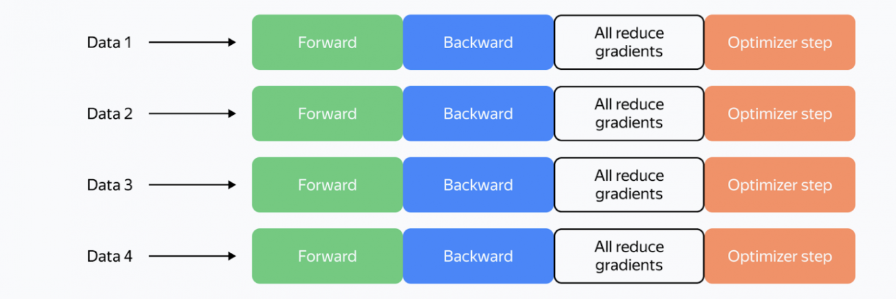
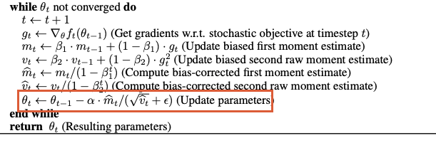
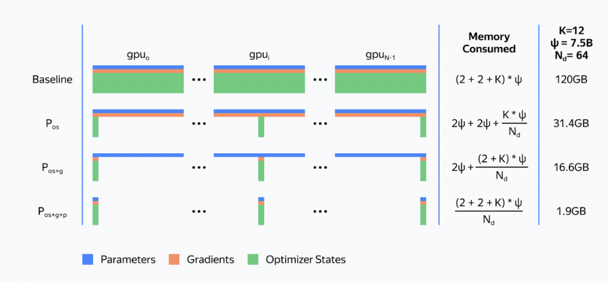
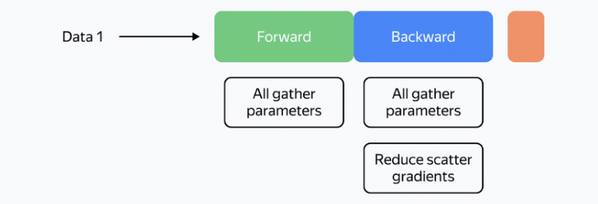

大模型时代，我们一直在做各种各样的并行优化，这些优化无非是在和“时间”赛跑还是在和“空间”赛跑。

当你手中只有一张 GPU 时，训练过程就像一个人的孤独长跑：

1. 对新的数据批次执行网络前向传输，并计算损失。
2. 对误差进行反向传播。
3. 优化器更新优化器状态和模型权重。

但当你拥有了 4 张、8 张甚至成百上千张 GPU 时，比赛规则变了。

从上图可以看到整个过程中，而这个过程就是数据并行，主要有哪些变化：

1. 每个 GPU 卡 仅计算大的批次数据中的一部分。（同时处理的数据量变为原来的 4 倍）
2. 在反向传播后需要进行一次梯度平均，保证所有卡训练更新的方向是一致的， 一般采用 allreduce 进行计算。

> 为什么这里要做梯度平均呢？**分布式训练的目标是“加速”，而不是“改变结果”。** 理想情况下，4 张卡并行训练 1 步的结果，应该和单张大显卡跑一个超大批次（Batch）的结果在数学上是**完全等价**的。就好像一个人的工作，我们拆分为 4 个人一起干，由于数据分布的随机性，显卡 A 可能觉得权重应该往左调，显卡 B 觉得该往右调。求平均值的过程，实际上是在做“共识决策”，使得他们工作的还是一个模型，干的还是一个方向。

## 1. 分布式数据并行 (DDP)

数据并行的前提是模型能够“塞进”显存，但训练数据量巨大。如果你的深度学习模型（包括权重、梯度和优化器状态）可以完整地放置在单张显卡的显存中，但你的数据集（如 ImageNet 或大规模语料库）有数百万甚至数亿条记录，单卡训练速度太慢，这时就该使用数据并行。

在数据并行中，每一个设备都拥有整个模型的副本，然后根据整个数据集的子集进行前向训练。假设总的训练样本为 D，使用 N 个训练卡进行加速，那么每一个训练卡拥有 $\frac{D}{N}$ 个样本，并使用这些样本分批计算 $G_i$, 然后广播通信这些梯度，所有设备汇集到其他 N - 1 卡的梯度的时候，执行聚会求均值的操作 $\sum_{i=1}^{n} G_i/N$, 进行参数更新。在实际操作中，我们主要采取 DDP 的实现。

### 1.1 数据并行训练过程

从上面的讨论中可以看出，实现数据并行我们主要关注两部分：1. 数据切分；2. 并行梯度通信。

数据的切分逻辑极其直观：

其核心在于实现数据集在并行维度上的均匀分布。无论是基于文件列表的预切分，还是对总数据流进行的实时偏移量（Offset）切分，目标都是确保每张显卡获取到互不重叠且规模对等的数据子集。

并行梯度通信：

传统上的并行梯度通信，就是计算完所有参数的计算后，统一的进行 AllReduce 计算。

为了优化性能，DDP中针对`allreduce`操作进行了更深入的设计。梯度的计算过程和进程间的通信过程分别需要消耗一定量的时间。等待模型所有的参数都计算完梯度再进行通信显然不是最优的。DDP中的设计是通过将全部模型参数划分为无数个小的bucket，在bucket级别建立`allreduce`。当所有进程中bucket0的梯度计算完成后就立刻开始通信，此时bucket1中梯度还在计算。这样可以实现计算和通信过程的时间重叠。

DDP 通过分布式多进程设计，去中心化的梯度同步、计算与通信重叠优化，解决了冗余的拷贝，线程开销，主 GPU 瓶颈等问题。

DDP 虽然高效，但它有一个致命的阿克琉斯之踵：**冗余**。

在 DDP 模式下，每张显卡都存储了**一模一样**的模型参数、梯度和优化器状态。

> **设想一下：** 如果一个模型本身就占用了 10GB 显存，你有 8 张显卡。在 DDP 模式下，为了跑得快，你实际上在显存里重复堆叠了 80GB 的相同数据。

当模型规模从亿级参数跃升到百亿、千亿级（如 Llama 或 GPT 系列）时，这堵“显存墙”就塌下来了——模型太大，单张卡根本塞不下，DDP 也就无从谈起。

## 2. 通信量与显存占用量

在数据并行进行计算时，一般采用 Ring-Allreduce 进行通信计算。

上图展示了 Ring-AllReduce 的计算过程，可以看出 Ring-AllReduce包含两个部分，ReduceScatter 和 AllGather。

假设发送的总数据量为 P，一共有 N 个节点。Ring-AllReduce 以类似于 ReduceScatter 的方式开始，在步骤 0 中，每个 GPU 将其本地数据的一部分发送给相邻 GPU。接下来的 N−2 步骤中，每个 GPU 重复执行recvReduceSend 操作：它从前一个相邻 GPU 接收一个数据段，对其本地数据的对应段执行逐元素归约，并将归约结果转发给环中的下一个 GPU。这种迭代归约过程持续进行，直到步骤 1。在 N−1这一步骤中，每个 GPU 接收一个数据段，执行最终归约，从而生成完全归约后的段，并将结果复制到输出缓冲区中的指定位置，然后再将该段发送出去。

接下来，以类似于AllGather 的方式进行，在接下来 k−2 每个步骤中，每个 GPU 执行一系列recvCopySend操作。在每个步骤中，GPU 从其前一个相邻 GPU 接收一个完全缩减后的段，将其直接复制到其输出缓冲区中的相应位置，并将该段原封不动地转发给下一个 GPU。

可以看出，Ring-AllReduce 中，ReduceScatter 通信了 N - 1 次，AllGather 通信了 N - 1 次，总共通信 2N - 2 次。每次的通信量 P / N。总通信量 $\frac{P}{N} * (2N - 2)$ ，当 N 足够大时，通信量约等于 2P。

可以看出 Ring-AllReduce 的通信实际上与卡数 N 无关，所以 Ring-AllReduce 的应该多机近线性扩展的。

### 2.1 数据并行通信数据量巨大

虽然 Ring-AllReduce 是近线性扩展的，它需要发送 2 倍的网络参数数量的梯度数据量。

例如，对于 Llama 70B 算法，在 fp16 格式下对梯度求和时，每次迭代都需要在卡之间传输 280 GB 的数据。在现代集群上，这将耗费大量时间。

> allreduce 通信量计算方式：2P = 2 * 2 (fp16字节大小) * 70 = 280

### 2.2 显存被什么占用了

要在多卡之间实现高效并行，我们必须先看清显存里到底装了什么。

简单来说，显存是被这几座大山占领的：

1. **神经网络中的‘三剑客’**（参数、梯度、激活值）
2. 优化器中的以及优化器状态， 如下所示例如 Adam 中的 m, v

3. 临时 Buffer 和零散的显存碎片

权重、梯度和优化器状态会在显卡之间重复存储。例如，Llama 70B 和混合精度模式下的 Adam 优化器将需要超过 1 TB 的显存，而典型的 GPU 显存容量为 80 GB。

> 下面我们以  Llama 70B 分别计算 FP32 和 BF16 混合精度情况下的显存占用：
>
> FP32:  70B 参数量， 70 *  4 *（1 + 1 + 2） = 1120 G, 这里包括一倍的参数，一倍的梯度和 2 倍的优化器状态。
>
> BF16:  70B 参数量， 70 * 2 * (1 + 1) + 70 * 4 * (1 + 2) = 1120 G, 这块主要采取 master weights 的方式，需要备份参数和优化器状态。

因此，由于内存冗余巨大，我们甚至无法将相对较小的模型放入 GPU 内存中，并且由于额外的通信，我们的训练速度将会减慢。

这些问题有解决办法吗？

## 3. Zero 面向万亿参数内存优化

2019 年，微软 DeepSpeed 开发团队发表了论文[《ZeRO：面向训练万亿参数模型的内存优化》。](https://arxiv.org/abs/1910.02054)在论文中，研究人员提出了 ZeRO（零冗余优化器）的概念，通过将优化器的权重、梯度和状态完全分布到所有 GPU 上，从而显著降低了内存负载：

所提出的分区是虚拟的。在正向和反向操作期间，模型处理所有参数的方式如同没有分区一样。但这如何实现呢？

答案是：**通过异步参数加载。**

在N个GPU上训练时，DeepSpeed库中ZeRO的实现如下：

1. 将每个参数分成 N 个部分，并将每个部分存储在各自的进程中。
2. 在第一次迭代中，在优化步骤之前，我们会记住参数的使用顺序。
3. 我们为收集到的参数分配空间。在随后的每次前向和后向迭代中，我们通过 all_gather 异步加载参数。当一个模块完成其工作后，我们释放该模块参数的内存，并开始加载下一个参数。**计算并行运行**。
4. 在反向传播过程中，我们在计算出梯度后立即执行 reduce_scatter 操作。
5. 在优化器步骤中，我们只更新属于当前卡 GPU 的权重和优化器状态。顺便一提，这使得优化器步骤本身的速度提高了 N 倍！

因此，在 ZeRO 的框架下，单个 GPU 的训练逻辑发生了质的变化， 如下所示：

它不再像 DDP 那样死板地守着一份完整的模型，而是通过“时分复用”策略实现了显存的极致利用。

其核心特点可以概括为以下三点：

1. 通信与计算异步：通过预取（Prefetching）和重叠（Overlapping）技术，当 GPU 还在计算当前层的算子时，下一层所需的参数已经开始通过网络异步传输了。
2. 通信模式的“常态化”：ZeRO 将通信打散到了前向和反向传播的每一个环节中。虽然通信变得更加频繁，但单次传输的数据量变小了。
3. 优化步骤的“高效性”: 优化器更新的数据量减少了，同时是只需要更新自己负责的部分。

### 3.1 ZeRO Stage1：优化器状态分割

将 batch 的数据分成 N 份，将 Optimizer State 分为 N 份， 每块 GPU 上各自维护一份，每块 GPU 上存储完整的模型参数。

1. **前向传播与反向传播**：每块 GPU 利用各自独一份的数据，做完一轮 forward 和 backward 后，各得一份大小为P 的梯度。
2. **梯度聚合同步**：各自将大小为 P 的梯度，平均分为 N 份，经过一次 Reduce-Scatter, 使得不同的显卡得到各自对应的一款聚合后的梯度，产生单卡的通信量 P。
3. **优化器更新**：每张 GPU 利用各自的一小份优化器更新对应的小份参数。
4. **参数全局同步**：通过 All-gather 操作从其他 GPU 中获取不具备的其他部分更新后的参数，产生的单卡单向通信量 P。

ZeRO Stage1 显存的占用量为 （2 + 2 + 12 / N）* P ，总通信量为 2P。

### 3.2 ZeRO Stage 2: 优化器状态+梯度分割

除了优化器状态均分外，ZeRO 2 将模型梯度也进行分块，整个优化过程为：

1. 每块 GPU 上存一份完整的模型参数，做完一轮 forward 和 backward 后，各个 GPU 得到的不一定属于自己的梯度块，需要经过 Reduce-Scatter 动态将其送给相应相应负责的 GPU 进行聚合，最终自己仅保留一份属于自己大小的 P / N 聚合后的梯度块。
2. 优化器更新：每张 GPU 利用各自的一小份优化器和小份梯度更新对应的小份参数。
3. 参数全局同步：通过 All-gather 操作从其他 GPU 中获取不具备的其他部分更新后的参数，产生的单卡单向通信量 P。

ZeRO Stage2 显存的占用量为 （2 + （2 + 12） / N）* P ，总通信量为 2P。

### 3.3 ZeRO Stage 3: 优化器状态 + 梯度 + 参数分割

1. 通过 All-Gather 从其他 GPU 中获取自身不具备的模型参数，单卡单向的通信量 P。
2. 利用各自独一份的数据，做完一轮 forward, 得到大小为 P 的激活，这时候不属于自己的其他参数倍释放，显存被激活占用。
3. 通过 All-Gather 操作从其他 GPU 中获取自身不具备的模型参数，单卡单向通信量为 P, 利用激活与完整参数进行backward, 在这个过程中 GPU 会获得不属于自己的梯度块，需要经过 Reduce-Scatter 动态的将其送给相应负责的 GPU 进行聚合；最终自己仅保留一份属于自己大小的 P / N 聚合后的梯度块。
4. 每块 GPU 利用自己的小块优化器与小块聚合梯度，更新自己的小块模型参数。

ZeRO Stage3 显存的占用量为 （2 + 2 + 12） / N * P ，总通信量为 2P。

DeepSpeed 的概念和实现加速了许多训练过程，同时显著降低了内存负载。然而，这种方法也有其缺点：

1. DeepSpeed 代码中存在大量漏洞和问题区域。
2. 大型集群中通信效率低下。
   * NCCL 的所有集体沟通都有一个特点：一次发送的数据越少，通信的效果就越差。
   * 假设我们有 N 个 GPU。那么，使用 all_gather 函数，我们每次只能传输参数总数的 1/N。随着 N 的增大，传输效率会降低。
   * 在 DeepSpeed 中，我们对每个参数张量执行 all_gather 和 reduce_scatter 操作。在 Llama 70B 数据集中，此类张量的典型大小为 8192 × 8192。当使用 1024 张卡片进行训练时，每次传输的数据量不会超过 128 KB，从而避免网络过载。
   * DeepSpeed 尝试通过同时组装大量张量来解决这个问题。然而，这种方法要么会导致大量缓慢的 GPU 内存操作，要么需要对所有通信进行自定义实现。

## FSDP时代
