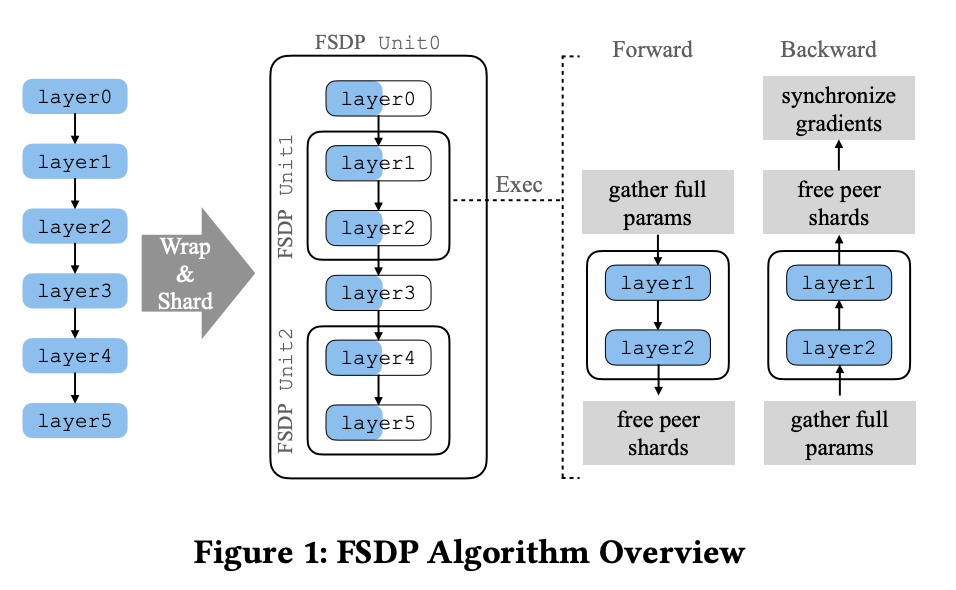

大模型时代，我们一直在做各种各样的并行优化，这些优化无非是在和“时间”赛跑还是在和“空间”赛跑。

当你手中只有一张 GPU 时，训练过程就像一个人的孤独长跑：

1. 对新的数据批次执行网络前向传输，并计算损失。
2. 对误差进行反向传播。
3. 优化器更新优化器状态和模型权重。

但当你拥有了 4 张、8 张甚至成百上千张 GPU 时，比赛规则变了。


从上图可以看到整个过程中，而这个过程就是数据并行，主要有哪些变化：

1. 每个 GPU 卡 仅计算大的批次数据中的一部分。（同时处理的数据量变为原来的 4 倍）
2. 在反向传播后需要进行一次梯度平均，保证所有卡训练更新的方向是一致的， 一般采用 allreduce 进行计算。

> 为什么这里要做梯度平均呢？**分布式训练的目标是“加速”，而不是“改变结果”。** 理想情况下，4 张卡并行训练 1 步的结果，应该和单张大显卡跑一个超大批次（Batch）的结果在数学上是**完全等价**的。就好像一个人的工作，我们拆分为 4 个人一起干，由于数据分布的随机性，显卡 A 可能觉得权重应该往左调，显卡 B 觉得该往右调。求平均值的过程，实际上是在做“共识决策”，使得他们工作的还是一个模型，干的还是一个方向。

## 1. 分布式数据并行 (DDP)

数据并行的前提是模型能够“塞进”显存，但训练数据量巨大。如果你的深度学习模型（包括权重、梯度和优化器状态）可以完整地放置在单张显卡的显存中，但你的数据集（如 ImageNet 或大规模语料库）有数百万甚至数亿条记录，单卡训练速度太慢，这时就该使用数据并行。

在数据并行中，每一个设备都拥有整个模型的副本，然后根据整个数据集的子集进行前向训练。假设总的训练样本为 D，使用 N 个训练卡进行加速，那么每一个训练卡拥有 $\frac{D}{N}$ 个样本，并使用这些样本分批计算 $G_i$, 然后广播通信这些梯度，所有设备汇集到其他 N - 1 卡的梯度的时候，执行聚会求均值的操作 $\sum_{i=1}^{n} G_i/N$, 进行参数更新。在实际操作中，我们主要采取 DDP 的实现。

### 1.1 数据并行训练过程

从上面的讨论中可以看出，实现数据并行我们主要关注两部分：1. 数据切分；2. 并行梯度通信。

数据的切分逻辑极其直观：

其核心在于实现数据集在并行维度上的均匀分布。无论是基于文件列表的预切分，还是对总数据流进行的实时偏移量（Offset）切分，目标都是确保每张显卡获取到互不重叠且规模对等的数据子集。

并行梯度通信：

传统上的并行梯度通信，就是计算完所有参数的计算后，统一的进行 AllReduce 计算。

为了优化性能，DDP中针对`allreduce`操作进行了更深入的设计。梯度的计算过程和进程间的通信过程分别需要消耗一定量的时间。等待模型所有的参数都计算完梯度再进行通信显然不是最优的。DDP中的设计是通过将全部模型参数划分为无数个小的bucket，在bucket级别建立`allreduce`。当所有进程中bucket0的梯度计算完成后就立刻开始通信，此时bucket1中梯度还在计算。这样可以实现计算和通信过程的时间重叠。

DDP 通过分布式多进程设计，去中心化的梯度同步、计算与通信重叠优化，解决了冗余的拷贝，线程开销，主 GPU 瓶颈等问题。

DDP 虽然高效，但它有一个致命的阿克琉斯之踵：**冗余**。

在 DDP 模式下，每张显卡都存储了**一模一样**的模型参数、梯度和优化器状态。

> **设想一下：** 如果一个模型本身就占用了 10GB 显存，你有 8 张显卡。在 DDP 模式下，为了跑得快，你实际上在显存里重复堆叠了 80GB 的相同数据。

当模型规模从亿级参数跃升到百亿、千亿级（如 Llama 或 GPT 系列）时，这堵“显存墙”就塌下来了——模型太大，单张卡根本塞不下，DDP 也就无从谈起。

## 2. 通信量与显存占用量

在数据并行进行计算时，一般采用 Ring-Allreduce 进行通信计算。


上图展示了 Ring-AllReduce 的计算过程，可以看出 Ring-AllReduce包含两个部分，ReduceScatter 和 AllGather。

假设发送的总数据量为 P，一共有 N 个节点。Ring-AllReduce 以类似于 ReduceScatter 的方式开始，在步骤 0 中，每个 GPU 将其本地数据的一部分发送给相邻 GPU。接下来的 N−2 步骤中，每个 GPU 重复执行recvReduceSend 操作：它从前一个相邻 GPU 接收一个数据段，对其本地数据的对应段执行逐元素归约，并将归约结果转发给环中的下一个 GPU。这种迭代归约过程持续进行，直到步骤 1。在 N−1这一步骤中，每个 GPU 接收一个数据段，执行最终归约，从而生成完全归约后的段，并将结果复制到输出缓冲区中的指定位置，然后再将该段发送出去。

接下来，以类似于AllGather 的方式进行，在接下来 k−2 每个步骤中，每个 GPU 执行一系列recvCopySend操作。在每个步骤中，GPU 从其前一个相邻 GPU 接收一个完全缩减后的段，将其直接复制到其输出缓冲区中的相应位置，并将该段原封不动地转发给下一个 GPU。

可以看出，Ring-AllReduce 中，ReduceScatter 通信了 N - 1 次，AllGather 通信了 N - 1 次，总共通信 2N - 2 次。每次的通信量 P / N。总通信量 $\frac{P}{N} * (2N - 2)$ ，当 N 足够大时，通信量约等于 2P。

可以看出 Ring-AllReduce 的通信实际上与卡数 N 无关，所以 Ring-AllReduce 的应该多机近线性扩展的。

### 2.1 数据并行通信数据量巨大

虽然 Ring-AllReduce 是近线性扩展的，它需要发送 2 倍的网络参数数量的梯度数据量。

例如，对于 Llama 70B 算法，在 fp16 格式下对梯度求和时，每次迭代都需要在卡之间传输 280 GB 的数据。在现代集群上，这将耗费大量时间。

> allreduce 通信量计算方式：2P = 2 * 2 (fp16字节大小) * 70 = 280

### 2.2 显存被什么占用了

要在多卡之间实现高效并行，我们必须先看清显存里到底装了什么。

简单来说，显存是被这几座大山占领的：

1. **神经网络中的‘三剑客’**（参数、梯度、激活值）
2. 优化器中的以及优化器状态， 如下所示例如 Adam 中的 m, v


3. 临时 Buffer 和零散的显存碎片

权重、梯度和优化器状态会在显卡之间重复存储。例如，Llama 70B 和混合精度模式下的 Adam 优化器将需要超过 1 TB 的显存，而典型的 GPU 显存容量为 80 GB。

> 下面我们以  Llama 70B 分别计算 FP32 和 BF16 混合精度情况下的显存占用：
>
> FP32:  70B 参数量， 70 *  4 *（1 + 1 + 2） = 1120 G, 这里包括一倍的参数，一倍的梯度和 2 倍的优化器状态。
>
> BF16:  70B 参数量， 70 * 2 * (1 + 1) + 70 * 4 * (1 + 2) = 1120 G, 这块主要采取 master weights 的方式，需要备份参数和优化器状态。

因此，由于内存冗余巨大，我们甚至无法将相对较小的模型放入 GPU 内存中，并且由于额外的通信，我们的训练速度将会减慢。

这些问题有解决办法吗？

## 3. Zero 面向万亿参数内存优化

2019 年，微软 DeepSpeed 开发团队发表了论文[《ZeRO：面向训练万亿参数模型的内存优化》。](https://arxiv.org/abs/1910.02054)在论文中，研究人员提出了 ZeRO（零冗余优化器）的概念，通过将优化器的权重、梯度和状态完全分布到所有 GPU 上，从而显著降低了内存负载：


所提出的分区是虚拟的。在正向和反向操作期间，模型处理所有参数的方式如同没有分区一样。但这如何实现呢？

答案是：**通过异步参数加载。**

在N个GPU上训练时，DeepSpeed库中ZeRO的实现如下：

1. 将每个参数分成 N 个部分，并将每个部分存储在各自的进程中。
2. 在第一次迭代中，在优化步骤之前，我们会记住参数的使用顺序。
3. 我们为收集到的参数分配空间。在随后的每次前向和后向迭代中，我们通过 all_gather 异步加载参数。当一个模块完成其工作后，我们释放该模块参数的内存，并开始加载下一个参数。**计算并行运行**。
4. 在反向传播过程中，我们在计算出梯度后立即执行 reduce_scatter 操作。
5. 在优化器步骤中，我们只更新属于当前卡 GPU 的权重和优化器状态。顺便一提，这使得优化器步骤本身的速度提高了 N 倍！

因此，在 ZeRO 的框架下，单个 GPU 的训练逻辑发生了质的变化， 如下所示：


它不再像 DDP 那样死板地守着一份完整的模型，而是通过“时分复用”策略实现了显存的极致利用。

其核心特点可以概括为以下三点：

1. 通信与计算异步：通过预取（Prefetching）和重叠（Overlapping）技术，当 GPU 还在计算当前层的算子时，下一层所需的参数已经开始通过网络异步传输了。
2. 通信模式的“常态化”：ZeRO 将通信打散到了前向和反向传播的每一个环节中。虽然通信变得更加频繁，但单次传输的数据量变小了。
3. 优化步骤的“高效性”: 优化器更新的数据量减少了，同时是只需要更新自己负责的部分。

### 3.1 ZeRO Stage1：优化器状态分割

将 batch 的数据分成 N 份，将 Optimizer State 分为 N 份， 每块 GPU 上各自维护一份，每块 GPU 上存储完整的模型参数。

1. **前向传播与反向传播**：每块 GPU 利用各自独一份的数据，做完一轮 forward 和 backward 后，各得一份大小为P 的梯度。
2. **梯度聚合同步**：各自将大小为 P 的梯度，平均分为 N 份，经过一次 Reduce-Scatter, 使得不同的显卡得到各自对应的一款聚合后的梯度，产生单卡的通信量 P。
3. **优化器更新**：每张 GPU 利用各自的一小份优化器更新对应的小份参数。
4. **参数全局同步**：通过 All-gather 操作从其他 GPU 中获取不具备的其他部分更新后的参数，产生的单卡单向通信量 P。

ZeRO Stage1 显存的占用量为 （2 + 2 + 12 / N）* P ，总通信量为 2P。

### 3.2 ZeRO Stage 2: 优化器状态+梯度分割

除了优化器状态均分外，ZeRO 2 将模型梯度也进行分块，整个优化过程为：

1. 每块 GPU 上存一份完整的模型参数，做完一轮 forward 和 backward 后，各个 GPU 得到的不一定属于自己的梯度块，需要经过 Reduce-Scatter 动态将其送给相应相应负责的 GPU 进行聚合，最终自己仅保留一份属于自己大小的 P / N 聚合后的梯度块。
2. 优化器更新：每张 GPU 利用各自的一小份优化器和小份梯度更新对应的小份参数。
3. 参数全局同步：通过 All-gather 操作从其他 GPU 中获取不具备的其他部分更新后的参数，产生的单卡单向通信量 P。

ZeRO Stage2 显存的占用量为 （2 + （2 + 12） / N）* P ，总通信量为 2P。

### 3.3 ZeRO Stage 3: 优化器状态 + 梯度 + 参数分割

1. 通过 All-Gather 从其他 GPU 中获取自身不具备的模型参数，单卡单向的通信量 P。
2. 利用各自独一份的数据，做完一轮 forward, 得到大小为 P 的激活，这时候不属于自己的其他参数倍释放，显存被激活占用。
3. 通过 All-Gather 操作从其他 GPU 中获取自身不具备的模型参数，单卡单向通信量为 P, 利用激活与完整参数进行backward, 在这个过程中 GPU 会获得不属于自己的梯度块，需要经过 Reduce-Scatter 动态的将其送给相应负责的 GPU 进行聚合；最终自己仅保留一份属于自己大小的 P / N 聚合后的梯度块。
4. 每块 GPU 利用自己的小块优化器与小块聚合梯度，更新自己的小块模型参数。

ZeRO Stage3 显存的占用量为 （2 + 2 + 12） / N * P ，总通信量为 2P。

DeepSpeed 的概念和实现加速了许多训练过程，同时显著降低了内存负载。然而，这种方法也有其缺点：

1. DeepSpeed 代码中存在大量漏洞和问题区域。
2. DeepSpeed Zero 针对动态图复杂情况易用性不是很好，它改变了模型和优化器且不能简单的部分开启部分不开启。
3. 大型集群中通信效率低下。

   * NCCL 的所有集体沟通都有一个特点：一次发送的数据越少，通信的效果就越差。
   * 假设我们有 N 个 GPU。那么，使用 all_gather 函数，我们每次只能传输参数总数的 1/N。随着 N 的增大，传输效率会降低。
   * 在 DeepSpeed 中，我们对每个参数张量执行 all_gather 和 reduce_scatter 操作。在 Llama 70B 数据集中，此类张量的典型大小为 8192 × 8192。当使用 1024 张卡片进行训练时，每次传输的数据量不会超过 128 KB，从而避免网络过载。
   * DeepSpeed 尝试通过同时组装大量张量来解决这个问题。然而，这种方法要么会导致大量缓慢的 GPU 内存操作，要么需要对所有通信进行自定义实现。

## 4. FSDP时代

DeepSpeed 改变了整个训练流程：它改变了模型和优化器。

- 而 FSDP 只影响模型本身。它只向优化器提供其自身参数集的权重和梯度，从而无需任何额外配置即可使用任何优化器。
- 能够将多个层参数合并成一个 FlattenParameter，该 FlattenParameter 将在分片过程中进行拆分。这使得在真正的大数据传输过程中能够实现快速、协作式的通信。
- ZeRO 要求模块必须按特定顺序调用，否则它将无法确定何时加载哪些参数。FSDP 支持动态图。

FSDP 将模型实例分解为更小的单元unit，并独立处理每个unit。在前向和反向计算期间，FSDP 一次只实例化一个unit的未分片参数和梯度，否则，它将保持参数和梯度处于分片状态。在整个训练循环中，优化器状态保持分片。



上图使用一个简单的六层模型展示了整体工作流程。

假设 FSDP 将模型分解为三个部分，即 [layer0, layer3]、[layer1, layer2] 和 [layer4, layer5]。这个分解行为可以由用户定义的函数来控制。然后，FSDP 将这三个部分分别包装成一个 FSDP 单元，并相应地分片参数。

让我们以包含 [layer1, layer2] 的 FSDP unit1 来解释这个过程：

1. 在 forward 进入 layer1 之前，通过 gather 从其他对等进程收集分片参数，然后执行前向计算。
2. 在 forward 执行 layer2 之后，通过 free 它刚收集的对等分片以减少内存占用。前向传播过程中，FSDP 一次只需要完全实例化一个unit，而所有其他unit都可以保持分片状态。
3. 在 backward 进入 layer2 之前，unit 1 恢复 layer1 和 layer2 的未分片参数。
4. 在 backward 进入 layer1 之后，unit 1 释放对等分片并启动 ReduceScatter 来归约和分片梯度。

在源码中，FSDP采用FlatParameter类的实例，来表示一个unit，即计算和通信的基本单元。在当前设计中，FlatParameter逻辑上表示一个1D的tensor，通过n个模型参数tensor展开拼接而成（可以是sharded或unsharded）。假设unit是LlamaDecoderLayer，那么其中的所有weight，包括q_proj, k_proj, v_proj等，layernorm的所有weight全部展平拼接为一个大的1D tensor，再将这个1D tensor平均分配到每个rank。如果不能整除，先padding再切分，这样每个rank上维护一份local shard tensor。

> 为什么要使用1D tensor呢？主要考量通信性能的约束。包括两方面原因：
>
> 1. 对于NCCL backend来说，FSDP需要调用allgather和reduce_scatter两个collective op，all_gather_into_tensor和reduce_scatter_tensor比all_gather和reduce_scatter的性能更好，而这两个op要求输入的tensor size是均等的；
> 2. 合并和展平tensor，减少了issue collective call的次数。

如何构建1D tensor呢？提供wrap策略。

### 4.1 模型初始化

在 FSDP 出现之前，PyTorch 要求在一个设备上完全实例化整个模型实例。虽然用户可以将不同的子模块分配到不同的设备上，但这需要修改模型源代码。

为了解决参数的切分，就需要考虑如何在不实例化任何 Tensor 存储的情况下创建模型实例， 将初始化推迟到将具体设备上。

为了克服这个问题，FSDP 引入了一种称为**延迟初始化**的机制。

该机制涉及在模拟或“伪”设备上分配模型参数张量。在此过程中，对张量执行的所有初始化操作都被记录下来。随后，当Tensor 从“伪”设备移动到 GPU 设备时，所有记录的操作都会自动重放。

我们知道，一旦 FSDP 包装了模型，它就会在所有 GPU 上均匀分布，每个设备的内存中只保存一个分片。但这可能存在另一个问题：

如果单 GPU 设备无法放置整个模型，但可以放置一个 FSDP 包装的 unit。另外，初始化是按分片进行初始化的话，如果聚集后的未分片参数无法放置在一个GPU 设备上呢？

为了避免这些问题，FSDP 必须在执行 Tensor 初始化操作之前准备未分片的参数。同时鉴于完全分片初始化是不安全的，FSDP 采用与处理模型前向和后向传播相同的方法，即一次初始化一个 FSDP unit，并在处理下一个unit之前分片该unit。

下面我们简要的过下 FSDP 初始化的逻辑源码逻辑。

首先我们展示下，我们一般如何使用 FSDP:

```py
fsdp_model = FSDP(
    model,
    device_id=torch.cuda.current_device(),  # 指定当前设备
    sharding_strategy=ShardingStrategy.FULL_SHARD,  # 使用 FULL_SHARD 策略
    auto_wrap_policy=lambda module: isinstance(module, nn.Linear)  # 只对 nn.Linear 层进行包裹
)
```

#### 4.1.1. Warp

使用 FSDP 只需要对模型进行包裹，这里可以传入 auto_wrap_policy 策略，指定 FSDP 的 unit 如何封装和切分。

```
            _auto_wrap(
                module,
                auto_wrap_policy,
                self._ignored_modules,
                self._ignored_params,
                root_kwargs,
                FullyShardedDataParallel,
            )
```

策略的遍历方式是“后序遍历”（先子后父），保证先处理叶子模块，再处理父模块。同时为了支持混合精度，对不适合混合精度（如 BatchNorm/LayerNorm）的一类模块进行特殊处理，单独包裹并禁用混合精度。

```
wrap_fn = _construct_wrap_fn(root_module, target_module_to_kwargs, fsdp_fn)
_post_order_apply(root_module, wrap_fn)   # 后序遍历
```

在 _auto_wrap 中 fsdp_fn 赋值为 FullyShardedDataParallel， fsdp_fn的作用是把module包装成FullyShardedDataParallel类型。

#### 4.1.2. 初始化 flatParamHandle

```
       _init_param_handle_from_module(
            self,
            module,
            device_id,
            param_init_fn,
            sync_module_states,
        )
```

获取 FSDP 需要管理的所有原始参数， 创建 FlatParamHandle。

```
# 获取 FSDP 需要管理的所有原始参数
managed_params = list(_get_orig_params(fully_sharded_module, state._ignored_params))
...
# 创建 FlatParamHandle
_init_param_handle_from_params(state, managed_params, fully_sharded_module)
```

FlatParamHandle 是 FSDP 的核心，它负责将 `params` 列表中的多个参数, “展平”（flatten）并合并成一个单一的、连续的张量（FlatParameter）。

```
@no_type_check
def _init_param_handle_from_params(
    state: _FSDPState, # FSDP 状态对象，用于跟踪和管理 FSDP 实例的各种状态
    params: list[nn.Parameter], # 从模块中收集到的、需要被 FSDP 管理的原始参数列表
    fully_sharded_module: nn.Module, # 这些参数所属的、需要被 FSDP 完全分片的模块
):
    if len(params) == 0:
        return

    # 1. 实例化 FlatParamHandle
    # FlatParamHandle 是 FSDP 的核心，它负责将 `params` 列表中的多个参数
    # “展平”（flatten）并合并成一个单一的、连续的张量（FlatParameter）。
    # 这里传入了所有必要的配置，如分片策略、混合精度设置、进程组等。
    handle = FlatParamHandle(
        params, # 原始参数列表
        fully_sharded_module, # 所属模块
        state.compute_device, # 计算设备 (例如, 'cuda:0')
        SHARDING_STRATEGY_MAP[state.sharding_strategy], # 分片策略
        state.cpu_offload.offload_params, # 是否启用 CPU offload
        state.mixed_precision.param_dtype, # 参数的数据类型 (例如, torch.float16)
        state.mixed_precision.reduce_dtype, # all-reduce 操作的数据类型
        state.mixed_precision.keep_low_precision_grads, # 是否保留低精度梯度
        state.process_group, # 分布式通信的进程组
        state._use_orig_params, # 是否使用原始参数的视图（一种优化）
        fsdp_extension=state._fsdp_extension, # FSDP 扩展
    )

    # 2. 对 FlatParameter 进行分片
    # 调用 .shard() 方法，根据指定的分片策略，将完整的 FlatParameter 分割成
    # 多个分片，每个 rank 只保留自己负责的那一部分。这是实现显存优化的关键。
    handle.shard()

    # 3. 更新 FSDP 状态
    # 将新创建的 FlatParameter 添加到 FSDP 实例的参数列表中，以便优化器可以找到它
    state.params.append(handle.flat_param)
    # 将新创建的 handle 保存到 FSDP 状态中
    state._handle = handle
    # 建立从模块到其对应 handle 的映射关系
    state._fully_sharded_module_to_handle[handle._fully_sharded_module] = handle

    # 4. 处理 CPU Offload
    # 如果启用了 CPU offload，并且分片后的 FlatParameter 当前不在 CPU 上
    cpu_device = torch.device("cpu")
    if state.cpu_offload.offload_params and handle.flat_param.device != cpu_device:
        # 将该分片移动到 CPU，以释放 GPU 显存
        handle.flat_param_to(cpu_device)
```

如上代码所示，可以看出在创建 FlatParameter 后，第一时间就调用了shard()操作， 并添加到FSDP 实例的参数列表。接下来我们看看在FlatParamHandle主要做了什么。

FlatParameter 类继承自 nn.Parameter，并在语义和行为上与 nn.Parameter 保持一致。FSDP 同时实现了一个配套的 FlatParamHandle 类，用于集中管理各个 FlatParameter 实例。无论是 FullyShardedDataParallel 还是 fully_shard 这类前端接口，均仅通过 FlatParamHandle 与 FlatParameter 进行交互，从而实现参数的统一管理与调度。

每个 FlatParameter 承载一个 FSDP 单元（FSDP unit）内所有参数张量的底层存储。FSDP 单元的边界直接决定了 all-gather 与 reduce-scatter 的触发时机，因此对整体 FSDP 性能具有关键影响。在理想情况下，FSDP 单元的划分应尽可能与模型的实际执行顺序保持一致，以最大化通信与计算的重叠并减少不必要的参数聚合。

FlatParamHandle 将一堆零散的参数（ params ）整齐地排列、打包，并贴上详细的标签（元数据），最终形成一个易于管理的单一实体（ FlatParameter ）。这个过程不仅处理了复杂的共享参数和内存对齐问题，还为后续的分布式操作（如 reduce-scatter ）做好了准备。一旦这个方法执行完毕， FlatParamHandle 就拥有了一个完整的、随时可以被分片和恢复的扁平化参数。

```
class FlatParamHandle:
    
    def __init__(
        self,
        ...
    ):
        super().__init__()
        ...
        # --- 创建扁平化参数和元数据 ---
        # 这个方法会执行以下操作:
        # 1. 计算所有参数的总元素数量。
        # 2. 创建一个大的、一维的 `FlatParameter` 来容纳所有参数。
        # 3. 将原始参数的数据复制到这个 `FlatParameter` 中。
        # 4. 记录每个原始参数在 `FlatParameter` 中的位置、形状等元数据。
        self._init_flat_param_and_metadata(
            params,
            fully_sharded_module,
            self._aligned_numel,
            use_orig_params,  # type: ignore[arg-type]
        )

        # --- 设置参数视图 ---
        # 让原始模块的参数成为 `FlatParameter` 的“视图”（view）。
        # 这意味着对原始参数的任何修改都会反映在 `FlatParameter` 上，反之亦然。
        self._use_unsharded_views(as_params=False)
```

在 _init_flat_param_and_metadata 方法中，遍历模块的所有子模块和参数，以确保参数的顺序是确定的。同时为了让 reduce-scatter 操作更高效，需要确保总元素数能被 world_size 整除。最后的结果就是进行了张量展开，获得了一个扁平的张量，形状为：[参数数量，参数长度]。即每个参数param都变成了一维，最后各个param都拼接在了一起。所以这些参数最后在物理地址上都是连续的，方便操作。最后，让原始模块的参数成为 `FlatParameter` 的“视图”（view）。

#### 4.1.3. shard

shard 函数的作用是，为切片后的flatParameter分配新内存；清空未分片的flat parameter的内存。

> 调用关系为：shard()->_get_shard->_get_unpadded_shard

```
def shard(self):
    ...
    sharded_flat_param, numel_padded = FlatParamHandle._get_shard(
                flat_param, self.rank, self.world_size
            )
    ...
    allocated = flat_param._typed_storage()._size() > 0
    if allocated:
         flat_param._typed_storage()._resize_(0)
    flat_param.set_(sharded_flat_param) 
```

```
def _get_unpadded_shard(
        tensor: Tensor,
        rank: int,
        world_size: int,
    ) -> tuple[Tensor, int]:

        chunks = (
            torch.flatten(tensor).chunk(world_size)
            if _is_truly_contiguous(tensor)
            else tensor.as_strided((tensor.numel(),), (1,)).chunk(world_size)
        )
        if len(chunks) < (rank + 1):
            # This rank gets an empty chunk fully padded with zeros since there
            # are not enough chunks across ranks
            chunk = chunks[0].new_empty(0)
        else:
            chunk = chunks[rank]

        ...
        return chunk, numel_to_pad
```

上述代码展示了如何从全量 flatparam中获取当前 rank 对应的 shard 分片的代码。 然后释放掉所有flat_param存储，并将其变为sharded_flat_param。

### 4.2 模型前向

FSDP 的 forward 本质上做了三件事：

1. **forward 之前：**确保当前 FSDP 单元所需的参数已经从 shard 状态恢复为可计算状态（all-gather / unshard）
2. **forward 本体：**直接调用原始 module 的 forward
3. **forward 之后：**立即将参数重新 shard（reshard），释放不必要的显存。

下面代码展示了 FSDP 的 forward：

```
    def forward(self, *args: Any, **kwargs: Any) -> Any:
        """Run the forward pass for the wrapped module, inserting FSDP-specific pre- and post-forward sharding logic."""
        handle = self._handle
        with torch.autograd.profiler.record_function(
            "FullyShardedDataParallel.forward"
        ):
            unused = None
            args, kwargs = _pre_forward(
                self,
                handle,
                _pre_forward_unshard,
                self._fsdp_wrapped_module,
                args,
                kwargs,
            )
            ...
            output = self._fsdp_wrapped_module(*args, **kwargs)
            return _post_forward(
                self, handle, _post_forward_reshard, self, unused, output
            )
```

#### 4.2.1. pre_forward

下面我们来看看 _pre_forward 主要做了什么。

```
def _pre_forward(
    state: _FSDPState,
    handle: Optional[FlatParamHandle],
    unshard_fn: Callable,
    module: nn.Module,
    args: tuple[Any, ...],
    kwargs: dict[str, Any],
) -> tuple[tuple[Any, ...], dict[str, Any]]:
    """
    执行前向传播前的逻辑。这包括：
    1. 对当前分片的参数进行反分片（unshard），使其恢复为完整参数。
    2. 为这些参数注册后向传播钩子（post-backward hooks）。
    3. 将前向传播的输入（args, kwargs）转换为指定的计算精度。
    """
    # 使用 PyTorch profiler 记录函数执行，便于性能分析
    with torch.profiler.record_function("FullyShardedDataParallel._pre_forward"):
        # 这是一个针对梯度检查点（gradient checkpointing）的特殊处理。
        # 在梯度检查点的重计算阶段，模块会再次执行前向传播，但此时参数已经 unshard 过了，
        # 无需重复执行 unshard 和注册 hook 等操作，直接返回即可。
        if handle and handle._training_state == HandleTrainingState.BACKWARD_PRE:
            return args, kwargs

        # 1. 更新 FSDP 状态，标记当前正处于前向或后向传播阶段。
        state.training_state = TrainingState.FORWARD_BACKWARD
        # 记录当前模块的执行顺序，这对于后续的预取（prefetching）和梯度同步至关重要。
        state._exec_order_data.record_pre_forward(handle, module.training)
        if handle:
            # 更新当前参数句柄（handle）的状态为“正在前向传播”。
            handle._training_state = HandleTrainingState.FORWARD

        # 2. 执行核心操作：反分片（Unsharding）。
        # 这个函数内部会触发 all-gather 操作，从所有 GPU 上收集参数分片，
        # 在当前设备上重建完整的、未分片的参数，以供模块的 forward 方法使用。
        if unshard_fn is not None:
            unshard_fn(state, handle)

        # 3. 注册后向传播钩子（Post-Backward Hook）。
        # 这个钩子会在反向传播计算完当前参数的梯度之后被触发。
        # 它的主要作用是：
        #   a. 将参数重新分片（reshard），释放完整参数占用的内存。
        #   b. 对计算出的完整梯度进行 reduce-scatter 操作，完成梯度同步。
        # 因为计算图（grad_fn）每次都可能变化，所以这个钩子需要在每次前向传播时都重新注册。
        _register_post_backward_hook(state, handle)

        # 针对 CPU Offload 的特殊处理：如果优化器在反向传播中将 CPU 上的梯度清空了，
        # 这里需要重新分配一块内存空间给它，为下一次梯度累积做准备。
        if handle and handle._offload_params and handle.flat_param._cpu_grad is None:
            handle.flat_param._cpu_grad = torch.zeros_like(
                handle.flat_param._local_shard, device=torch.device("cpu")
            ).pin_memory()
        ...
        return args, kwargs
```

可以看出 _pre_forward 主要做了三件事：

1. 更新 FSDP 状态，标记当前正处于前向或后向传播阶段。
2. 执行核心操作：反分片（Unsharding）。
3. 注册后向传播钩子（Post-Backward Hook），用于在反向传播后对参数进行重新分片和进行reduce-scatter 操作，完成梯度同步。

那么 unshard_fn 的实现过程是如何的，下面是其代码片段：

```
# 1. 分配内存：为即将聚合的完整参数张量分配空间。
unsharded_flat_param = self._alloc_padded_unsharded_flat_param()
# 2. 执行 All-Gather：调用我们之前分析过的 `_all_gather_flat_param` 方法，
# 从所有进程收集参数分片，并填充到刚刚分配的内存中。
padded_unsharded_flat_param = self._all_gather_flat_param(unsharded_flat_param)
# 3. 切换状态：将模块内部的参数指针切换为指向这个刚刚聚合好的完整参数，
# 以便后续的前向或后向计算可以使用它。
self._use_unsharded_flat_param(padded_unsharded_flat_param)
```

对于GPU使用到了dist.all_gather_into_tensor操作。

注册后向传播钩子主要是在 _register_post_backward_hook 实现的。 在 FlatParameter 的 AccumulateGrad 对象上注册一个后向钩子(post-backward hook)，

用于在梯度计算完成后执行梯度的 reduce-scatter 操作以及参数的重新分片(reshard)。AccumulateGrad 对象是完成 FlatParameter 梯度计算的最后一个函数，因此钩子能确保在参数的整个梯度计算完成后才运行。

下面展示的是 _post_backward_hook 的代码片段：

```
@torch.no_grad()
def _post_backward_hook(
    state: _FSDPState,
    handle: FlatParamHandle,
    flat_param,  # Note: this is a positional argument passed by the hook
    *unused: Any,
):
    """
    这是 FSDP 的核心反向传播钩子，负责在本地梯度计算完成后，
    进行跨 GPU 的参数重新分片（reshard）和 梯度同步（reduce-scatter）。

    后置条件:
    - 如果使用 `NO_SHARD` 策略，`.grad` 属性将是经过 all-reduce 后的完整梯度。
    - 否则，`_saved_grad_shard` 属性将是经过 reduce-scatter 后的分片梯度（会与已有的梯度累加）。
    """
    flat_param = handle.flat_param
    # 标记该参数的后向钩子已被调用
    flat_param._post_backward_called = True
    with torch.autograd.profiler.record_function(
        "FullyShardedDataParallel._post_backward_hook"
    ):
        handle._training_state = HandleTrainingState.BACKWARD_POST
        ...
        # 关键步骤1：在进行梯度通信之前，先尝试重新分片参数，以尽早释放内存
        _post_backward_reshard(state, handle)
        
        ...
        # 关键步骤2：等待当前计算流中的所有操作（如梯度计算）完成，
        # 然后再开始 reduce-scatter 梯度。这确保了我们拥有完整的本地梯度。
        # 在专用的后向流中执行梯度通信
        with state._device_handle.stream(state._post_backward_stream):
            autograd_computed_grad = flat_param.grad.data
            # 如果开启了低精度训练，且梯度类型与通信类型不符，则进行类型转换以降低通信开销
            if (
                not _low_precision_hook_enabled(state)
                and flat_param.grad.dtype != handle._reduce_dtype
                # 如果强制全精度（例如在 eval 模式下），则不降低梯度精度
                and not handle._force_full_precision
            ):
                flat_param.grad.data = flat_param.grad.to(handle._reduce_dtype)
            
            # 根据分片策略执行梯度规约
            if handle.uses_sharded_strategy:
                _reduce_grad(state, handle)  # Reduce-scatter
            else:
                _reduce_grad_no_shard(state, handle)  # All-reduce
           ...
```

FlatParameter` 的 `.grad` 属性包含了本地批次（local batch）的完整（unsharded）梯度, 先尝试重新分片参数，以尽早释放内存。等待当前计算流中的所有操作（如梯度计算）完成，然后再开始 reduce-scatter 梯度。

```
<!-- _post_backward_reshard -->
      # 1. 计算那些应该释放的参数
      free_unsharded_flat_param = _should_free_in_backward(state, handle)
      # 2. 执行重新分片操作。如果 `free_unsharded_flat_param` 为 True，则会释放内存
      _reshard(state, handle, free_unsharded_flat_param)
      # 3. 为下一次迭代预取参数。这里的模式是 BACKWARD，意味着这个预取是在
      #    反向传播阶段触发的，目的是为下一次迭代的第一个前向传播做准备，
      #    从而实现计算和通信的重叠。
      _prefetch_handle(state, handle, _PrefetchMode.BACKWARD)
```

在进行反向reshard的代码里，同时在_prefetch_handle中异步地执行下一个前向的 unshard (all-gather) 操作，但不同步等待操作完成。这使得 all-gather 通信可以与当前流中的计算（例如，前向/后向计算）重叠。同步操作（`wait()`）会被推迟到真正需要使用该参数之前执行。

#### 4.2.2. post_forward

post_forward 主要负责在前向计算完成后，将不再需要的完整参数重新分片，以释放 GPU 内存。同时，在输出张量上注册 pre-backward 钩子，以便在反向传播开始时，能够及时地将分片参数恢复为完整参数，用于梯度计算。

下面我们来看看 _post_forward 的代码。

```
def _post_forward(
    state: _FSDPState,
    handle: FlatParamHandle | None,
    reshard_fn: Callable,
    module: nn.Module,
    input: Any,
    output: Any,
) -> Any:
    with torch.profiler.record_function("FullyShardedDataParallel._post_forward"):
        # For `fully_shard` + `checkpoint`, skip post-forward logic in the
        # recomputed forward
        if handle and handle._training_state == HandleTrainingState.BACKWARD_PRE:
            return output

        state._exec_order_data.record_post_forward(handle)
        if reshard_fn is not None:
            reshard_fn(state, handle)
        # Register pre-backward hooks to unshard the flat parameters for the
        # gradient computation (if needed)
        output = _register_pre_backward_hooks(state, module, output, handle)
        state.training_state = TrainingState.IDLE
        if handle:
            handle._training_state = HandleTrainingState.IDLE
        return output
```

_post_forward 主要调用了 reshard_fn 来对参数进行重新分片，释放完整参数占用的内存。其次就是注册_register_pre_backward_hooks 来为输出张量注册 pre-backward 钩子。

reshard_fn 主要是调用 FlatParamHandle 和 _reshard 来执行重新分片的逻辑。

```
def reshard(self, free_unsharded_flat_param: bool):
    self._use_sharded_flat_param()
    if free_unsharded_flat_param:
        self._free_unsharded_flat_param()
```

主要作用是将 self.flat_param (一个 nn.Parameter) 的 .data 属性从指向完整的、未分片的张量，切换为指向本地的分片张量 (self.flat_param._local_shard)。

_register_pre_backward_hooks 主要是注册反向传播前置钩子。通过在模块的输出张量上注册钩子，FSDP 可以在反向传播到达该模块之前，精确地触发相应参数的 all-gather 操作。

具体注册的勾子函数为_pre_backward_hook，该函数主要是执行_unshard来通过 all-gather 操作获取完整的参数，并且为了重叠计算和通信，它会立即触发下一个（在反向传播顺序中）模块参数的 prefetching（预取）。

```
def _pre_backward_hook(
    state: _FSDPState,
    module: nn.Module,
    handle: FlatParamHandle,
    grad,
    *unused: Any,
) -> Any:
        handle._training_state = HandleTrainingState.BACKWARD_PRE

        if handle._needs_pre_backward_unshard:
            # If the handles have been prefetched, then there is no need to
            # call `_unshard()` again
            if not handle._prefetched:
                _unshard(
                    state,
                    handle,
                    state._unshard_stream,
                    state._pre_unshard_stream,
                )
            # Don't wait during trace
            if not torch.distributed._functional_collectives.is_torchdynamo_compiling():
                state._device_handle.current_stream().wait_stream(state._unshard_stream)

        # Set this to `False` to ensure that a mistargeted prefetch does not
        # actually unshard these handles
        handle._needs_pre_backward_unshard = False
        with torch.profiler.record_function(
            "FullyShardedDataParallel._pre_backward_prefetch"
        ):
            _prefetch_handle(state, handle, _PrefetchMode.BACKWARD)
        handle.prepare_gradient_for_backward()
        handle._ran_pre_backward_hook = True
        return grad
```

_pre_backward_hook 主要做了如下件事：

1. 如果没有被预取过，执行 unshard（all-gather）
2. 等待 unshard 完成
3. 为执行的下一个 FSDP unit 预取参数。

### 4.3 FSDP 低精度

FSDP 提供了一种多功能的原生混合精度机制。在参数管理方面，它遵循标准的混合精度技术，即同时维护参数的低精度和全精度副本。前向和反向计算使用低精度，优化器步骤使用全精度。FSDP 允许用户独立指定参数、梯度归约和非可训练缓冲区的精度。

在 FSDP 的低精度策略中，FP32 master weights 始终是 shard 状态，unshard 出来的 full 参数直接以低精度（FP16 / BF16）存在，不会维护一个全量 FP32 + FP16 的双副本。

所以说，在 FSDP 中，参数的峰值显存并非由所有参数决定，而仅由最大 FSDP unit 的完整参数副本决定。

**那为什么 ZeRO + BF16 必须重写 Optimizer？**

DeepSpeed 需要实现 bf16Optimizer，是因为 ZeRO 改变了“优化器的执行语义”。DeepSpeed 接管参数、梯度、optimizer state，需要重写 optimizer step 改写混合精度与梯度缩放逻辑。所以，DeepSpeed 必须为每一种精度组合实现一个“optimizer 语义版本”。

而 FSDP 的设计原则是，优化器看到的，就是一个合法的 nn.Parameter 列表。FSDP 只向 optimizer 暴露 本 rank 的 sharded FlatParameter。优化器完全不知道参数曾经 unshard

完全不知道通信存在。

FSDP 把混合精度问题限制在“参数 materialization 阶段”。FSDP 的原生混合精度每个 FlatParameter 仅在其前向之前以及（如果在向前传播后重新分片）其反向之前产生一次全精度到低精度的转换。

总而，一句话，FSDP 重写了 Parameter， ZeRO 重写了 optimizer。

## 5. 总结

FSDP 通过将模型拆分为若干 FSDP unit，并以 FlatParameter 作为最小计算与通信调度单元，实现了参数、梯度和优化器状态的完全分片。在 forward 与 backward 过程中，FSDP 精确地在“用前恢复、用后释放”的时序上进行 all-gather 与 reduce-scatter，并辅以基于执行顺序的参数预取，从而在保证 PyTorch 原生语义和动态图支持的前提下，大幅降低了峰值显存占用。

下面看完整体的代码，我们来简单说下 FSDP 可能存在的问题吧。

虽然其在通用性和生态兼容性方面具有明显优势，然而 FSDP 并非零成本方案，其性能高度依赖于合理的 unit 划分和通信重叠效果，并可能增加内存分配的开销。

- 当需要 all-gather 或 reduce-scatter 时，需要在 GPU 上临时分配一个完整张量来存储 unshard 的参数。这意味着在训练过程中 同一个参数张量可能被多次分配和释放，增加了内存分配的开销。
- 在unit 分片边界，FSDP 会执行：unshard → 临时 full 参数和reshard → 释放 full 参数，尤其在单个 unit 边界很小的情况下，分片频繁，会导致小块内存频繁分配/释放，增加碎片和开销。
- 为了通信和计算重叠，它会创建多个 CUDA stream，并进行一些小型的 tensor 运算或同步操作，这些操作在主计算流中穿插，虽然每次开销不大，但频繁执行会形成“准备计算负载”，all-reduce / reduce-scatter 性能依赖连续的大 tensor 调用。中间的小型的 tensor 运算会打断整体的流水。

接下来将继续行文分析M-Core中的FSDP是如何实现的，是否有优化上述问题。其次，针对FSDP中的细节进行详细的展开分析其实现。通过FSDP实验进行分析，和实现改造尝试进行优化。

## 引用

[1] https://www.llamafactory.cn/huggingface-docs/accelerate/concept_guides/fsdp_and_deepspeed.html

[2] https://zhuanlan.zhihu.com/p/8978862456

[3] https://zhuanlan.zhihu.com/p/649837295

[4] https://habr.com/ru/companies/yandex/articles/817509/

[5] https://www.bilibili.com/video/BV13cn4zFEQ1/?spm_id_from=333.337.search-card.all.click&vd_source=997b612028a4d9f90d4179eb93284d60

[6] bilibili.com/video/BV1hRq6BtEt6/?spm_id_from=333.1387.homepage.video_card.click

[7] https://lywencoding.com/posts/48646366.html