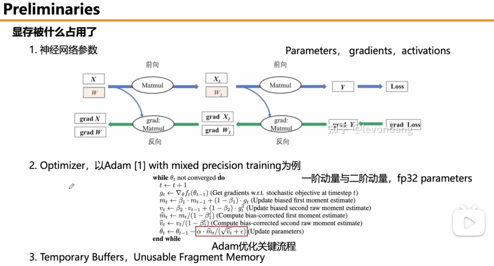
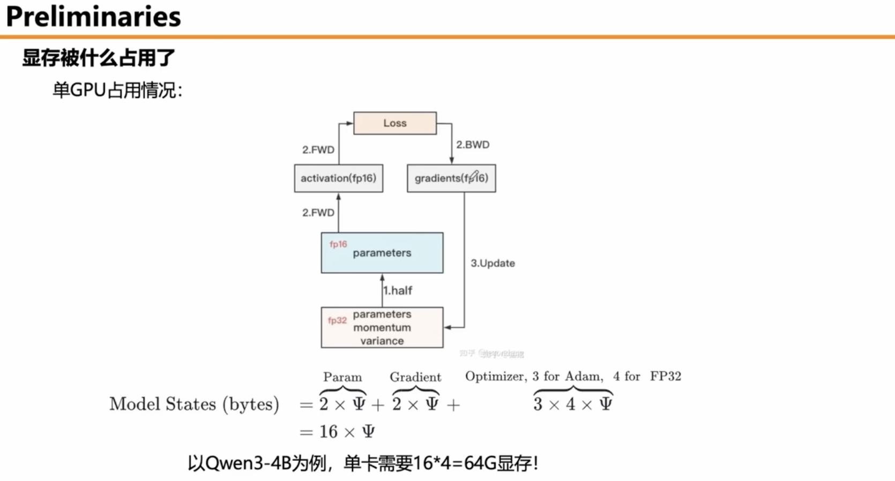
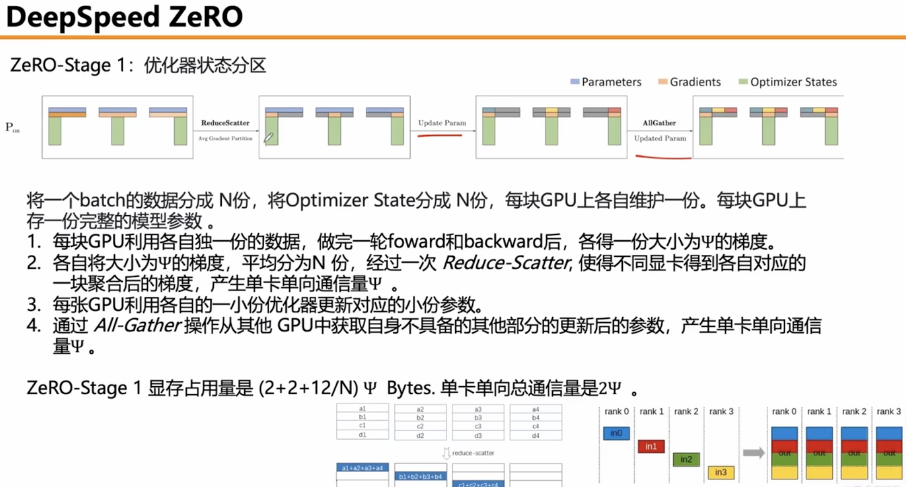
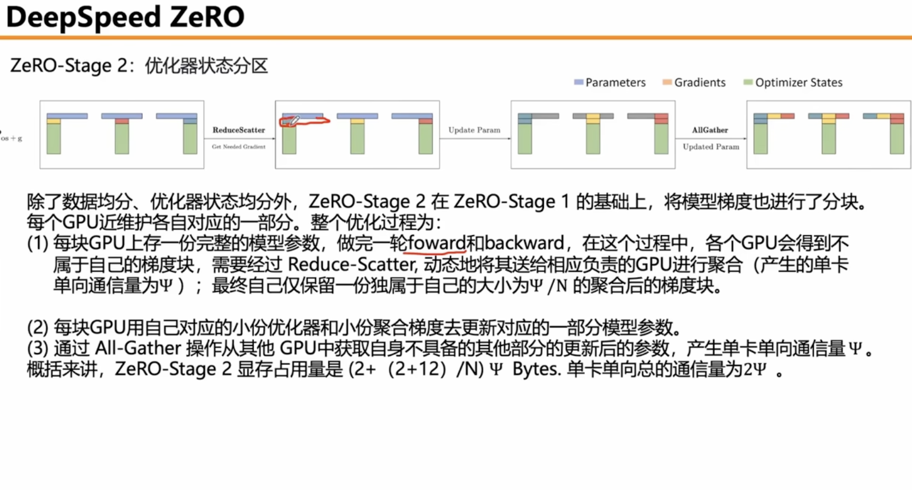
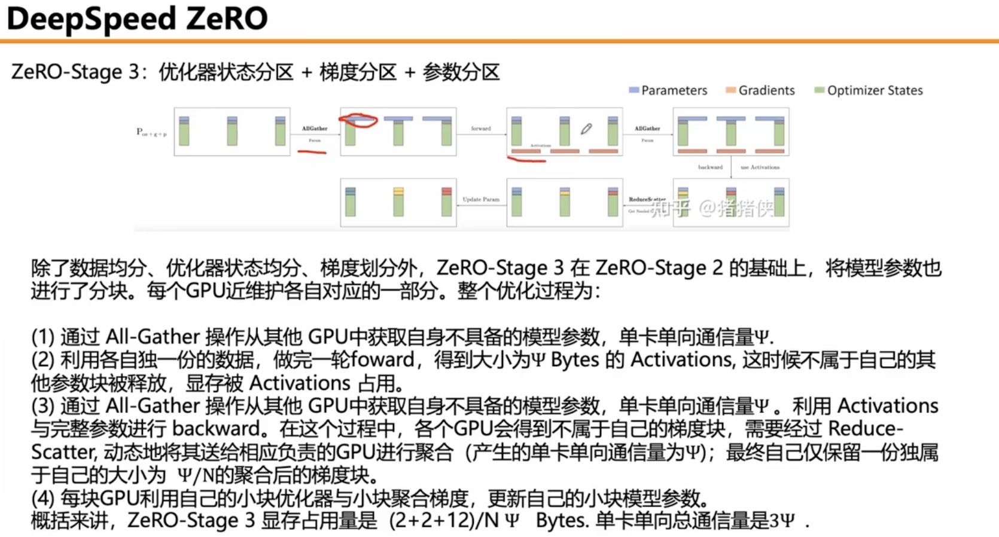
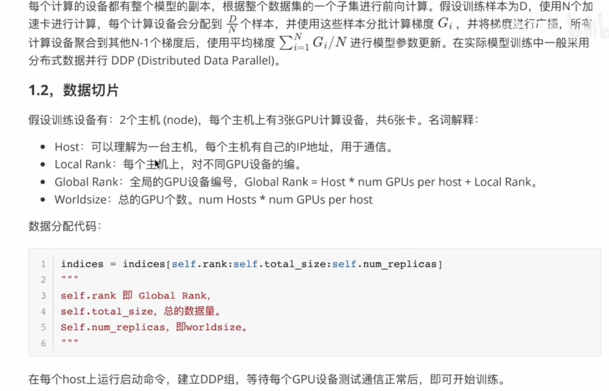
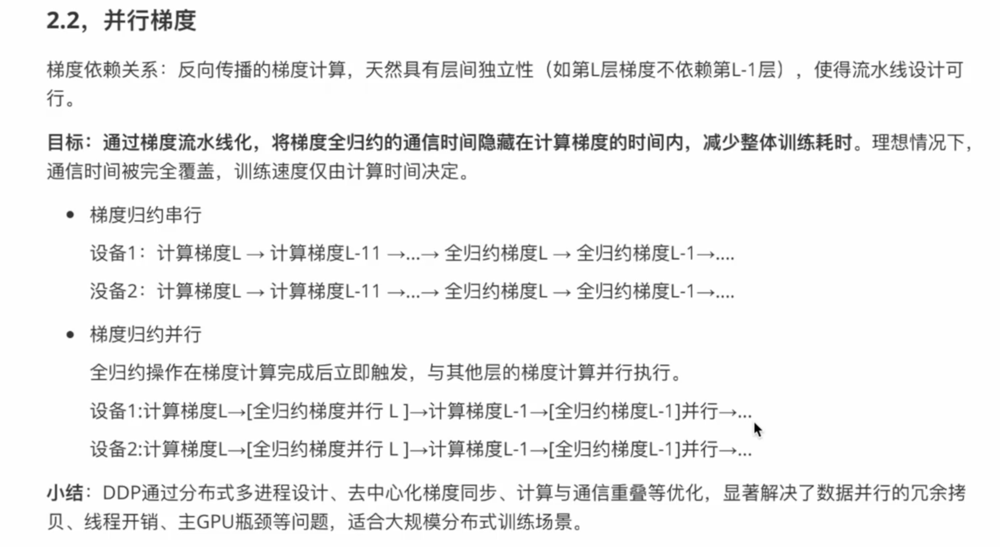

## deepspeed zero

数据并行，把数据划分N份，每一个卡跑一份。
数据并行的问题，每一个都保存一个完整的模型

流水线并行，使得模型层放在不同的硬件上，卡与卡间增加更多通信

Reduce

Scatter

Reduce-scatter 把一个数据切片，然后分发，在分发前做求和

all-gather

DP

显存都被什么占用了

https://www.llamafactory.cn/huggingface-docs/accelerate/concept_guides/fsdp_and_deepspeed.html

https://zhuanlan.zhihu.com/p/8978862456

https://zhuanlan.zhihu.com/p/649837295

https://lywencoding.com/posts/48646366.html

