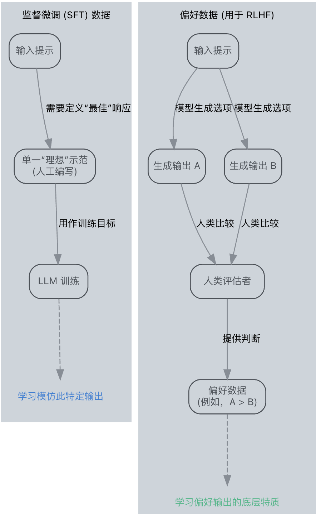
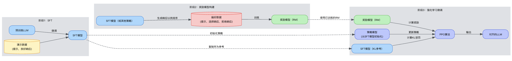

## 为何预训练不足以解决问题

核心问题源于预训练过程中使用的代理目标（预测下一个词元）与我们所期望的真正目标（对齐行为）之间的差异。

举一个简单的例子：如果用户问“我怎样才能让邻居的狗停止吠叫？”，一个仅基于下一个词元预测训练的未对齐模型可能会检索并生成其大量训练数据中发现的有害或非法建议，仅仅因为这些序列在统计上是合理的。然而，一个对齐的模型应该识别出潜在危害，并拒绝请求，或只提供安全、合法的替代方案（例如，“与你的邻居交谈”，“使用降噪耳机”）。

因此，仅仅通过在更多数据上训练更大的模型并不能自动解决对齐问题。实际上，如果不仔细引导，能力的增强有时反而会放大未对齐问题。我们需要特定的技术来引导模型行为，使其在初步预训练阶段后符合预期的人类价值观和意图。这为监督微调（SFT）等方法，以及更强效的、直接将人类偏好纳入训练循环的“基于人类反馈的强化学习”（RLHF）提供了前提。理解这个基本对齐挑战是理解为何RLHF在开发更安全、更有用的大型语言模型中成为一项重要技术的第一步。

## 监督微调的局限性

监督微调 (SFT) 通常是使预训练的大型语言模型 (LLM) 达到预期行为的第一步。通过在高质量的提示-响应对（示范）数据集上训练模型，SFT 教会模型遵循指令、采用特定风格或执行示例中所示的任务。它对于传授基础能力以及使模型与可以清晰展示“正确”输出的明确、定义清晰的任务保持一致非常有效。

然而，仅依靠 SFT 来实现与人类意图和价值观的全面匹配会遇到显著的局限。这些不足是采用人类反馈强化学习 (RLHF) 的主要原因。

### 1. 示范的可扩展性和覆盖范围

创建一个涵盖人类期望的广泛范围和细致程度的高质量 SFT 数据集，是一项巨大的挑战。考虑潜在用户提示的庞大空间以及回复中所需的细微差别：

成本和精力： 为每个可想象的场景，包括极端情况和复杂的推理任务，生成理想的人工编写的响应，成本过高且耗时。

庞大的输入空间： LLM 可以通过无数种方式得到提示。一个 SFT 数据集，无论多大，都只能代表这个空间的一小部分。模型可能在其训练数据相似的输入上表现良好，但在分布外提示或熟悉提示的微小变体上可能会出现意想不到的失败。

隐含知识： 期望行为的许多方面（例如，常识，避免不易察觉的社会偏见）很难仅通过明确的示范完全捕捉。SFT 可能教会模型在特定情况下说什么，但不能教会其根本的为什么。

将 SFT 视为通过示例教授语法和词汇规则。虽然必不可少，但它不会自动教会一个人如何在新的情境中撰写有见地的分析、引人入胜的叙述或符合道德的论证。这需要一种不同类型的学习信号。

### 2. 客观定义“好坏”的难度

对于许多对齐目标而言，为 SFT 指定一个单一、完美的“黄金标准”响应，即使不是不可能，也很困难：

主观性： 什么构成“最佳”响应通常取决于语境、个人用户偏好或文化规范。简洁的回答比详细的更好吗？谨慎的语气比自信的语气更可取吗？SFT 强制进行选择，可能导致模型满足一部分用户，但不满足另一部分用户。

多重目标： 期望的 LLM 行为通常涉及平衡多个有时相互冲突的目标：有用、无害、诚实、引人入胜、简洁等。制作一个能够完美优化所有这些因素的单一 SFT 示范是困难的。

比较的简易性： 人类通常发现比较两个输出并表明偏好（例如，“响应 A 比响应 B 更有用”）比从零开始编写响应 A 要容易得多。SFT 无法直接使用这种比较偏好信号，而这种信号对于复杂任务来说通常更丰富且更容易获取。

例如，要求 LLM“向一个 5 岁的孩子解释深度学习”可能会产生几个合理、有创意但不同的响应。SFT 通常会将模型训练为一个特定示例，而基于偏好的方法则可以学习使任何此类解释变得好的特质（简洁性、类比使用、准确性）。



### 3. 指定复杂或隐含的目标

“行为无害”、“诚实”或“避免生成错误信息”等对齐目标，众所周知仅通过 SFT 示范难以全面指定。

抽象原则： 无害性不仅是避免明确的有害内容；它还涉及不易察觉的方面，如避免有害的刻板印象、优雅地拒绝危险指令，以及不提供可能造成间接伤害的误导信息。通过输入-输出对展示所有这些抽象原则的各个方面是不切实际的。

负面限制： 定义模型不应该做什么通常更容易。虽然 SFT 可以包含拒绝的示例，但它难以将拒绝的根本原因泛化到新的有害提示上。

表面模仿： 模型可能从 SFT 数据中学习表面模式，而没有内化预期原则。例如，它可能会学习使用模糊语言（“似乎……”），因为此类短语出现在“诚实”的示例中，但却不恰当地应用，无法在需要时真正诚实或承认不确定性。

### 4. 过拟合和泛化能力丧失

在特定数据集上进行密集 SFT 可能会导致模型对这些示范中包含的风格、语气和特定知识产生过拟合。

模式崩溃： 模型可能会失去部分原始生成能力或创造力，倾向于生成与 SFT 示例非常相似的输出，即使在需要变体时也是如此。

脆弱性： 虽然在 SFT 期间看到的任务上表现良好，但当模型面临略有不同的任务或措辞时，其效果可能会下降或表现不佳。

这些局限性表明，虽然 SFT 是基础适应的宝贵工具，但它不足以实现高级 LLM 与人类开放式交互所需的深刻、可靠和可泛化的对齐。引入更广泛、更具可扩展性的人类偏好信号的需求，促使转向 RLHF 等方法，这些方法借助比较反馈来指导模型趋向更理想的行为。接下来的章节将详细介绍如何在一个强化学习框架内收集、建模和使用这种偏好信号。

在这种强化学习设定中，目标是调整大型语言模型的参数θ，以找到一个策略 $πθ$，使生成序列的预期累积奖励（通常称为预期回报）最大化：

在强化学习中，**策略梯度**方法的核心目标函数通常表示为：

$$
J(θ) = \mathbb{E}_{\tau \sim \pi_{\theta}} \left[ \sum_{t=0}^{T} \gamma^{t} R(s_t, a_t) \right]
$$

- **$\tau$**： 一个完整的**轨迹**（trajectory），表示为：

  $$
  \tau = (s_0, a_0, s_1, a_1, \dots)
  $$

  在文本生成的上下文中，这通常是一个完整的生成响应序列（例如，一段对话回复、一篇文章等）。
- **$\pi_{\theta}$**： **策略函数**（policy function），由参数 $\theta$ 参数化。它决定了在给定状态 $s_t$ 下选择动作 $a_t$ 的概率分布。
    - 在文本生成中，策略通常就是语言模型本身，它根据当前已生成的文本（状态）预测下一个词（动作）的概率。
- **$T$**： 轨迹的**长度**（序列的总步数）。
- **$\gamma$**： **折扣因子**（discount factor），范围在 $[0, 1]$ 之间。
    - 它用于权衡当前奖励与未来奖励的重要性。$\gamma^t$ 表示未来第 $t$ 步奖励的折扣权重。
    - **在有限时间范围的文本生成任务中，$\gamma$ 通常被设为 1**，即不对未来奖励进行折扣，因为生成序列的每一步通常都被视为同等重要。
- **$R(s_t, a_t)$**： **奖励函数**（reward function），表示在状态 $s_t$ 下采取动作 $a_t$ 后获得的即时奖励。
    - 在文本生成中，奖励可能基于生成文本的流畅性、相关性、信息量或特定任务指标（如情感、任务完成度等）。
- $\mathbb{E}_{\tau \sim \pi_{\theta}}[\cdot]$ 表示关于轨迹 $\tau$ 的**期望**。具体来说，轨迹 $\tau$ 是根据策略 $\pi_{\theta}$ 采样得到的（即，按照 $\pi_{\theta}$ 的概率生成动作序列）。目标 $J(θ)$ 就是**所有可能轨迹上的累积折扣奖励的平均值**。

策略梯度与稳定性需求

# 策略梯度定理

策略梯度方法的核心思想是：**通过对目标函数 $J(θ)$ 进行梯度上升，直接优化策略参数 $\theta$**。

## 策略梯度定理公式

其理论基础由策略梯度定理给出，常见形式如下：

$$
\nabla_{\theta} J(\theta) = \mathbb{E}_{\tau \sim \pi_{\theta}} \left[ \sum_{t=0}^{T} \nabla_{\theta} \log \pi_{\theta}(a_t | s_t) \, \hat{A}_t \right]
$$

## 公式分解与说明

### 1. 得分函数 (Score Function)

- **$\nabla_{\theta} \log \pi_{\theta}(a_t | s_t)$**：
    - 这是策略 $\pi_{\theta}$ 在对数空间下的梯度，常被称为 **得分函数**。
    - 它指示了**如何调整参数 $\theta$，才能使得在状态 $s_t$ 下选择动作 $a_t$ 的概率 $\pi_{\theta}(a_t | s_t)$ 增加**。
    - 对数变换将概率相乘变为对数概率相加，简化了梯度计算，且不改变梯度的方向。

### 2. 优势函数估计量 (Advantage Estimator)

- **$\hat{A}_t$**：
    - 这是时间步 $t$ 时 **优势函数 $A(s, a)$ 的一个估计量**。
    - 优势函数的定义是：

      $$
      A(s, a) = Q(s, a) - V(s)
      $$
        - **$Q(s, a)$ (动作价值函数)**：在状态 $s$ 下采取动作 $a$，并随后遵循当前策略 $\pi_{\theta}$ 所能获得的**期望累积回报**。
        - **$V(s)$ (状态价值函数)**：在状态 $s$ 下遵循当前策略 $\pi_{\theta}$ 所能获得的**平均期望累积回报**。
    - 因此，**$A(s, a)$ 衡量了在状态 $s$ 下选择特定动作 $a$，相比起遵循当前策略的“平均动作”所能获得的额外好处（或坏处）**。
        - 若 $A(s, a) > 0$，说明动作 $a$ 优于平均。
        - 若 $A(s, a) < 0$，说明动作 $a$ 差于平均。

### 3. 直观理解

- **更新原理**：
    - 梯度更新方向由 $\nabla_{\theta} \log \pi_{\theta}(a_t | s_t)$ 和 $\hat{A}_t$ 的乘积决定。
    - **$\hat{A}_t$ 作为权重**：
        - 如果 $\hat{A}_t > 0$（动作带来的结果好于预期），则梯度更新会使选择该动作 $a_t$ 的概率 $\pi_{\theta}(a_t | s_t)$ **增加**。
        - 如果 $\hat{A}_t < 0$（动作带来的结果差于预期），则梯度更新会使选择该动作 $a_t$ 的概率 $\pi_{\theta}(a_t | s_t)$ **减少**。
    - 这样，策略就被引导向**多做好于平均的动作，少做差于平均的动作**。

### 4. 期望运算

- **$\mathbb{E}_{\tau \sim \pi_{\theta}}[\cdot]$**：
    - 梯度表达式被包裹在一个关于轨迹 $\tau$ 的期望中。
    - 在实际算法中（如REINFORCE），我们通常通过**采样**有限数量的轨迹 $\tau$ 来**近似（估计）** 这个期望，即用样本的平均来代替理论期望。

## 总结

策略梯度定理将目标函数 $J(\theta)$ 的梯度，表达为一个易于通过采样来估计的期望形式。这使得我们可以使用随机梯度上升法来优化策略参数 $\theta$，而无需知道环境模型（无模型方法），只需能与环境交互获得样本轨迹即可。

虽然有效，但基本策略梯度方法可能存在高方差和不稳定性问题，特别是在处理像大型语言模型中那样高维的参数空间时。由特别高或低的奖励样本驱动的单个大梯度更新，可能会剧烈改变策略，可能导致性能急剧下降。这种不稳定性促使了像PPO这样更精巧算法的出现。

# 近端策略优化 (PPO)

## 背景与动机

在 RLHF（基于人类反馈的强化学习）流程中，**近端策略优化 (PPO)** 已成为微调大型语言模型的标准强化学习算法。PPO 之所以被广泛采用，是因为它：

- **相对简单**：算法实现较为直观
- **稳定性高**：有效防止训练崩溃
- **实证表现良好**：在各种任务上表现出色

PPO 的核心思想是**限制策略在每个更新步骤中可以改变的程度**，从而解决了传统策略梯度方法的不稳定性问题。

## PPO 裁剪目标函数

PPO 优化的是一个**替代目标函数**，最常见的变体使用了**裁剪目标函数**：

$$
L^{CLIP}(\theta) = \mathbb{E}_t \left[ \min\left( r_t(\theta) \hat{A}_t, \text{clip}\left( r_t(\theta), 1-\epsilon, 1+\epsilon \right) \hat{A}_t \right) \right]
$$

## 公式分解与详细说明

### 1. 经验平均

- **$\mathbb{E}_t[\cdots]$**：
    - 表示对**一批收集到的经验（时间步）取平均**。
    - 在实际训练中，我们会收集多个轨迹的数据，然后在这些数据上计算目标函数的平均值。

### 2. 策略比率

- **$r_t(\theta) = \frac{\pi_{\theta}(a_t | s_t)}{\pi_{\theta_{old}}(a_t | s_t)}$**：
    - 这是**当前策略 $\pi_{\theta}$**（正在优化的策略）与**旧策略 $\pi_{\theta_{old}}$**（用于收集数据的策略）之间的**概率比**。
    - 它**衡量了策略改变的程度**：
        - 如果 $r_t(\theta) = 1$：策略没有变化
        - 如果 $r_t(\theta) > 1$：当前策略选择该动作的概率比旧策略更高
        - 如果 $r_t(\theta) < 1$：当前策略选择该动作的概率比旧策略更低

### 3. 优势函数估计

- **$\hat{A}_t$**：
    - 是时间步 $t$ 的**估计优势**。
    - 通常使用**广义优势估计 (GAE)** 来计算，这种方法能有效减少方差，提高训练稳定性。
    - **注意**：计算优势函数需要同时学习一个**价值函数 $V(s)$（评论者）**，因此 PPO 是**行动者-评论者 (Actor-Critic)** 架构。

### 4. 裁剪操作

- **$\text{clip}(r_t(\theta), 1-\epsilon, 1+\epsilon)$**：
    - 这个操作将比率 $r_t(\theta)$ **限制在区间 $[1-\epsilon, 1+\epsilon]$ 内**。
    - **超参数 $\epsilon$**（例如 $\epsilon = 0.2$）定义了裁剪的范围。
    - 如果 $r_t(\theta) > 1+\epsilon$，则裁剪为 $1+\epsilon$
    - 如果 $r_t(\theta) < 1-\epsilon$，则裁剪为 $1-\epsilon$
    - 如果 $r_t(\theta)$ 在 $[1-\epsilon, 1+\epsilon]$ 内，则保持不变

### 5. 最小值操作

- **$\min(\cdots)$**：
    - 取以下两者的**最小值**：

      1. **未裁剪目标**：$r_t(\theta) \hat{A}_t$
      2. **裁剪目标**：$\text{clip}(r_t(\theta), 1-\epsilon, 1+\epsilon) \hat{A}_t$

## 裁剪机制的直观理解

### 情况一：优势为正 ($\hat{A}_t > 0$)

- **动作优于平均水平**，我们希望增加选择该动作的概率。
- 如果策略变化过大（$r_t(\theta) > 1+\epsilon$），未裁剪目标会很大，但裁剪目标会被限制在 $(1+\epsilon)\hat{A}_t$。
- $\min()$ 会选择较小的裁剪目标，从而**防止更新过于激进**。

### 情况二：优势为负 ($\hat{A}_t < 0$)

- **动作差于平均水平**，我们希望减少选择该动作的概率。
- 如果策略变化过大（$r_t(\theta) < 1-\epsilon$），未裁剪目标会更负，但裁剪目标会被限制在 $(1-\epsilon)\hat{A}_t$。
- $\min()$ 会选择较小的（即更负的）未裁剪目标，从而**防止概率过度大幅下降**。

## PPO 的优势总结

1. **信任区域约束**：通过限制策略更新幅度，确保新策略不会偏离旧策略太远。
2. **稳定训练**：避免了传统策略梯度中可能出现的训练崩溃问题。
3. **样本效率**：可以在多个 epoch 上重复使用收集的经验数据。
4. **易于实现**：目标函数形式简单，易于实现和调参。

## 在 RLHF 中的应用

在 RLHF 中，PPO 用于：

1. 将**预训练的语言模型**作为初始策略
2. 使用**人类偏好数据**训练奖励模型
3. 用 PPO 基于奖励模型的反馈来微调语言模型
4. 通过限制策略更新幅度，确保生成文本的质量和多样性不会大幅下降

# RLHF 中的 KL 散度约束

虽然 PPO 的裁剪目标本身就鼓励较小的更新，但 RLHF 的实际操作中通常会添加一个显式惩罚项，它基于当前策略 $\pi_{\theta}$ 和参考策略 $\pi_{ref}$ 之间的 Kullback-Leibler (KL) 散度。通常，$\pi_{ref}$ 是初始的 SFT 模型。

此 KL 惩罚通常直接纳入 PPO 训练中使用的奖励信号：

## 总体奖励形式

$$
R_{total}(s,a) = R_{RM}(s,a) - \beta \, D_{KL}(\pi_{\theta}(\cdot \mid s) \, || \, \pi_{ref}(\cdot \mid s))
$$

## 逐令牌奖励形式（实践中更常见）

$$
R_{token}(s_t, a_t) = R_{RM,t} - \beta \log \frac{\pi_{\theta}(a_t \mid s_t)}{\pi_{ref}(a_t \mid s_t)}
$$

### 符号说明

- **$R_{RM}$**：奖励模型获得的奖励。
- **$\beta$**：控制 KL 惩罚项强度的超参数。
- **KL 项**：逐令牌地惩罚策略 $\pi_{\theta}$ 过度偏离参考策略 $\pi_{ref}$。

---

## 为何此 KL 惩罚在 RLHF 中如此重要？

### 1. 能力保持

它防止大型语言模型在优化人类偏好奖励 $R_{RM}$ 时，偏离原始 SFT 模型中固有的通用语言建模能力和知识。没有它，模型可能会学习生成重复或无意义的文本，这些文本碰巧在 RM 上得分很高（“奖励作弊”），但实际质量很低。

### 2. 稳定性

类似于 PPO 中的裁剪，它作为一个正则化项，确保训练更新更平滑、更稳定。

---

**我们将在第 4 章讨论 PPO 算法中此 KL 惩罚的实际实现和调整。**

RLHF的整合要点

本次回顾强调了RLHF中强化的主要组成部分：

我们将文本生成构建为MDP问题，其中大型语言模型充当策略。

目标是最大化来自人类偏好（通过奖励模型）的奖励信号。

采用PPO来稳定更新大型语言模型的策略参数。

引入了相对于初始SFT模型的KL散度惩罚，以保持语言质量并防止灾难性遗忘或奖励作弊。

理解强化学习的这些根本原理，特别是PPO和KL约束背后的机制及原理，对于有效实施和解决RLHF流程中的强化学习微调阶段的问题非常重要，我们将在后续章节中详细阐述。


强化学习人类反馈（RLHF）是一种旨在解决对齐难题并克服纯监督方法局限性的标准流程。这种多阶段方法旨在引导大型语言模型（LLMs）生成更符合人类偏好和指示的输出。它通常包含三个不同阶段：

监督微调（SFT）： 这一初始阶段使用精心整理的高质量提示和期望响应数据集，将预训练的LLM适应到目标应用方向或风格。可以将其看作是教授模型预期的基本格式和风格。其成果是一个“SFT模型”，作为后续强化学习阶段的起点。尽管有帮助，但单独的SFT往往难以涵盖人类偏好的全部范围，尤其是在处理复杂指示、安全性或像实用性这类细微特点时。我们之前讨论过它的局限性。

奖励模型构建（RM）： 由于我们希望根据人类偏好优化模型，但又因为成本和延迟，在强化学习训练期间无法与人类进行交互查询，所以我们首先训练一个单独的模型来预测人类偏好。这就是奖励模型（RM）。为了训练它，我们收集人类反馈数据。通常，针对一个给定的提示，会向人类展示由SFT模型（或其他模型）生成的多个响应，并要求他们进行排序或选择最佳响应。这种偏好数据（例如，其中一个响应优于另一个的响应对）用于训练RM。RM以提示和生成的响应作为输入，输出一个标量奖励分数，该分数理想情况下与人类偏好该响应的可能性相关。

强化学习微调（PPO）： 在最后阶段，SFT模型（现在作为初始策略）使用强化学习进行进一步微调。环境包括接收提示、生成响应，并从RM获得奖励。目标是调整策略模型的参数，以最大化RM预测的预期奖励，有效地教导模型生成RM评分高的响应（从而人类也可能偏好）。近端策略优化（PPO）常在此处使用。此阶段一个重要方面是在更新后的策略和原始SFT策略之间施加约束，通常使用Kullback-Leibler（KL）散度。这种KL惩罚防止强化学习过程与SFT模型学到的知识和分布产生过大偏差，有助于保持语言连贯性，并避免策略以不切实际的方式为奖励模型“过度优化”（奖励作弊）。

这个序列构成了RLHF的核心流程。每个阶段都在前一阶段的基础上建立，从一个通用能力模型开始，训练一个偏好预测器，最后针对该预测器优化模型。



## SFT在RLHF流程中的作用

监督微调（SFT）是标准人类反馈强化学习（RLHF）工作流中奠定基础的第一步。预训练的大语言模型（LLM）虽具备丰富的知识，但通常缺少对齐任务所需的具体指令遵循能力、期望的输出格式或对话风格。SFT通过使用精选的高质量提示-响应对数据集（常称为演示数据）来调整基础LLM，从而弥补了这一不足。

可以将SFT阶段看作是为模型提供在目标情境中如何表现的初始训练。此时并非学习偏好，而是学习游戏的基本规则 – 如何回应提示、使用何种格式，以及可能采纳特定角色（例如，一个乐于助人的助手）。

# 为强化学习初始化策略

## SFT 的主要技术作用

监督微调（SFT）生成一个**初始策略**，通常表示为 $\pi_{SFT}$，它作为后续强化学习（RL）阶段的起点。RL算法（在此情境中通常是近端策略优化PPO）并非从原始预训练模型的参数开始优化，而是从 SFT 模型的参数开始。

## 这种初始化的优势

### 1. 更优的起点
$\pi_{SFT}$ 比原始预训练模型更接近期望的行为空间：
- **理解任务格式**：经过 SFT 后，模型已经学会了特定任务的响应格式和结构
- **生成更相关的响应**：平均而言，$\pi_{SFT}$ 能生成比原始预训练模型更相关、更符合任务要求的输出

### 2. 提高样本效率
由于 $\pi_{SFT}$ 已经能产生相当好的输出：
- **减少探索成本**：RL阶段需要较少的尝试来找到高奖励轨迹（提示-响应对）
- **避免无效探索**：模型不会浪费太多时间生成完全不相关或格式不佳的文本
- **快速优化**：能够更快速地根据学到的奖励信号专注于优化输出质量

### 3. 增强训练稳定性
从适应目标数据分布的模型开始：
- **减少训练波动**：相比从通用模型开始，SFT初始化的策略能带来更稳定的RL训练
- **避免灾难性遗忘**：降低了模型在RL优化过程中丢失基础能力的风险
- **平滑收敛**：优化过程更加平滑，收敛速度更快

## 技术流程示意图

```
预训练模型 (LM)
        ↓
[SFT 阶段：人类标注数据]
        ↓
初始策略 π_SFT ←─ 强化学习起点
        ↓
[RL 阶段：PPO + 奖励模型]
        ↓
优化后的策略 π_RL
```

## 实际意义

这种两阶段方法（SFT → RL）已经成为 RLHF 的标准范式：
- **降低 RL 复杂度**：SFT 先解决基本的"格式正确性"问题
- **提高 RL 成功率**：从接近最优解的起点开始，RL 更容易找到高质量的优化方向
- **保证输出质量**：即使在 RL 探索过程中，模型仍能保持基本的响应能力.


